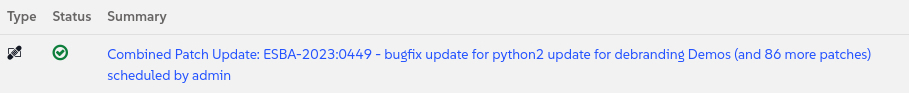

🌌 دعم موسع للأنظمة القديمة (legacy)
===================================

<style type="text/css">
  * {
    font-family: suse;
    src: url('https://fonts.google.com/specimen/SUSE');
  }
  .hovereffect {
    border-radius: 25px 25px 25px 25px;
    background: linear-gradient(#30ba78 0 0) var(--hundredpercent, 0) / var(--hundredpercent, 0) no-repeat;
    transition: 0.5s, background-position 0s;
    padding: 5px;
  }
  .hovereffect:hover {
    --hundredpercent: 100%;
    color: white;
    border-radius: 10px 25px 10px 25px;
  }
  .smlmext {
    color: #fe7c3f;
  }
  .smlm {
    color: #fe7c3f;
  }
  .suse {
    color: #30ba78;
  }
  .smls {
    color: #2453ff;
  }
  .smlsext {
    color: #2453ff;
  }
  .companyname {
    color: #008657;
  }
  .liberty {
    color: #efefef;
  }
  .sles {
    color: #90ebcd;
  }
  .highlightcopy {
    color: white;
    font-weight: bold;
    padding: 0 10px;
  }

  .bottoms {
    vertical-align: middle;
    height: 50%;
    width: 50%;
    margin: 0px;
    padding: 0px;
    object-fit: contain;
  }

  img.animatedgif {
    --borderthickness: 5pt;
    --colors: #0000 25%,#30ba78 0;
    padding: 10px;
    background:
      conic-gradient(from 90deg  at top    var(--borderthickness) left  var(--borderthickness),var(--colors)) 0    0,
      conic-gradient(from 180deg at top    var(--borderthickness) right var(--borderthickness),var(--colors)) 100% 0,
      conic-gradient(from 0deg   at bottom var(--borderthickness) left  var(--borderthickness),var(--colors)) 0    100%,
      conic-gradient(from -90deg at bottom var(--borderthickness) right var(--borderthickness),var(--colors)) 100% 100%;
    background-size: 50px 50px;
    background-repeat: no-repeat;
    transition: 1s;
  }

  img.animatedgif:hover {
    background-size: 51% 51%;
  }
  img.logos {
    border-radius: 10px;
  }
  ul {
    list-style-image: url('../assets/logos/chameleon_icon.png')
  }
</style>


# تمديد عمر أسطولنا القديم (Legacy Fleet)

في أي شركة طيران، لديك طائرات قديمة وموثوقة خدمتك لسنوات ولكن ليس لديك بديل لها حتى الآن. بالنسبة لنا، جزء من هذا الأسطول القديم هو أنظمة CentOS 7 الخاصة بنا. إنها مستقرة ولكنها في نهاية العمر الافتراضي (end-of-life)، مما يعني أنها لم تعد تتلقى تحديثات أمان مهمة من الشركة المصنعة الأصلية. بالنسبة لشركة طيران، الطيران بدون دعم هو خطر لا يمكننا تحمله ببساطة.

سيكون الحل التقليدي هو استبدال كامل ومكلف لكل واحدة منها.
ولكن ماذا لو تمكنا من إجراء ترقية لتمديد العمر، وتحديثها في مكانها (in place) مع الحد الأدنى من التعطيل؟ هذه هي بالضبط مهمة هذا التحدي. سنستخدم قوة <b class="smlmext">SUSE Multi-Linux Manager</b> جنبًا إلى جنب مع <b class="smlsext">SUSE Multi-Linux Support</b> للانتقال الآمن لهذه الأنظمة وإبقائها في الخدمة حتى نتمكن من استبدالها بنظام تشغيل (OS) أكثر حداثة.


## <b class="hovereffect">خطة رحلتنا:</b>

- فحص الأنظمة القديمة الحالية التي تشغل Centos 7

- إلحاق (Onboard) نظام QA وتطبيق أي تصحيحات (patches) متاحة

- تحديد وتطبيق التحديثات إن وجدت.

- تحرير (Liberate) النظام باستخدام صيغة liberate.

- ملاحظة ما تغير بين كلا النظامين

- تحديد ما إذا كانت هذه هجرة (migration).

<br/>

## <b class="hovereffect">طائراتنا</b>

- CentOS 7 QA ✈ خادم الاختبار والتطوير الخاص بنا.

- CentOS 7 Prod ✈ خادم الإنتاج الخاص بنا المسجل بالفعل في <b class="smlm">SMLM</b>

<br/><br/>


تفاصيل المختبر (Lab details)
===========

اسم المستخدم (Username):
```txt
[[ Instruqt-Var key="SMLM_USERNAME" hostname="zbastion" ]]
```

كلمة المرور (Password):
```txt
[[ Instruqt-Var key="UNIVERSAL_PWD" hostname="zbastion" ]]
```

رابط <b class="smlm">SMLM</b> URL: <a href="[[ Instruqt-Var key="SMLM_URL" hostname="zbastion" ]]">[[ Instruqt-Var key="SMLM_URL" hostname="zbastion" ]]</a>


إلحاق Centos 7 QA (Onboarding Centos 7 QA)
======================


## <b class="hovereffect">فحص الأنظمة القديمة الحالية</b>

قم بالوصول إلى طرفية النظام من علامة التبويب [button label="Centos 7 QA" variant="success"](tab-1)

تحقق من الإصدار الحالي للنظام:

```bash,run
rpm -qi centos-release centos-logos
```


الآن قم بتشغيل الأمر التالي لتسجيل النظام في <b class="smlm">SMLM</b>:


```bash,run
curl -Sks "smlm.${_SANDBOX_ID}.instruqt.io"/pub/bootstrap/generic_bootstrap.sh | SMLM_DNS="smlm.${_SANDBOX_ID}.instruqt.io" ACTIVATION_KEYS=1-liberty7ltss PROFILENAME='airco-dh4a-qa' bash ; echo "Let's wait 2 minutes for all the background processes to finish"; sleep 120
```


هذا مشابه للأمر الذي استخدمناه لإلحاق Ubuntu في المختبر السابق، ما يتغير هو:

- **Activation key** (مفتاح التفعيل): هو مرجع للإعدادات التي سيتم تطبيقها على النظام افتراضيًا، في هذه الحالة تم إنشاؤه للإشارة فقط إلى قنوات البرمجيات التي سيتم تسجيل النظام فيها.

- **Profile name** (اسم الملف التعريفي): إذا لم نحدد فسيستخدم اسم المضيف (hostname) ولكن في هذه الحالة نريده أن يكون له اسم ذو مغزى أكبر بنفس اتفاقية التسمية التي استخدمناها مع Centos 7 Prod.


**اختياري:** إذا كنا فضوليين ونريد أن نرى ما يحدث عندما نقوم بالترقية وتنفيذ صيغة Liberate، يمكننا تشغيل الأمر التالي على كلا النظامين ( [button label="Centos 7 QA" variant="success"](tab-1) و [button label="Centos 7 Prod" variant="success"](tab-2) ):


```bash,run
journalctl -f
```

ورؤية السجلات (logs) تظهر في الطرفيات.


<br/><br/>


## <b class="hovereffect">تحديد وتطبيق التحديثات من مستودعات <b class="liberty">Liberty</b></b>

تأتي أنظمة Centos 7 هذه مع أحدث الحزم المقدمة من المصدر (upstream)، ونريد التأكد من إصلاح الأخطاء الجديدة وأن لدينا شخص دعم ودود لمساعدتنا عند وجود مشاكل، الآن قمنا بالفعل بالاشتراك في أنظمة Centos 7 في مستودعات البرامج المقدمة من SUSE أثناء عملية التسجيل، لذا دعونا نقوم بتصحيحها جميعًا:


الآن دعونا ننتقل إلى علامة التبويب [button label="SMLM UI" variant="success"](tab-0)


- اذهب إلى `Systems` ✈ `System List` في القائمة اليسرى.

- ابحث عن مضيفك **airco-dh4a-qa** وانقر عليه.

- حدد `Software` ✈ `Packages`

- انقر على `Update Packages List`، سيستغرق هذا حوالي دقيقة ليكتمل

- حدد `Software` ✈ `Patches`

- سترى قائمة بالتصحيحات (patches) المتاحة.

انقر على `Select All`، ثم `Apply Patches` في الزاوية العلوية اليمنى وأخيرًا `Confirm`. سيقوم <b class="smlmext">SUSE Multi-Linux Manager</b> الآن بجدولة وتنفيذ إجراء الترقية على نظام CentOS.


> [!NOTE]
> قد يستغرق الأمر بضع دقائق للحصول على قائمة الحزم قبل أن تتمكن من رؤية قائمة التصحيحات التي يمكن تطبيقها على النظام.


بما أن هذا قد يستغرق بعض الوقت، دعونا نرى ما يحدث خلف الكواليس.
اذهب إلى علامة التبويب `Events`، ثم `History`، يجب أن ترى قائمة بالأحداث التي حدثت منذ تسجيل النظام في <b class="smlm">SMLM</b>، في الصفوف الأولى يجب أن نتمكن من العثور على حدث يحتوي على شيء مشابه لـ *Combined Patch*.


إذا نقرنا عليه يمكننا رؤية كل التفاصيل، لا تتردد في إلقاء نظرة، وإلا انتظر حتى يصبح الرمز أخضر:



لقد قمنا للتو بتطبيق تصحيحات تصلح الأخطاء في الحزم الموجودة، هذه الحزم المصححة تأتي مباشرة من SUSE، هذه ليست هجرة (migration).

<br/>

دعونا نقارنها بنظام الإنتاج الذي لم نقم بتحديثه بعد.

الرجاء الذهاب إلى `Software` ✈ `Packages` ✈ `Profiles`

حدد النظام `airco-dh4a-prod`، وهو نسخة الإنتاج، ثم انقر على:


يمكننا أن نرى أن معظم إصدارات الحزم لم تتغير، لا تزال نفس الإصدار ( **X.X.X**-xyz ) ولكن مع تطبيق تصحيح ( X.X.X-**xyz** ).

قبل أن ننتقل إلى القسم التالي، دعونا ننشئ ملف تعريف مخزن (stored profile)، سيساعدنا هذا على رؤية الاختلافات بوضوح أكبر بعد تطبيق صيغة liberate في القسم التالي.


الرجاء الذهاب إلى `Software` ✈ `Packages` ✈ `Profile` وانقر على `Create System Profile`. للاسم يمكنك تسميته:

```txt
before_liberation
```


  <div style='align: middle; margin: 15px;'>
    
  </div>


<br/><br/>


تحرير (Liberate) النظام (اختياري)
==============================

هذه خطوة **اختيارية** وليست مطلوبة للحصول على الدعم.

الآن دعونا نحرر (liberate) النظام:

- اذهب إلى علامة التبويب `Formulas`، وابحث عن **Liberate**، وبمجرد العثور عليها، حددها وانقر على `Save` في أعلى اليمين.

سترى رسالة باللون الأزرق في الجزء العلوي من الشاشة، مرر لأعلى إذا لم تتمكن من رؤيتها:


انقر حيث يقول `Highstate`، سيتم توجيهك إلى علامة تبويب أخرى (`States` ✈ `Highstate`).

يمكنك أن ترى في الملخص في الأسفل أن صيغة liberate مدرجة.

لبدء عملية التحرير، انقر:


سيستغرق هذا بعض الوقت، يرجى التحقق من `Events` -> `History`، يجب أن ترى حدثًا يسمى **Apply highstate scheduled**

لننتظر بضع دقائق حتى ينتهي، في غضون ذلك يمكنك ملاحظة ما يحدث من خلال النظر إلى الطرفية [button label="Centos 7 QA" variant="success"](tab-1).


  <div style='align: middle; margin: 15px;'>
    
  </div>

<br/><br/>

## <b class="hovereffect">ملاحظة ما تغير</b>


بمجرد اكتماله، دعونا نقارن النظام مرة أخرى لرؤية الفرق، إذا لم نكن هناك بالفعل دعونا ننقر على اسم النظام `airco-dh4a-qa`.

ثم اذهب إلى `Software` ✈ `Packages` ✈ `Profile`

تحت **Compare to Stored Profile** انقر: 

يمكننا أن نرى أن الشيء الوحيد الذي تغير هو الحزم التالية:

- **centos-logos**، استبدلت بـ **sles_es-logos**

- **centos-release**، استبدلت بـ **sles_es-release-server**

يبقى الباقي كما هو ولكن الآن لديك كل الدعم والترقيات والتصحيحات المقدمة من <b class="suse">SUSE</b> لـ <b class="liberty">Liberty Linux</b>.

ينطبق الشيء نفسه على الإصدارات الأكثر حداثة من CentOS و RHEL، يمكنك تحويلها إلى <b class="liberty">Liberty</b> والحصول على دعم لها من قبل <b class="suse">SUSE</b> دون الحاجة إلى إجراء أي تغييرات على البرامج والمكتبات الفعلية.


  <div style='align: middle; margin: 15px;'>
    
  </div>

<br/>


تحرير (Liberate) خادم الإنتاج (اختياري)
=========================================

لقد رأينا كيفية تصحيح وتحرير خادم Centos 7 القديم لدينا في QA، حان الوقت الآن لفعل الشيء نفسه مع نظام الإنتاج، ولكن هذه المرة سنفعل ذلك بترتيب مختلف.

- أولاً، سنطبق صيغة **Liberate**

  دعونا نذهب إلى خادم الإنتاج لدينا `airco-dh4a-prod` ونقوم بـ `Create System Profile`

  بعد ذلك دعونا نطبق صيغة **Liberate** كما فعلنا مع نظام QA.

- بمجرد اكتماله، دعونا نقارن النظام بالملف التعريفي الذي أنشأناه للتو، كما نرى كان التغيير الوحيد هو حزم **centos-logos** و **centos-release**، والباقي يبقى كما هو تمامًا.


هل هي هجرة (migration)؟
==================

تتضمن الهجرة بناء خادم جديد تمامًا، وإعادة تثبيت جميع التطبيقات من الصفر، ونقل البيانات بعناية، وهي عملية تستغرق وقتًا طويلاً ومكلفة ومحفوفة بالمخاطر.

ما فعلناه كان أكثر أناقة بكثير. لقد أجرينا ترقية في المكان (in-place upgrade).

بقيت هوية الخادم واسم المضيف والتطبيقات وبيانات المستخدم دون مساس تمامًا. قمنا ببساطة بتغيير مصدر التحديثات الأساسي الخاص به، وتلك المكونات التي انتهى عمرها الافتراضي هي الآن مكونات مدعومة بالكامل تتلقى التصحيحات.

لقد نجحنا في تمديد عمر نظامنا، وأعدناه إلى الامتثال الأمني، وفعلنا كل ذلك دون انقطاع الهجرة الكاملة. هذه هي الكفاءة التي تبقي [[ Instruqt-Var key="COMPANY_NAME" hostname="zbastion" ]] تحلق عاليًا.


لماذا هذا مهم لـ [[ Instruqt-Var key="COMPANY_NAME" hostname="zbastion" ]]؟
=================================================================================

- يسمح لـ [[ Instruqt-Var key="COMPANY_NAME" hostname="zbastion" ]] بالحفاظ على أنظمتها العاملة مدعومة، مما يمنحهم الوقت للهجرة اعتمادًا على احتياجات أعمالهم بدلاً من احتياجات البائع.

- يخفف من المخاطر التي تنطوي عليها وجود أنظمة غير مدعومة من خلال تقديم دعم موسع. يتجنب هذا النهج الحاجة إلى هجرة فورية، كل شيء يعمل كالمعتاد ولكن الآن هناك مجموعة من الخبراء يمكنهم الرد على مكالماتك.

- يمنحك الحرية في تغيير مزود الدعم دون المرور بهجرات طويلة، ويسمح لك بالقيام بذلك على نطاق واسع (at scale).


مزيد من المعلومات
================

- [Registering RHEL 7 or CentOS Linux 7 with SUSE Manager](https://documentation.suse.com/liberty/7/html/suma-quickstart/art-suma-quickstart.html)
- [Running OpenSCAP compliance scans for SUSE Multi-Linux Support 7](https://documentation.suse.com/liberty/7/html/compliance-scans/art-compliance-scans.html)
- [Registering CentOS Linux 7 with the SUSE Customer Center](https://documentation.suse.com/liberty/7/html/quickstart-scc/art-quickstart-scc.html)
- [SUSE Multi-Linux Support 9](https://documentation.suse.com/liberty/9/)