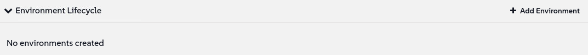

🌌 إدارة دورة الحياة (Lifecycle management)
===================================

<style type="text/css">
  * {
    font-family: suse;
    src: url('https://fonts.google.com/specimen/SUSE');
  }
  .hovereffect {
    border-radius: 25px 25px 25px 25px;
    background: linear-gradient(#30ba78 0 0) var(--hundredpercent, 0) / var(--hundredpercent, 0) no-repeat;
    transition: 0.5s, background-position 0s;
    padding: 5px;
  }
  .hovereffect:hover {
    --hundredpercent: 100%;
    color: white;
    border-radius: 10px 25px 10px 25px;
  }
  .smlmext {
    color: #fe7c3f;
  }
  .smlm {
    color: #fe7c3f;
  }
  .suse {
    color: #30ba78;
  }
  .smls {
    color: #2453ff;
  }
  .smlsext {
    color: #2453ff;
  }
  .companyname {
    color: #008657;
  }
  .liberty {
    color: #efefef;
  }
  .sles {
    color: #90ebcd;
  }
  .highlightcopy {
    color: white;
    font-weight: bold;
    padding: 0 10px;
  }

  .bottoms {
    vertical-align: middle;
    height: 50%;
    width: 50%;
    margin: 0px;
    padding: 0px;
    object-fit: contain;
  }

  img.animatedgif {
    --borderthickness: 5pt;
    --colors: #0000 25%,#30ba78 0;
    padding: 10px;
    background:
      conic-gradient(from 90deg  at top    var(--borderthickness) left  var(--borderthickness),var(--colors)) 0    0,
      conic-gradient(from 180deg at top    var(--borderthickness) right var(--borderthickness),var(--colors)) 100% 0,
      conic-gradient(from 0deg   at bottom var(--borderthickness) left  var(--borderthickness),var(--colors)) 0    100%,
      conic-gradient(from -90deg at bottom var(--borderthickness) right var(--borderthickness),var(--colors)) 100% 100%;
    background-size: 50px 50px;
    background-repeat: no-repeat;
    transition: 1s;
  }

  img.animatedgif:hover {
    background-size: 51% 51%;
  }

  img.logos {
    border-radius: 10px;
  }

</style>


في هذا الجزء سننتقل من مهام الصيانة الفردية إلى إنشاء عملية معتمدة على مستوى الأسطول لإدارة التغيير. سنستكشف كيف توفر إدارة دورة حياة المحتوى (Content Lifecycle Management) في <b class="smlmext">SUSE Multi-Linux Manager</b> الهيكلية والأمان الذي تتطلبه شركة الطيران الخاصة بنا.


في [[ Instruqt-Var key="COMPANY_NAME" hostname="zbastion" ]]، لا يتم تثبيت قطعة جديدة على طائرة ركاب في اللحظة التي تصل فيها من الشركة المصنعة. بل تمر بعملية اعتماد صارمة.

أولاً، يتم فحصها واختبارها في ورشة عمل خاضعة للرقابة (**التطوير / Development**). بعد ذلك، يتم تركيبها على طائرة اختبار غير تجارية وتخضع لاختبارات أرضية وطيران شاقة (**ضمان الجودة / Quality Assurance - QA**). فقط بعد اجتياز كل فحص يمكن تصوره، يتم اعتمادها للتثبيت عبر أسطولنا النشط (**الإنتاج / Production**).


يمنع هذا النهج المنهجي والمرحلي أي مكون معيب واحد من إيقاف طائرة عن الطيران، مما يضمن سلامة ركابنا وموثوقية عملياتنا. نحن نطبق نفس الفلسفة تمامًا على أنظمة تكنولوجيا المعلومات لدينا. ترقية البرنامج أو التطبيق الجديد هو "مكون" يمكن أن يوقف عملياتنا الرقمية إذا كان معيبًا. إدارة دورة حياة المحتوى هي عملية الاعتماد الرسمية لدينا لجميع تغييرات البرامج.


## <b class="hovereffect">أهدافك:</b>

- بناء مشروع دورة حياة المحتوى (Content Lifecycle Project).

- استخدام المشروع لإدارة واعتماد تحديثات البرامج لأنظمتنا.


تفاصيل المختبر (Lab details)
===========

اسم المستخدم (Username):
```txt
[[ Instruqt-Var key="SMLM_USERNAME" hostname="zbastion" ]]
```

كلمة المرور (Password):
```txt
[[ Instruqt-Var key="UNIVERSAL_PWD" hostname="zbastion" ]]
```

رابط <b class="smlm">SMLM</b> URL: <a href="[[ Instruqt-Var key="SMLM_URL" hostname="zbastion" ]]">[[ Instruqt-Var key="SMLM_URL" hostname="zbastion" ]]</a>


بناء مسار اعتماد البرمجيات الخاص بنا
==============================================

في هذا التمرين، سنقوم بإنشاء مشروع دورة حياة المحتوى للتحكم في تدفق تحديثات البرامج. يضمن هذا أن يتم اختبار التصحيح (patch) بدقة قبل أن يصل إلى خوادم الإنتاج الحيوية لدينا.

<br/>

هدفنا هو بناء خط أنابيب `Dev ✈ QA ✈ Prod`.

1.  **التطوير (Development - Dev):** ورشة العمل الأولية. تصل جميع التصحيحات والحزم الجديدة هنا أولاً.
2.  **ضمان الجودة (Quality Assurance - QA):** أرض الاختبار. سنقوم بترويج (promote) إصدار محدد من المحتوى من Dev إلى QA ليقوم فريق الاختبار لدينا بالتحقق منه.
3.  **الإنتاج (Production - Prod):** الأسطول النشط. يتم ترويج مجموعة التصحيحات المعتمدة والموافق عليها من قبل QA فقط إلى الإنتاج (Production)، حيث يمكن تطبيقها بأمان على أنظمتنا الحية.


<br/>

## <b class="hovereffect">إنشاء المشروع</b>

- انتقل إلى `Content Lifecycle` ✈ `Projects` وانقر على 

- املأ تفاصيل المشروع:

- **Project Name** (اسم المشروع):

```txt
Airtrain SLES15 SPx
```

- **Project Label** (تسمية المشروع):

```txt
at-sles15_spx
```

- **Project Description** (وصف المشروع):

```txt
Certified software channel for Airtrain SLES 15 systems.
```


- انقر على 

الآن دعنا نملأه، انقر على `Attach/Detach Sources`


- في **New Base Channel** حدد <b class="sles">SLE-Product-SLES15-SP6-Pool for x86_64</b> وانقر على 

<br/>

## <b class="hovereffect">إنشاء بيئة التطوير (Dev)</b>

إنشاء دورة حياة بيئة التطوير

- انقر على `Add Environment`



- املأ بالآتي:
  * **Name:** <b class="highlightcopy">Development</b>
  * **Label:** <b class="highlightcopy">dev</b>

- انقر على 

<br/>

## <b class="hovereffect">إنشاء بيئة ضمان الجودة (QA)</b>

إنشاء دورة حياة بيئة ضمان الجودة

- انقر على `Add Environment`

- املأ بالآتي:
  * **Name:** <b class="highlightcopy">QA</b>
  * **Label:** <b class="highlightcopy">qa</b>

- انقر على 

<br/>

## <b class="hovereffect">إنشاء بيئة الإنتاج (Prod)</b>

إنشاء دورة حياة بيئة الإنتاج

- انقر على `Add Environment`

- املأ بالآتي:
  * **Name:** <b class="highlightcopy">Production</b>
  * **Label:** <b class="highlightcopy">prod</b>

- انقر على 

<br/>

## <b class="hovereffect">تعبئة المحتوى (Populate)</b>

الآن لدينا البيئات الثلاث، دعنا نملأها بالمحتوى.

لن نستخدم مرشحًا (filter) في هذه الحالة لأن <b class="sles">SLES</b> يوفر بالفعل إصدارات حزم مستقرة.

إيقاع الاختبار في [[ Instruqt-Var key="COMPANY_NAME" hostname="zbastion" ]] هو حاليًا شهر واحد، لذلك سنقوم بتسمية هذا البناء (build) باسم الشهر الحالي، أكتوبر (October).

- انقر على 

- في **Version Message** اكتب

```txt
October
```


- انقر على `Build`

> [!NOTE]
> قد تستغرق هذه العملية بضع دقائق، سترى بعض الخطوات مثل 'cloning' (الاستنساخ)، ولكن قد تشعر بالارتياح لمعرفة أن هذا لا يتطلب الكثير من التخزين. تنطبق عملية الاستنساخ فقط على نقاط فهرس الحزمة، وليس الحزم الفعلية نفسها.


<br/>

## <b class="hovereffect">ترويج المحتوى (Promoting)</b>

الآن، دعنا نقوم بترويج المحتوى إلى المراحل التالية.

- انقر على زر `Promote` بين Development و QA
- ستظهر شاشة أخرى بعنوان **Promote version 1 into QA**، فقط انقر فوق `Promote` مرة أخرى.

كرر نفس الخطوة لبيئة الإنتاج (Production).


  <div style='align: middle; margin: 15px;'>
    
  </div>

<br/>

ترقية أنظمتنا.
====================

الآن دعنا نجرب كيف يعمل الأمر.

سنقوم بما يلي:
- إضافة بعض أنظمتنا إلى البيئة الجديدة.
- إنشاء إصدار جديد من المحتوى.
- ترويج الإصدار الجديد وتحديث الأنظمة.

<br/>

## <b class="hovereffect">إضافة أنظمة</b>

لنذهب إلى `Systems` ✈ `System List` ✈ `All`

- انقر على نظام **at-ct-qa**
- اذهب إلى `Software` ✈ `Software Channels`
- في **Custom Channels**، حدد مربع الاختيار لقناة **at-sles15_spx-qa-...** وانقر على 
- انقر على 


عُد إلى `Systems` ✈ `System List` ✈ `All`

- قم بالتصفية حسب:

```txt
at-
```

- حدد جميع الأنظمة التي تنتهي بـ **-pro**
- اذهب إلى `Systems` ✈ `System Set Manager`
- اذهب إلى `Channels`
- في **Custom Channels**، حدد مربع الاختيار لقناة **at-sles15_spx-prod-...** وانقر على 
- انقر على 'include recommended' للاشتراك في جميع القنوات الموصى بها:

<p style="margin: 1px; padding: 1px; vertical-align: middle; display:inline-block; align:left;"> </p><p style="margin: 1px; padding: 1px;vertical-align: middle; display:inline-block; align:left;"></p> ✈ <p style="margin: 1px; padding: 1px;vertical-align: middle; display:inline-block; align:center;"></p>


  <div style='align: middle; margin: 15px;'>
    
  </div>

<br/>

## <b class="hovereffect">إنشاء إصدار جديد</b>


لقد مر شهر ونريد الاستمرار في عملية التحديث المستقرة لدينا.
أنت بصدد إنشاء نسخة ثابتة وغير متغيرة من قنوات البرامج لفريق المطورين.

لن تظهر أي تصحيحات جديدة فجأة وتعطل عملهم.

- عُد إلى `Content Lifecycle` ✈ `Projects` وانقر على المشروع الذي أنشأناه للتو.

- انقر على 

- في **Version Message** اكتب

```txt
November
```


- انقر على `Build`

لاحظ أن رقم الإصدار قد زاد تلقائيًا.

الآن يمكن للمطورين القيام بعملهم باستخدام الإصدارات الجديدة والمصححة من المكتبات والتطبيقات التي توفرها SUSE.


  <div style='align: middle; margin: 15px;'>
    
  </div>


<br/>

## <b class="hovereffect">ترويج المحتوى من Dev إلى QA</b>

لنفتراض أن المطورين قد أعطوا موافقتهم. حان الوقت لإنشاء إصدار مستقر لفريق QA حتى يتمكنوا من إجراء جميع اختبارات ما قبل الإنتاج.

- انقر على زر `Promote` بين Development و QA
- ستظهر شاشة أخرى بعنوان **Promote version 2 into QA**، فقط انقر فوق `Promote` مرة أخرى.

الآن دعنا نذهب إلى أنظمة QA ونقوم بالترقية.

- `Systems` ✈ `System List` ✈ `All`
- انقر على نظام **at-ct-qa**
- اذهب إلى `Software` ✈ `Packages` ✈ `Upgrade`
- انقر على:

<p style="margin: 1px; padding: 1px; vertical-align: middle; display:inline-block; align:left;"> </p><p style="margin: 1px; padding: 1px;vertical-align: middle; display:inline-block; align:left;"></p> ✈ <p style="margin: 1px; padding: 1px;vertical-align: middle; display:inline-block; align:center;"></p> ✈ <p style="margin: 1px; padding: 1px;vertical-align: middle;display:inline-block; align:right;"> </p>


الآن يمكن لمهندسي ضمان الجودة (QA) إجراء اختباراتهم بأمان دون انقطاع.


> [!NOTE]
> ليس لدينا ما يكفي من الوقت لرؤية التغييرات تصل، في سيناريو حقيقي يجب أن تكون هناك إصدارات جديدة من الحزم متاحة للترويج في الإصدار 2.

  <div style='align: middle; margin: 15px;'>
    
  </div>


<br/>

## <b class="hovereffect">الترويج إلى الإنتاج (Promote to Production)</b>

أكمل فريق QA اختباراته الصارمة على `v2` واعتمدها على أنها مستقرة وآمنة للأسطول الرئيسي. حان الوقت لإتاحتها لأنظمة الإنتاج لدينا.

سنكرر نفس العملية التي قمنا بها لـ QA في بيئة الإنتاج لدينا:

- أولاً، قم بترويج المحتوى.
  سيؤدي هذا إلى إتاحة الحزم الجديدة لخوادم الإنتاج لدينا.
  لقد نجحت في ضمان أن التحديثات المختبرة والمعتمدة فقط هي التي يمكن أن تصل إلى أنظمتك الأكثر أهمية.

- ثانيًا، قم بترقية أنظمة الإنتاج (Production) لدينا، والفرق الوحيد هنا هو أننا سنجدول الترقية إلى **غدًا في الساعة 14:00** للسماح لجميع فرقنا بالاستعداد والحصول على عملية خاضعة للرقابة.


<br/>

لماذا هذا مهم لـ [[ Instruqt-Var key="COMPANY_NAME" hostname="zbastion" ]]؟
=================================================================================

- نحن نبني سلسلة من بوابات الأمان، مما يسهل تنفيذ مبدأ أساسي لاستراتيجيتنا التشغيلية: **إدارة المخاطر**.
- يمكن اكتشاف أي تصحيح سيء واحد يتم إدخاله في بيئة **Dev** وإصلاحه قبل وقت طويل من أن تتاح له الفرصة للتأثير على الأنظمة المدرة للدخل.
- تحول هذه العملية الترقيع والتحديثات من حدث محفوف بالمخاطر ومثير للأعصاب إلى إجراء صيانة روتيني يمكن التنبؤ به، وهو حجر الزاوية لشركة طيران موثوقة.


<br/>

مزيد من المعلومات
================

* [نوافذ الصيانة (Maintenance Windows)](https://documentation.suse.com/multi-linux-manager/5.1/en/docs/administration/maintenance-windows.html)

* [إدارة التصحيح (Patch Management)](https://documentation.suse.com/multi-linux-manager/5.1/en/docs/administration/patch-management.html)

* [إدارة دورة حياة المحتوى (Content Lifecycle Management)](https://documentation.suse.com/multi-linux-manager/5.1/en/docs/administration/content-lifecycle.html)

* [صفحة منتج SUSE Multi-Linux Manager](https://www.suse.com/products/suse-manager/)