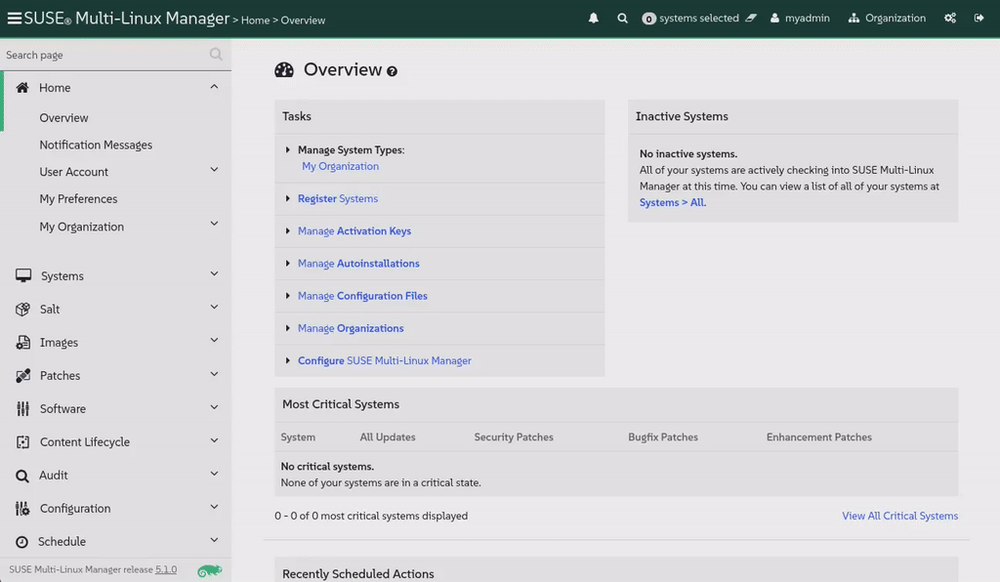

🌌 ভিন্ন লিনাক্স ডিস্ট্রিবিউশন পরিচালনা করা
===================================

<style type="text/css">
  * {
    font-family: suse;
    src: url('https://fonts.google.com/specimen/SUSE');
  }
  .hovereffect {
    border-radius: 25px 25px 25px 25px;
    background: linear-gradient(#30ba78 0 0) var(--hundredpercent, 0) / var(--hundredpercent, 0) no-repeat;
    transition: 0.5s, background-position 0s;
    padding: 5px;
  }
  .hovereffect:hover {
    --hundredpercent: 100%;
    color: white;
    border-radius: 10px 25px 10px 25px;
  }
  .smlmext {
    color: #fe7c3f;
  }
  .smlm {
    color: #fe7c3f;
  }
  .suse {
    color: #30ba78;
  }
  .smls {
    color: #2453ff;
  }
  .smlsext {
    color: #2453ff;
  }
  .companyname {
    color: #008657;
  }
  .liberty {
    color: #efefef;
  }
  .sles {
    color: #90ebcd;
  }

  .highlightcopy {
    color: white;
    font-weight: bold;
    padding: 0 10px;
  }

  .bottoms {
    vertical-align: middle;
    height: 50%;
    width: 50%;
    margin: 0px;
    padding: 0px;
    object-fit: contain;
  }

  img.animatedgif {
    --borderthickness: 5pt;
    --colors: #0000 25%,#30ba78 0;
    padding: 10px;
    background:
      conic-gradient(from 90deg  at top    var(--borderthickness) left  var(--borderthickness),var(--colors)) 0    0,
      conic-gradient(from 180deg at top    var(--borderthickness) right var(--borderthickness),var(--colors)) 100% 0,
      conic-gradient(from 0deg   at bottom var(--borderthickness) left  var(--borderthickness),var(--colors)) 0    100%,
      conic-gradient(from -90deg at bottom var(--borderthickness) right var(--borderthickness),var(--colors)) 100% 100%;
    background-size: 50px 50px;
    background-repeat: no-repeat;
    transition: 1s;
  }

  img.animatedgif:hover {
    background-size: 51% 51%;
  }

  img.logos {
    border-radius: 10px;
  }

</style>


এখানে [[ Instruqt-Var key="COMPANY_NAME" hostname="zbastion" ]] -এ, <b class="smlmext">SUSE Multi-Linux Manager</b> হলো একটি একক প্যানেল (single pane of glass) থেকে আমাদের বৈচিত্র্যময় লিনাক্স ডিস্ট্রিবিউশন এবং আর্কিটেকচারের ফ্লিট পরিচালনা করার চাবিকাঠি। এটি আমাদের অতিরিক্ত কাস্টমাইজেশনগুলি এড়াতে সহায়তা করেছে যা ইঞ্জিনিয়ার হিসেবে আমাদের কাজকে জটিল করে তুলত, যা ফলস্বরূপ আমাদের সিস্টেম পলিসিগুলি রক্ষণাবেক্ষণ এবং বাস্তবায়নের জন্য প্রয়োজনীয় খরচ এবং সময় বাড়িয়ে দিত।

এই টুলের সাহায্যে, আমরা একটি একক ভেন্ডর, আর্কিটেকচার বা অটোমেশন প্ল্যাটফর্মে আবদ্ধ নই। আমাদের পরিবেশের জন্য আমাদের যা প্রয়োজন তা বেছে নিতে এবং সেগুলির সবকটিকে একই উপায়ে পরিচালনা করতে আমরা মুক্ত। কল্পনা করুন, আমাদের ফ্লিটের প্রতিটি ধরণের বিমানের জন্য যদি আমাদের নিজস্ব ভাষা এবং পদ্ধতি সহ একটি ভিন্ন এয়ার ট্রাফিক কন্ট্রোল টাওয়ারের প্রয়োজন হতো। অপারেশনাল জটিলতা অসাধ্য হতো এবং খরচ হতো আকাশচুম্বী।

আমরা সবাই জানি একটি নির্দিষ্ট বিমান মডেল একটি নির্দিষ্ট রুটের জন্য ভালো; আধা ঘণ্টার ফ্লাইটের জন্য একটি জাম্বো জেট ওড়ানো সাশ্রয়ী নয়। আমাদের লিনাক্স ডিস্ট্রিবিউশনগুলির ক্ষেত্রেও একই কথা প্রযোজ্য। যদিও SUSE-এর নিজস্ব ডিস্ট্রিবিউশনগুলি চমৎকার, আমাদের কিছু অ্যাপ্লিকেশনের নির্দিষ্ট প্রয়োজনীয়তা রয়েছে। <b class="smlm">SMLM</b> নিশ্চিত করে যে আমরা কখনই আবদ্ধ (locked in) না হই এবং সর্বদা হাতের কাজটির জন্য সেরা সমাধানটি ইন্টিগ্রেট করতে পারি।


## <b class="hovereffect">আপনার উদ্দেশ্য:</b>

- একটি Ubuntu 24.04 LTS সিস্টেম অনবোর্ড করুন, যা আমাদের মার্কেটিং টিমের জন্য প্রয়োজনীয় একটি বিশেষায়িত সিস্টেম।

- প্রদর্শন করুন কিভাবে আমরা আমাদের বাকি ফ্লিটের মতো একই টুল এবং প্যাচিং পদ্ধতি ব্যবহার করে এই নতুন, ভিন্ন সিস্টেমটি পরিচালনা করি।


ল্যাবের বিবরণ (Lab details)
===========

ব্যবহারকারীর নাম (Username):
```txt
[[ Instruqt-Var key="SMLM_USERNAME" hostname="zbastion" ]]
```

পাসওয়ার্ড (Password):
```txt
[[ Instruqt-Var key="UNIVERSAL_PWD" hostname="zbastion" ]]
```

<b class="smlm">SMLM</b> URL: <a href="[[ Instruqt-Var key="SMLM_URL" hostname="zbastion" ]]">[[ Instruqt-Var key="SMLM_URL" hostname="zbastion" ]]</a>


Ubuntu অনবোর্ডিং (Onboarding Ubuntu)
=================

আমাদের মার্কেটিং বিভাগ থেকে একটি নতুন সার্ভিস রিকোয়েস্ট এসেছে। তাদের গ্রাফিক ডিজাইনাররা একটি নির্দিষ্ট ক্রিয়েটিভ স্যুইটের উপর নির্ভর করে যা শুধুমাত্র Ubuntu-তে সমর্থিত। আমরা তাদের সিস্টেমটি অনবোর্ড করতে যাচ্ছি যাতে আমরা এটি পরিচালনা করতে পারি এবং নিশ্চিত করতে পারি যে এটি আমাদের নিরাপত্তা এবং সম্মতির মানদণ্ডগুলি পূরণ করে, ঠিক যেমনটি আমরা অন্যদের সাথে করি।

চলুন শুরু করি।
<br/>

- [button label="Ubuntu 2404 LTS" variant="success"](tab-1) ট্যাব থেকে সিস্টেম টার্মিনালে প্রবেশ করুন

  আমরা কোনো পরিবর্তন করার আগে, আসুন পরীক্ষা করি এটি কোথা থেকে প্যাকেজ সোর্স করছে:

```bash,run
grep -v '^#\|^Types:\|Trusted:\|Architectures:' /etc/apt/sources.list.d/*
```

এই ওয়ার্কস্টেশনটি সরাসরি পাবলিক Ubuntu রিপোজিটরি থেকে সফটওয়্যার টানছে। এটি দুটি সমস্যা উপস্থাপন করে: প্রথমত, প্রয়োগ করা প্যাচগুলির উপর আমাদের কোনো নিয়ন্ত্রণ নেই, যা একটি নিরাপত্তা উদ্বেগ। দ্বিতীয়ত, যেমনটি মার্কেটিং টিম রিপোর্ট করেছে, প্রতিবার যখন এই ওয়ার্কস্টেশনগুলি আপডেটগুলি নিয়ে আসে, তারা অফিসের ইন্টারনেট সংযোগ ধীর করে দিতে পারে, যা অন্যান্য কর্মীদের জন্য হতাশার কারণ হতে পারে।


আসুন এই সিস্টেমটিকে আমাদের ব্যবস্থাপনার অধীনে আনি। এটি সমস্ত সফটওয়্যার প্রয়োজনের জন্য আমাদের অভ্যন্তরীণ <b class="smlmext">SUSE Multi-Linux Manager</b> ইনস্ট্যান্সের সাথে সংযুক্ত করে উভয় সমস্যার সমাধান করবে।

আমরা এটি করার জন্য [button label="web UI" variant="success"](tab-0) ব্যবহার করতে যাচ্ছি:

- `Home` ✈ `Overview` -এর অধীনে, আসুন `Register Systems` -এ ক্লিক করি

- নিম্নলিখিত বিবরণ পূরণ করুন:

  - **Host:**

  ```txt
  ubuntu2404lts
  ```

  - **User:** (ব্যবহারকারী)

  ```txt
  root
  ```

  - **Password:** (পাসওয়ার্ড)

  ```txt
  [[ Instruqt-Var key="UNIVERSAL_PWD" hostname="zbastion" ]]
  ```

  - **Activation Key:** (অ্যাক্টিভেশন কী)   <b class="highlightcopy">1-ubuntu2404</b>

- বাকিটি যেমন আছে তেমনই রাখুন এবং ক্লিক করুন


- রেজিস্ট্রেশন প্রক্রিয়াটি সম্পন্ন হতে কয়েক মিনিট সময় নিতে পারে, আসুন [button label="terminal" variant="success"](tab-1) -এ যাই এবং কী পরিবর্তন হয়েছে তা দেখতে প্রথম কমান্ডটি আরও একবার রান করি:


```bash,run
echo 'Waiting for the registration to complete' ;while [[ ! -f /etc/apt/sources.list.d/susemanager_bootstrap.sources ]] || [[ ! -f /etc/apt/sources.list.d/susemanager:channels.sources ]]; do echo -n '.'; sleep 5; done ; sleep 60; grep -v '^#\|^Types:\|Trusted:\|Architectures:' /etc/apt/sources.list.d/*
```


আমরা দেখতে পাচ্ছি নতুন ফাইল উপস্থিত হয়েছে:

**/etc/apt/sources.list.d/susemanager:***

এগুলি সিস্টেমকে <b class="smlm">SMLM</b> -এ আমাদের কেন্দ্রীয়ভাবে পরিচালিত এবং নিয়ন্ত্রিত চ্যানেলগুলির দিকে নির্দেশ করে।


আমরা আরও দেখতে পাচ্ছি আসল ফাইল, **/etc/apt/sources.list.d/ubuntu.sources**, সমস্ত পাবলিক রিপোজিটরি নিষ্ক্রিয় করতে পরিবর্তন করা হয়েছে কিন্তু মুছে ফেলা হয়নি, এটি আমাদের প্রয়োজনে সহজেই রোল ব্যাক করতে অনুমতি দেবে।


> [!NOTE]
> রেজিস্ট্রেশনের জন্য পাসওয়ার্ড অথেনটিকেশন সহ SSH-এর মাধ্যমে রুট ব্যবহার করা শুধুমাত্র প্রদর্শনের উদ্দেশ্যে এবং প্রোডাকশনের জন্য সুপারিশ করা হয় না।


> [!NOTE]
> ডিফল্টরূপে আমাদের UI বা কমান্ড লাইন < salt-key -A -y > এর মাধ্যমে প্রতিটি সিস্টেমের রেজিস্ট্রেশন অনুমোদন করতে হয়, এখানে <b class="smlm">SMLM</b> স্বয়ংক্রিয়ভাবে অনুমোদন করার জন্য কনফিগার করা হয়েছে।


  <div style='align: middle; margin: 15px;'>
    
  </div>

<br/>


এখন আসুন [button label="SMLM UI" variant="success"](tab-0) ট্যাবে যাই


- আমরা নেভিগেট করি `Systems` ✈ `System List` ✈ `All` -এ

  আমরা এইমাত্র যে সিস্টেমটি রেজিস্টার করেছি `Ubuntu2404lts` তা দেখতে পাচ্ছি, লক্ষ্য করুন ডিফল্টরূপে এটি হোস্টনামের অধীনে রেজিস্টার হবে।

  আসুন এটিতে ক্লিক করি, আমরা সরাসরি `Details` - `Overview` -এ যাব যেখানে আমরা অন্যান্য তথ্যের মধ্যে দেখতে পাব:

  - সিস্টেম স্ট্যাটাস।
  - হোস্টনাম, আইপি অ্যাড্রেস, ভার্চুয়ালাইজেশনের ধরণ, ব্যবহৃত কার্নেল এবং ইনস্টল করা পণ্যের মতো সমস্ত তথ্য।
  - এটি যে চ্যানেলগুলিতে সাবস্ক্রাইব করা হয়েছে।

  <div style='align: middle; margin: 15px;'>
    
  </div>


<br/>

একাধিক লিনাক্স ডিস্ট্রিবিউশন পরিচালনা করা
=====================================


যেমনটি আগে উল্লেখ করা হয়েছে, <b class="companyname">[[ Instruqt-Var key="COMPANY_NAME" hostname="zbastion" ]]</b> -এ আমরা বিভিন্ন লিনাক্স ডিস্ট্রিবিউশন ব্যবহার করি, যেমন আমরা বিভিন্ন বিমান মডেল এবং কোম্পানি ব্যবহার করি। এটি আমাদের প্রতিটি প্রয়োজনের জন্য সবচেয়ে উপযুক্ত পণ্য ব্যবহার করে প্রতিযোগিতায় এগিয়ে থাকতে সাহায্য করে।

<b class="smlmext">SUSE Multi-Linux Manager</b> এর মাধ্যমে আমরা একই পদ্ধতি, একই সময়সূচী ইত্যাদি ব্যবহার করে একই ইন্টারফেস এবং মেকানিজম ব্যবহার করে সেগুলির সবকটি পরিচালনা করতে পারি।

নিচে আমরা অন্বেষণ করব কিভাবে আপনার সিস্টেমে বিভিন্ন কাজ সম্পাদন করা যায়, আমাদের সিস্টেমগুলি কোন OS চালাচ্ছে তা নির্বিশেষে একই প্রক্রিয়া অনুসরণ করে, অপ্রয়োজনীয় কাস্টমাইজেশন তৈরি না করেই।


## <b class="hovereffect">অতিরিক্ত তথ্য যোগ করুন</b>


আসুন আমরা এইমাত্র রেজিস্টার করা সিস্টেমটির সাথে চালিয়ে যাই, আমরা এটিতে কিছু সেটিংস এবং তথ্য যোগ করতে যাচ্ছি:

- আসুন `Properties` -এ ক্লিক করি, যেখানে আমরা সিস্টেম সম্পর্কে অতিরিক্ত তথ্য যোগ করব এবং কিছু সেটিংস পরিবর্তন করব।


  - প্যাচগুলির স্বয়ংক্রিয় প্রয়োগ সক্ষম করুন (Enable Automatic application of patches):

  

    প্রাসঙ্গিক প্যাচ থাকলে এটি স্বয়ংক্রিয়ভাবে সিস্টেম প্যাচ করবে।


  - সিস্টেমের জন্য নিম্নলিখিত বিবরণ যোগ করুন:


| ক্ষেত্র (Field) | বিষয়বস্তু (Content)                                                  |
| ---: | :-----                                                    |
| **Description** | <b class="highlightcopy">Multimedia workstation for graphics designers.</b> |
| **Facility Address** | <b class="highlightcopy">Candy eye street, 1</b> |
| **City** | <b class="highlightcopy">Aeolia</b> |
| **Building** | <b class="highlightcopy">Belem Tower 4</b> |
| **Room** | <b class="highlightcopy">Sierra nevada</b> |


- আসুন দেখি এটি কোন হার্ডওয়্যারে চলছে:

  - ক্লিক করুন `Details` ✈ `Hardware`


<br/>

> [!NOTE]
> এই সমস্ত API এর মাধ্যমে স্বয়ংক্রিয় করা যেতে পারে।

<br/>

এখন আমরা কাস্টম কি (custom keys) ব্যবহার করে সিস্টেমে কিছু অতিরিক্ত তথ্য যোগ করতে যাচ্ছি, এই তথ্যটি পরে আপনার অটোমেশন স্ক্রিপ্টগুলিতে সহজেই ব্যবহার করা যেতে পারে।


- ক্লিক করুন `Details` ✈ `Custom Info`


- `application` এ ক্লিক করুন এবং নিম্নলিখিত দিয়ে **value** (মান) পূরণ করুন:

```text
Logo Wings designer pro
```


<br/>

> [!NOTE]
> আমরা ইতিমধ্যে আপনার জন্য কাস্টম কি **application** তৈরি করেছি, আপনি যদি নিজের কি (keys) তৈরি করতে চান তবে এটি এখানে যাওয়ার মতোই সহজ: `Systems` ✈ `Custom System Info` ✈ `Create key`

<br/><br/>

আসুন Systems তালিকায় ফিরে যাই

`Systems` ✈ `System List` ✈ `All`


আসুন যেকোনো সিস্টেমে ক্লিক করি এবং `Details` ✈ `Custom Info` -এ যাই।

আমরা ইতিমধ্যে প্রতিটি সিস্টেমে একটি মান পূরণ করেছি,

<br/>

এখন `Details` ✈ `Overview` -এ যান এবং লক্ষ্য করুন **Installed Products** এবং **Subscribed Channels**, এগুলি আপনার Ubuntu সিস্টেমের চেয়ে আলাদা কারণ তারা একটি ভিন্ন অপারেটিং সিস্টেম চালাচ্ছে।


  <div style='align: middle; margin: 15px;'>
    
  </div>

<br/>


## <b class="hovereffect">একসাথে একাধিক সিস্টেমে কমান্ড রান করুন</b>


আসুন আমাদের কাছে থাকা সমস্ত সিস্টেমে কিছু করি, `Systems` ✈ `System List` ✈ `All` -এ ফিরে যান এবং সব নির্বাচন করুন:


**Base Channel** কলামটি লক্ষ্য করুন, আমাদের কাছে তিনটি ভিন্ন OS চালিত সিস্টেম রয়েছে।

<br/>

আমরা পরিচালনা করতে চাই এমন সমস্ত সিস্টেম নির্বাচন করার পর আসুন একটি গ্রুপ অ্যাকশন সম্পাদন করতে যাই:

`Systems` ✈ `System Set Manager`

আসুন তাদের সবার উপর একটি কমান্ড রান করি, তার জন্য আমরা যেতে পারি:

`Misc` ✈ `Remote Command`

তারপর নিম্নলিখিত বিবরণ পূরণ করুন এবং বাকিগুলি ডিফল্ট মানগুলির সাথে ছেড়ে দিন:


স্ক্রিপ্ট (Script):

```bash,run
cat /etc/os-release
```

সময়সূচী (schedule) পরিবর্তন করবেন না, আমরা চাই এটি যত তাড়াতাড়ি সম্ভব রান করুক, ক্লিক করুন:


<br/>


<br/><br/>

আপনি শীর্ষে একটি নীল বিজ্ঞপ্তি দেখতে পাবেন যা নির্দেশ করে যে টাস্কটি শিডিউল করা হয়েছে।

আসুন ফলাফলগুলি দেখি, তার জন্য আমরা যাব:

`Schedule` ✈ `Completed Actions`

আমরা অ্যাকশনগুলির একটি তালিকা দেখতে পাব, **Filter by Action** ক্ষেত্রে টাইপ করুন:

```text
Run
```
তালিকায় প্রদর্শিত শীর্ষ এন্ট্রিটিতে ক্লিক করুন, এটি এর অনুরূপ হওয়া উচিত:


সেখানে আমরা **Completed Systems** -এ যেতে পারি এবং সিস্টেমের নামে ক্লিক করে ফলাফল পরীক্ষা করতে পারি।


  <div style='align: middle; margin: 15px;'>
    
  </div>

<br/>


<br/><br/>

এর সাথে আমরা এই অংশটি সম্পূর্ণ করছি, আমরা ওয়ার্কশপ চলাকালীন একাধিক লিনাক্স সিস্টেম কীভাবে পরিচালনা করতে পারি তার আরও উদাহরণ দেখব।


এটি [[ Instruqt-Var key="COMPANY_NAME" hostname="zbastion" ]] এর জন্য কেন গুরুত্বপূর্ণ?
=================================================================================

- কোনো ভেন্ডর লক-ইন নেই, পরিবর্তনের বাজারের সাথে দ্রুত প্রতিক্রিয়া জানাতে পছন্দের স্বাধীনতা এবং নমনীয়তা বজায় রাখুন।

- কাস্টমাইজেশনে অতিরিক্ত কাজ এড়িয়ে সহজ করুন এবং সময় বাঁচান।

- সবকিছু পরিচালনা করার জন্য একটি একক UI জটিলতা হ্রাস করে এবং ভবিষ্যতের ট্রাবলশুটিং, স্কেলিং, প্যাচিং এবং অটোমেশনকে অনেক বেশি চনমনে (agile) এবং কম সময়সাপেক্ষ করে তুলবে।


আরও তথ্য
================

সমর্থিত ডিস্ট্রিবিউশনের তালিকার জন্য অনুগ্রহ করে ভিজিট করুন:

[SMLM - Supported Clients and Features](https://documentation.suse.com/multi-linux-manager/5.1/en/docs/client-configuration/supported-features.html)