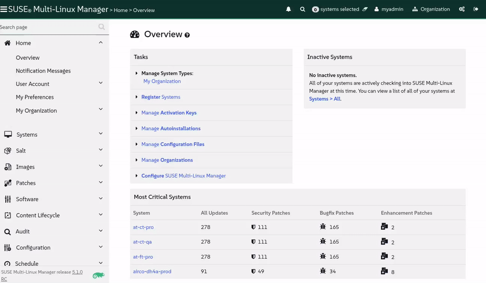

🌌 লিগ্যাসি সিস্টেমের জন্য বর্ধিত সমর্থন
===================================

<style type="text/css">
  * {
    font-family: suse;
    src: url('https://fonts.google.com/specimen/SUSE');
  }
  .hovereffect {
    border-radius: 25px 25px 25px 25px;
    background: linear-gradient(#30ba78 0 0) var(--hundredpercent, 0) / var(--hundredpercent, 0) no-repeat;
    transition: 0.5s, background-position 0s;
    padding: 5px;
  }
  .hovereffect:hover {
    --hundredpercent: 100%;
    color: white;
    border-radius: 10px 25px 10px 25px;
  }
  .smlmext {
    color: #fe7c3f;
  }
  .smlm {
    color: #fe7c3f;
  }
  .suse {
    color: #30ba78;
  }
  .smls {
    color: #2453ff;
  }
  .smlsext {
    color: #2453ff;
  }
  .companyname {
    color: #008657;
  }
  .liberty {
    color: #efefef;
  }
  .sles {
    color: #90ebcd;
  }
  .highlightcopy {
    color: white;
    font-weight: bold;
    padding: 0 10px;
  }

  .bottoms {
    vertical-align: middle;
    height: 50%;
    width: 50%;
    margin: 0px;
    padding: 0px;
    object-fit: contain;
  }

  img.animatedgif {
    --borderthickness: 5pt;
    --colors: #0000 25%,#30ba78 0;
    padding: 10px;
    background:
      conic-gradient(from 90deg  at top    var(--borderthickness) left  var(--borderthickness),var(--colors)) 0    0,
      conic-gradient(from 180deg at top    var(--borderthickness) right var(--borderthickness),var(--colors)) 100% 0,
      conic-gradient(from 0deg   at bottom var(--borderthickness) left  var(--borderthickness),var(--colors)) 0    100%,
      conic-gradient(from -90deg at bottom var(--borderthickness) right var(--borderthickness),var(--colors)) 100% 100%;
    background-size: 50px 50px;
    background-repeat: no-repeat;
    transition: 1s;
  }

  img.animatedgif:hover {
    background-size: 51% 51%;
  }
  img.logos {
    border-radius: 10px;
  }
  ul {
    list-style-image: url('../assets/logos/chameleon_icon.png')
  }
</style>


# আমাদের লিগ্যাসি ফ্লিটের আয়ু বাড়ানো

যেকোনো এয়ারলাইনে, আপনার কাছে পুরানো, নির্ভরযোগ্য বিমান থাকে যা আপনাকে বছরের পর বছর ধরে সেবা দিয়েছে কিন্তু যার কোনো প্রতিস্থাপন আপনার কাছে এখনও নেই। আমাদের জন্য, সেই লিগ্যাসি ফ্লিটের একটি অংশ হলো আমাদের CentOS 7 সিস্টেম। এগুলি স্থিতিশীল কিন্তু এন্ড-অফ-লাইফ (end-of-life), যার অর্থ তারা আর তাদের মূল প্রস্তুতকারকের কাছ থেকে গুরুত্বপূর্ণ নিরাপত্তা আপডেট পায় না। একটি এয়ারলাইনের জন্য, সমর্থন ছাড়া উড্ডয়ন করা এমন একটি ঝুঁকি যা আমরা কেবল নিতে পারি না।

ঐতিহ্যগত সমাধানটি হবে প্রতিটি একক সিস্টেমের সম্পূর্ণ, ব্যয়বহুল প্রতিস্থাপন।
কিন্তু আমরা যদি একটি জীবন-বর্ধক (life-extension) আপগ্রেড সম্পাদন করতে পারতাম, ন্যূনতম ব্যাঘাতের সাথে তাদের আধুনিকায়ন করতে পারতাম? এই চ্যালেঞ্জের জন্য এটিই হলো মিশন। আমরা <b class="smlmext">SUSE Multi-Linux Manager</b> এবং <b class="smlsext">SUSE Multi-Linux Support</b> এর শক্তি ব্যবহার করব এই সিস্টেমগুলিকে নিরাপদে ট্রানজিশন করতে এবং সেগুলিকে সার্ভিসে রাখতে যতক্ষণ না আমরা সেগুলিকে আরও আধুনিক OS দিয়ে প্রতিস্থাপন করতে পারি।


## <b class="hovereffect">আমাদের ফ্লাইট প্ল্যান:</b>

- Centos 7 চালিত বর্তমান লিগ্যাসি সিস্টেমগুলি পরীক্ষা করুন

- QA সিস্টেম অনবোর্ড (Onboard) করুন এবং উপলব্ধ যেকোনো প্যাচ প্রয়োগ করুন

- আপডেটগুলি শনাক্ত করুন এবং প্রয়োগ করুন যদি থাকে।

- liberate ফর্মুলা দিয়ে সিস্টেমটিকে লিবারেট (Liberate) করুন।

- উভয় সিস্টেমের মধ্যে কী পরিবর্তন হয়েছে তা পর্যবেক্ষণ করুন

- এটি একটি মাইগ্রেশন কিনা তা শনাক্ত করুন।

<br/>

## <b class="hovereffect">আমাদের বিমানগুলি</b>

- CentOS 7 QA ✈ আমাদের টেস্ট এবং ডেভেলপমেন্ট সার্ভার।

- CentOS 7 Prod ✈ আমাদের প্রোডাকশন সার্ভার যা ইতিমধ্যেই <b class="smlm">SMLM</b> -এ নিবন্ধিত

<br/><br/>


ল্যাবের বিবরণ (Lab details)
===========

ব্যবহারকারীর নাম (Username):
```txt
[[ Instruqt-Var key="SMLM_USERNAME" hostname="zbastion" ]]
```

পাসওয়ার্ড (Password):
```txt
[[ Instruqt-Var key="UNIVERSAL_PWD" hostname="zbastion" ]]
```

<b class="smlm">SMLM</b> URL: <a href="[[ Instruqt-Var key="SMLM_URL" hostname="zbastion" ]]">[[ Instruqt-Var key="SMLM_URL" hostname="zbastion" ]]</a>


Centos 7 QA অনবোর্ডিং (Onboarding Centos 7 QA)
======================


## <b class="hovereffect">বর্তমান লিগ্যাসি সিস্টেমগুলি পরীক্ষা করা</b>

[button label="Centos 7 QA" variant="success"](tab-1) ট্যাব থেকে সিস্টেম টার্মিনালে প্রবেশ করুন

সিস্টেমের বর্তমান সংস্করণ পরীক্ষা করুন:

```bash,run
rpm -qi centos-release centos-logos
```


এখন সিস্টেমটিকে <b class="smlm">SMLM</b> -এ রেজিস্টার করতে নিম্নলিখিত কমান্ডটি রান করুন:


```bash,run
curl -Sks "smlm.${_SANDBOX_ID}.instruqt.io"/pub/bootstrap/generic_bootstrap.sh | SMLM_DNS="smlm.${_SANDBOX_ID}.instruqt.io" ACTIVATION_KEYS=1-liberty7ltss PROFILENAME='airco-dh4a-qa' bash ; echo "Let's wait 2 minutes for all the background processes to finish"; sleep 120
```


এটি আগের ল্যাবে Ubuntu অনবোর্ড করতে আমরা যা ব্যবহার করেছি তার মতোই, যা পরিবর্তন হয়েছে তা হলো:

- **Activation key** (অ্যাক্টিভেশন কী): এটি সেই সেটিংসের একটি রেফারেন্স যা ডিফল্টরূপে সিস্টেমে প্রয়োগ করা হবে, এই ক্ষেত্রে এটি শুধুমাত্র কোন সফটওয়্যার চ্যানেলগুলিতে সিস্টেমটি রেজিস্টার হবে তা নির্দেশ করার জন্য তৈরি করা হয়েছে।

- **Profile name** (প্রোফাইল নাম): যদি আমরা নির্দিষ্ট না করি তবে এটি হোস্টনাম ব্যবহার করবে তবে এই ক্ষেত্রে আমরা চাই এটির একটি আরও অর্থবহ নাম থাকুক যা আমরা Centos 7 Prod এর সাথে ব্যবহৃত একই নামকরণ কনভেনশন অনুসরণ করে।


**ঐচ্ছিক:** আমরা যদি কৌতূহলী হই এবং দেখতে চাই যে আমরা যখন আপগ্রেড করি এবং Liberate ফর্মুলা এক্সিকিউট করি তখন কী ঘটে, তবে আমরা উভয় সিস্টেমে ( [button label="Centos 7 QA" variant="success"](tab-1) এবং [button label="Centos 7 Prod" variant="success"](tab-2) ) নিম্নলিখিত কমান্ডটি রান করতে পারি:


```bash,run
journalctl -f
```

এবং টার্মিনালে লগগুলি উপস্থিত হতে দেখুন।


<br/><br/>


## <b class="hovereffect"><b class="liberty">Liberty</b> রিপোজিটরি থেকে আপডেট শনাক্ত এবং প্রয়োগ করুন</b>

এই Centos 7 সিস্টেমগুলি আপস্ট্রিমে সরবরাহ করা সর্বশেষ প্যাকেজগুলির সাথে আসে, আমরা নিশ্চিত করতে চাই যে নতুন বাগগুলি ফিক্স করা হয়েছে এবং সমস্যা হলে আমাদের সাহায্য করার জন্য আমাদের একজন বন্ধুত্বপূর্ণ সাপোর্ট ব্যক্তি আছেন, এখন আমরা ইতিমধ্যে রেজিস্ট্রেশন প্রক্রিয়ার সময় Centos 7 সিস্টেমগুলিকে SUSE প্রদত্ত সফটওয়্যার রিপোজিটরিগুলিতে সাবস্ক্রাইব করেছি, তাই আসুন তাদের সবকটিকে প্যাচ করি:


এখন আসুন [button label="SMLM UI" variant="success"](tab-0) ট্যাবে যাই


- বাম হাতের মেনুতে `Systems` ✈ `System List` -এ যান।

- আপনার হোস্ট **airco-dh4a-qa** খুঁজুন এবং এটিতে ক্লিক করুন।

- `Software` ✈ `Packages` নির্বাচন করুন

- `Update Packages List` -এ ক্লিক করুন, এটি সম্পূর্ণ হতে প্রায় এক মিনিট সময় নেবে

- `Software` ✈ `Patches` নির্বাচন করুন

- আপনি উপলব্ধ প্যাচগুলির একটি তালিকা দেখতে পাবেন।

`Select All` -এ ক্লিক করুন, তারপর উপরের ডানদিকে `Apply Patches` এবং অবশেষে `Confirm` -এ ক্লিক করুন। <b class="smlmext">SUSE Multi-Linux Manager</b> এখন CentOS সিস্টেমে আপগ্রেড প্রক্রিয়া শিডিউল এবং সম্পাদন করবে।


> [!NOTE]
> সিস্টেমে প্রয়োগ করা যেতে পারে এমন প্যাচগুলির তালিকা দেখার আগে প্যাকেজগুলির তালিকা পেতে কয়েক মিনিট সময় লাগতে পারে।


যেহেতু এটি কিছুটা সময় নিতে পারে, আসুন দেখি পর্দার আড়ালে (under the hood) কী ঘটে।
`Events` ট্যাবে যান, তারপর `History` -তে, আপনি ইভেন্টগুলির একটি তালিকা দেখতে পাবেন যা <b class="smlm">SMLM</b> -এ সিস্টেমটি রেজিস্টার হওয়ার পর থেকে ঘটেছে, প্রথম সারিগুলিতে আমাদের একটি ইভেন্ট খুঁজে পাওয়া উচিত যাতে *Combined Patch* এর মতো কিছু রয়েছে।


আমরা যদি এটিতে ক্লিক করি তবে আমরা সমস্ত বিবরণ দেখতে পারি, নির্দ্বিধায় একবার দেখুন, অন্যথায় আইকনটি সবুজ না হওয়া পর্যন্ত অপেক্ষা করুন:


আমরা এইমাত্র বিদ্যমান প্যাকেজগুলিতে বাগ ফিক্স করে এমন প্যাচগুলি প্রয়োগ করেছি, এই প্যাচ করা প্যাকেজগুলি সরাসরি SUSE থেকে আসছে, এটি কোনো মাইগ্রেশন নয়।

<br/>

আসুন এটিকে প্রোডাকশন সিস্টেমের সাথে তুলনা করি যা আমরা এখনও আপডেট করিনি।

অনুগ্রহ করে `Software` ✈ `Packages` ✈ `Profiles` -এ যান

সিস্টেমটি নির্বাচন করুন `airco-dh4a-prod`, যা প্রোডাকশন সংস্করণ, তারপর ক্লিক করুন:


আমরা দেখতে পাচ্ছি বেশিরভাগ প্যাকেজ সংস্করণ পরিবর্তন হয়নি, এখনও একই সংস্করণ ( **X.X.X**-xyz ) কিন্তু একটি প্যাচ প্রয়োগ করা হয়েছে ( X.X.X-**xyz** )।

আমরা পরবর্তী বিভাগে যাওয়ার আগে আসুন একটি স্টোরড প্রোফাইল (stored profile) তৈরি করি, এটি আমাদের পরবর্তী বিভাগে liberate ফর্মুলা প্রয়োগ করার পরে পার্থক্যগুলি আরও স্পষ্টভাবে দেখতে সাহায্য করবে।


অনুগ্রহ করে `Software` ✈ `Packages` ✈ `Profile` -এ যান এবং `Create System Profile` -এ ক্লিক করুন। নামের জন্য আপনি এটিকে বলতে পারেন:

```txt
before_liberation
```


  <div style='align: middle; margin: 15px;'>
    
  </div>


<br/><br/>


সিস্টেমটি লিবারেট (Liberate) করুন (ঐচ্ছিক)
==============================

এটি একটি **ঐচ্ছিক** ধাপ এবং সাপোর্ট পাওয়ার জন্য এটি প্রয়োজনীয় নয়।

এখন আসুন সিস্টেমটি লিবারেট করি:

- `Formulas` ট্যাবে যান, **Liberate** অনুসন্ধান করুন, এবং একবার পাওয়া গেলে, এটি নির্বাচন করুন এবং উপরের ডানদিকে `Save` ক্লিক করুন।

আপনি স্ক্রিনের শীর্ষে নীল রঙের একটি বার্তা দেখতে পাবেন, আপনি যদি দেখতে না পান তবে উপরে স্ক্রোল করুন:


যেখানে `Highstate` লেখা আছে সেখানে ক্লিক করুন, আপনাকে অন্য একটি ট্যাবে নির্দেশিত করা হবে (`States` ✈ `Highstate`)।

আপনি নীচের সারাংশে দেখতে পাচ্ছেন যে liberate ফর্মুলাটি তালিকাভুক্ত করা হয়েছে।

লিবারেশন প্রক্রিয়া শুরু করতে, ক্লিক করুন:


এটিতে কিছুটা সময় লাগবে, অনুগ্রহ করে `Events` -> `History` চেক করুন, আপনি **Apply highstate scheduled** নামে একটি ইভেন্ট দেখতে পাবেন

এটি শেষ হওয়ার জন্য কয়েক মিনিট অপেক্ষা করি, এর মধ্যে আপনি [button label="Centos 7 QA" variant="success"](tab-1) টার্মিনালের দিকে তাকিয়ে কী ঘটছে তা পর্যবেক্ষণ করতে পারেন।


  <div style='align: middle; margin: 15px;'>
    
  </div>

<br/><br/>

## <b class="hovereffect">কী পরিবর্তন হয়েছে তা পর্যবেক্ষণ করুন</b>


একবার এটি সম্পূর্ণ হয়ে গেলে আসুন পার্থক্য দেখতে আবার সিস্টেমের তুলনা করি, যদি আমরা ইতিমধ্যে সেখানে না থাকি তবে আসুন সিস্টেমের নাম `airco-dh4a-qa` তে ক্লিক করি।

তারপর `Software` ✈ `Packages` ✈ `Profile` -এ যান

**Compare to Stored Profile** এর অধীনে ক্লিক করুন: 

আমরা দেখতে পাচ্ছি যে একমাত্র যা পরিবর্তন হয়েছে তা হলো নিম্নলিখিত প্যাকেজগুলি:

- **centos-logos**, প্রতিস্থাপিত হয়েছে **sles_es-logos** দ্বারা

- **centos-release**, প্রতিস্থাপিত হয়েছে **sles_es-release-server** দ্বারা

বাকি সব একই থাকে কিন্তু এখন আপনার কাছে <b class="liberty">Liberty Linux</b> এর জন্য <b class="suse">SUSE</b> দ্বারা প্রদত্ত সমস্ত সাপোর্ট, আপগ্রেড এবং প্যাচ রয়েছে।

CentOS এবং RHEL এর আরও আধুনিক সংস্করণগুলির ক্ষেত্রেও একই কথা প্রযোজ্য, আপনি সেগুলিকে <b class="liberty">Liberty</b> -তে রূপান্তর করতে পারেন এবং প্রকৃত সফটওয়্যার এবং লাইব্রেরিগুলিতে কোনও পরিবর্তন না করেই <b class="suse">SUSE</b> দ্বারা সমর্থিত হতে পারেন।


  <div style='align: middle; margin: 15px;'>
    
  </div>

<br/>


প্রোডাকশন সার্ভার লিবারেট (Liberate) করুন (ঐচ্ছিক)
=========================================

আমরা দেখেছি কিভাবে QA তে আমাদের পুরানো Centos 7 সার্ভার প্যাচ এবং লিবারেট করতে হয়, এখন প্রোডাকশন সিস্টেমের সাথে একই কাজ করার সময় এসেছে, তবে এবার আমরা এটি একটি ভিন্ন ক্রমে করব।

- প্রথমত, আমরা **Liberate** ফর্মুলা প্রয়োগ করব

  আসুন আমাদের প্রোডাকশন সার্ভার `airco-dh4a-prod` -এ যাই এবং `Create System Profile` করি

  এরপরে আসুন QA সিস্টেমের সাথে আমরা যেমন করেছি তেমন **Liberate** ফর্মুলা প্রয়োগ করি।

- একবার এটি সম্পূর্ণ হয়ে গেলে, আসুন আমরা এইমাত্র তৈরি করা প্রোফাইলের সাথে সিস্টেমের তুলনা করি, যেমনটি আমরা দেখতে পাচ্ছি একমাত্র পরিবর্তন হয়েছে **centos-logos** এবং **centos-release** প্যাকেজগুলি, বাকিগুলি হুবহু একই রয়েছে।


এটি কি একটি মাইগ্রেশন?
==================

একটি মাইগ্রেশনের মধ্যে একটি সম্পূর্ণ নতুন সার্ভার তৈরি করা, স্ক্র্যাচ থেকে সমস্ত অ্যাপ্লিকেশন পুনরায় ইনস্টল করা এবং সাবধানে ডেটা সরিয়ে নেওয়া জড়িত, এমন একটি প্রক্রিয়া যা সময়সাপেক্ষ, ব্যয়বহুল এবং ঝুঁকিতে পূর্ণ।

আমরা যা করেছি তা অনেক বেশি মার্জিত (elegant)। আমরা একটি ইন-প্লেস আপগ্রেড (in-place upgrade) করেছি।

সার্ভারের পরিচয়, হোস্টনাম, অ্যাপ্লিকেশন এবং ব্যবহারকারীর ডেটা সম্পূর্ণ অস্পৃশ্য ছিল। আমরা কেবল আপডেটের জন্য এর অন্তর্নিহিত উৎস পরিবর্তন করেছি, এবং সেই এন্ড-অফ-লাইফ উপাদানগুলি এখন প্যাচ গ্রহণকারী সম্পূর্ণ সমর্থিত উপাদান।

আমরা সফলভাবে আমাদের সিস্টেমের আয়ু বাড়িয়েছি, এটিকে নিরাপত্তা সম্মতিতে ফিরিয়ে এনেছি এবং একটি সম্পূর্ণ মাইগ্রেশনের ব্যাঘাত ছাড়াই এটি করেছি। এটিই সেই দক্ষতা যা [[ Instruqt-Var key="COMPANY_NAME" hostname="zbastion" ]] -কে উঁচুতে ওড়ায়।


এটি [[ Instruqt-Var key="COMPANY_NAME" hostname="zbastion" ]] এর জন্য কেন গুরুত্বপূর্ণ?
=================================================================================

- এটি [[ Instruqt-Var key="COMPANY_NAME" hostname="zbastion" ]] -কে তাদের চলমান সিস্টেমগুলি সমর্থিত রাখতে দেয়, তাদের ভেন্ডরের প্রয়োজনের পরিবর্তে তাদের ব্যবসার প্রয়োজনের উপর নির্ভর করে মাইগ্রেট করার সময় দেয়।

- এটি বর্ধিত সমর্থন (extended support) প্রদানের মাধ্যমে অসমর্থিত সিস্টেম থাকার ঝুঁকি হ্রাস করে। এই পদ্ধতিটি অবিলম্বে মাইগ্রেশনের প্রয়োজনীয়তা এড়ায়, সবকিছু যথারীতি চলে তবে এখন বিশেষজ্ঞদের একটি দল আছে যারা আপনার কলের উত্তর দিতে পারে।

- এটি আপনাকে দীর্ঘ মাইগ্রেশনের মধ্য দিয়ে না গিয়ে সাপোর্ট প্রোভাইডার পরিবর্তন করার স্বাধীনতা দেয় এবং আপনাকে এটি স্কেলে (at scale) করার অনুমতি দেয়।


আরও তথ্য
================

- [Registering RHEL 7 or CentOS Linux 7 with SUSE Manager](https://documentation.suse.com/liberty/7/html/suma-quickstart/art-suma-quickstart.html)
- [Running OpenSCAP compliance scans for SUSE Multi-Linux Support 7](https://documentation.suse.com/liberty/7/html/compliance-scans/art-compliance-scans.html)
- [Registering CentOS Linux 7 with the SUSE Customer Center](https://documentation.suse.com/liberty/7/html/quickstart-scc/art-quickstart-scc.html)
- [SUSE Multi-Linux Support 9](https://documentation.suse.com/liberty/9/)