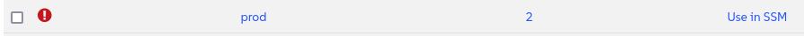

🌌 নিরাপত্তা এবং প্যাচিং (Security and patching)
===================================

<style type="text/css">
  * {
    font-family: suse;
    src: url('https://fonts.google.com/specimen/SUSE');
  }
  .hovereffect {
    border-radius: 25px 25px 25px 25px;
    background: linear-gradient(#30ba78 0 0) var(--hundredpercent, 0) / var(--hundredpercent, 0) no-repeat;
    transition: 0.5s, background-position 0s;
    padding: 5px;
  }
  .hovereffect:hover {
    --hundredpercent: 100%;
    color: white;
    border-radius: 10px 25px 10px 25px;
  }
  .smlmext {
    color: #fe7c3f;
  }
  .smlm {
    color: #fe7c3f;
  }
  .suse {
    color: #30ba78;
  }
  .smls {
    color: #2453ff;
  }
  .smlsext {
    color: #2453ff;
  }
  .companyname {
    color: #008657;
  }
  .liberty {
    color: #efefef;
  }
  .sles {
    color: #90ebcd;
  }
  .highlightcopy {
    color: white;
    font-weight: bold;
    padding: 0 10px;
  }

  .bottoms {
    vertical-align: middle;
    height: 50%;
    width: 50%;
    margin: 0px;
    padding: 0px;
    object-fit: contain;
  }

  img.animatedgif {
    --borderthickness: 5pt;
    --colors: #0000 25%,#30ba78 0;
    padding: 10px;
    background:
      conic-gradient(from 90deg  at top    var(--borderthickness) left  var(--borderthickness),var(--colors)) 0    0,
      conic-gradient(from 180deg at top    var(--borderthickness) right var(--borderthickness),var(--colors)) 100% 0,
      conic-gradient(from 0deg   at bottom var(--borderthickness) left  var(--borderthickness),var(--colors)) 0    100%,
      conic-gradient(from -90deg at bottom var(--borderthickness) right var(--borderthickness),var(--colors)) 100% 100%;
    background-size: 50px 50px;
    background-repeat: no-repeat;
    transition: 1s;
  }

  img.animatedgif:hover {
    background-size: 51% 51%;
  }

  img.logos {
    border-radius: 10px;
  }

</style>


এই ল্যাবে, আমরা আমাদের সবচেয়ে গুরুত্বপূর্ণ দায়িত্বগুলির মধ্যে একটি মোকাবেলা করব: আমাদের সমগ্র ডিজিটাল ফ্লিটের নিরাপত্তা নিশ্চিত করা। আমরা অন্বেষণ করব কিভাবে <b class="smlmext">SUSE Multi-Linux Manager</b> আমাদের একটি বিশ্বমানের এয়ারলাইনের প্রয়োজনীয় গতি এবং নির্ভুলতার সাথে নিরাপত্তার হুমকির প্রতিক্রিয়া জানাতে দেয়।


## <b class="hovereffect">আপনার উদ্দেশ্য:</b>

- OpenSCAP ব্যবহার করে আপনার সিস্টেমে একটি নিরাপত্তা কমপ্লায়েন্স অডিট সম্পাদন করুন।

- প্রাসঙ্গিক নিরাপত্তা দুর্বলতা (security vulnerabilities) দ্বারা প্রভাবিত সিস্টেমগুলি শনাক্ত করুন।

- সমস্ত প্রভাবিত সিস্টেমে প্রয়োজনীয় প্যাচগুলি (patches) একসাথে প্রয়োগ করুন।


ল্যাবের বিবরণ (Lab details)
===========

ব্যবহারকারীর নাম (Username):
```txt
[[ Instruqt-Var key="SMLM_USERNAME" hostname="zbastion" ]]
```

পাসওয়ার্ড (Password):
```txt
[[ Instruqt-Var key="UNIVERSAL_PWD" hostname="zbastion" ]]
```

<b class="smlm">SMLM</b> URL: <a href="[[ Instruqt-Var key="SMLM_URL" hostname="zbastion" ]]">[[ Instruqt-Var key="SMLM_URL" hostname="zbastion" ]]</a>


আপনার সিস্টেম অডিট করুন
==================

আমরা আমাদের প্রোডাকশন সিস্টেমগুলি অডিট করতে চাই যাতে সেগুলি কমপ্লায়েন্ট (compliant) কিনা তা নিশ্চিত করা যায়।

আমরা ইতিমধ্যে যাচাই করেছি যে নিম্নলিখিত প্যাকেজগুলি ইনস্টল করা আছে:

- openscap-utils
- scap-security-guide


প্রোডাকশন গ্রুপ নির্বাচন করুন

- আসুন `Systems` ✈ `System Groups` -এ যাই
- **prod** গ্রুপটি খুঁজুন এবং `Use in SSM` -এ ক্লিক করুন


আমাদের **System Set Manager Overview** পৃষ্ঠায় নির্দেশিত করা হবে, যেমনটি আমরা আগে দেখেছি, এখান থেকে আমরা একসাথে একাধিক সিস্টেমে অ্যাকশন প্রয়োগ করতে পারি।

- `Audit` ট্যাবে যান
- `OpenSCAP` এর অধীনে নিম্নলিখিত বিবরণ দিয়ে ফর্মটি পূরণ করুন, বাকিগুলি ডিফল্ট রাখুন:
  - **Command-line Arguments:** <b class="highlightcopy">--profile xccdf_org.ssgproject.content_profile_stig</b>
  - **Path to XCCDF document:** <b class="highlightcopy">/usr/share/xml/scap/ssg/content/ssg-sle15-ds.xml</b>
- চাপুন


<p style="margin: 1px; padding: 1px; vertical-align: middle; display:inline-block; align:left;">
</p>
<p style="margin: 1px; padding: 1px;vertical-align: middle; display:inline-block; align:left;">

</p> ✈
<p style="margin: 1px; padding: 1px;vertical-align: middle; display:inline-block; align:center;">

</p>


এটিতে কয়েক মিনিট সময় লাগবে।


ফলাফল দেখতে আসুন `Audit` ✈ `OpenSCAP` ✈ `All Scans` -এ যাই


আমরা যদি এই ফলাফলগুলির মধ্যে একটিতে ক্লিক করি তবে আমরা আরও বিস্তারিত ব্রেকডাউন দেখতে পাব।

- **report.html** -এ ক্লিক করে, আপনি ওপেনএসসিএপি (OpenSCAP) দ্বারা জেনারেট করা রিপোর্টের একটি সুন্দর সংস্করণ দেখতে পারেন।


রিপোর্ট করা সমস্যাগুলি নিয়ে চিন্তা করবেন না।


  <div style='align: middle; margin: 15px;'>
    
  </div>

<br/>


দুর্বলতা দ্বারা প্রভাবিত সিস্টেমগুলি শনাক্ত করুন
============================================

আমরা দেখতে চাই কোন সিস্টেমগুলি দুর্বলতা (vulnerabilities) দ্বারা প্রভাবিত।

- এখন, আসুন `Patches` ✈ `Patch List` ✈ `Relevant` -এ নেভিগেট করি

  এখানে আমরা আমাদের সিস্টেমের জন্য উপলব্ধ সমস্ত প্রাসঙ্গিক প্যাচের একটি তালিকা দেখতে পাচ্ছি, আসুন **Security Patches** (নিরাপত্তা প্যাচ) দেখি।

- একটি **Advisory** (উপদেষ্টা) নামে ক্লিক করে, আপনি একটি বিস্তারিত পৃষ্ঠা দেখতে পারেন যা দেখায় যে এটি কোন প্যাকেজ এবং সিস্টেমগুলিকে প্রভাবিত করে, অন্যান্য বিবরণ সহ।

- তালিকার ডানদিকে, **CVEs** কলামটি অফিসিয়াল দুর্বলতা রিপোর্টগুলির সরাসরি লিঙ্ক প্রদান করে।

  আমাদের নিজস্ব প্যাচ তৈরি করাও সম্ভব, তবে আমরা এই ট্র্যাকে এটি কভার করব না, আরও তথ্যের জন্য অনুগ্রহ করে ট্র্যাকের শেষে লিঙ্কগুলি দেখুন।


## <b class="hovereffect">প্রভাবিত সিস্টেম প্যাচ করুন</b>

আমাদের সিস্টেম প্যাচ করা এই ধাপগুলি অনুসরণ করার মতোই সহজ:

- `Systems` ✈ `System Set Manager` -এ যান
- `Patches` ট্যাবে নেভিগেট করুন ✈ ড্রপ-ডাউন তালিকায় **Security Advisory** নির্বাচন করুন, এবং `Show` -এ ক্লিক করুন


- ক্লিক করুন `Select All` ✈ `Apply Patches` ✈ 


  <div style='align: middle; margin: 15px;'>
    
  </div>

<br/>


এটি [[ Instruqt-Var key="COMPANY_NAME" hostname="zbastion" ]] এর জন্য কেন গুরুত্বপূর্ণ?
=================================================================================


- দ্রুত কাজ করতে সক্ষম হওয়ার মাধ্যমে, আমরা এক্সপোজারের সময়সীমা কমিয়ে দিচ্ছি। যখন একটি নতুন দুর্বলতা আবিষ্কৃত হয়, তখন আমাদের এবং যারা এটি কাজে লাগানোর চেষ্টা করছে সেই বিদ্বেষপূর্ণ অভিনেতাদের মধ্যে একটি প্রতিযোগিতা শুরু হয়। একটি জটিল, ম্যানুয়াল প্যাচিং প্রক্রিয়া আমাদের গুরুত্বপূর্ণ সিস্টেমগুলিকে দীর্ঘ সময়ের জন্য উন্মুক্ত রাখে।

- <b class="smlmext">SUSE Multi-Linux Manager</b> আমাদের সমগ্র ফ্লিটের নিরাপত্তা অবস্থার একটি একক, ঐক্যবদ্ধ দৃশ্য প্রদান করে এবং আমাদের একটি ধারাবাহিক, নির্ভরযোগ্য প্রক্রিয়ার মাধ্যমে হুমকিগুলি প্রতিকার করতে দেয়।

- সহজেই বিভিন্ন নিরাপত্তা কাঠামোর (security frameworks) বিপরীতে আমাদের সিস্টেমের কমপ্লায়েন্স চেক করতে সক্ষম হওয়া আমাদের দ্রুত সংশোধনমূলক ব্যবস্থা বাস্তবায়ন করতে এবং কঠোর শিল্প প্রবিধান মেনে চলতে দেয়।


আরও তথ্য
================


* [অডিটিং (Auditing)](https://documentation.suse.com/multi-linux-manager/5.1/en/docs/administration/auditing.html)
* [SUSE সিকিউরিটি (SUSE Security)](https://www.suse.com/support/security/)
* [OpenSCAP এর সাথে সিস্টেম সিকিউরিটি (System Security with OpenSCAP)](https://documentation.suse.com/multi-linux-manager/5.1/en/docs/administration/openscap.html)
* [প্যাচ ম্যানেজ করুন (Manage Patches)](https://documentation.suse.com/multi-linux-manager/5.1/en/docs/administration/patch-management.html)