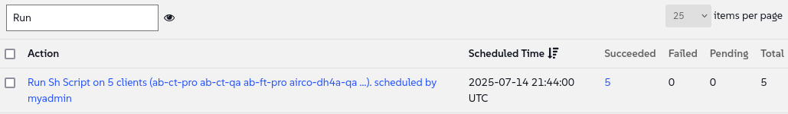

🌌 Verwaltung verschiedener Linux-Distributionen
===================================

<style type="text/css">
  * {
    font-family: suse;
    src: url('https://fonts.google.com/specimen/SUSE');
  }
  .hovereffect {
    border-radius: 25px 25px 25px 25px;
    background: linear-gradient(#30ba78 0 0) var(--hundredpercent, 0) / var(--hundredpercent, 0) no-repeat;
    transition: 0.5s, background-position 0s;
    padding: 5px;
  }
  .hovereffect:hover {
    --hundredpercent: 100%;
    color: white;
    border-radius: 10px 25px 10px 25px;
  }
  .smlmext {
    color: #fe7c3f;
  }
  .smlm {
    color: #fe7c3f;
  }
  .suse {
    color: #30ba78;
  }
  .smls {
    color: #2453ff;
  }
  .smlsext {
    color: #2453ff;
  }
  .companyname {
    color: #008657;
  }
  .liberty {
    color: #efefef;
  }
  .sles {
    color: #90ebcd;
  }

  .highlightcopy {
    color: white;
    font-weight: bold;
    padding: 0 10px;
  }

  .bottoms {
    vertical-align: middle;
    height: 50%;
    width: 50%;
    margin: 0px;
    padding: 0px;
    object-fit: contain;
  }

  img.animatedgif {
    --borderthickness: 5pt;
    --colors: #0000 25%,#30ba78 0;
    padding: 10px;
    background:
      conic-gradient(from 90deg  at top    var(--borderthickness) left  var(--borderthickness),var(--colors)) 0    0,
      conic-gradient(from 180deg at top    var(--borderthickness) right var(--borderthickness),var(--colors)) 100% 0,
      conic-gradient(from 0deg   at bottom var(--borderthickness) left  var(--borderthickness),var(--colors)) 0    100%,
      conic-gradient(from -90deg at bottom var(--borderthickness) right var(--borderthickness),var(--colors)) 100% 100%;
    background-size: 50px 50px;
    background-repeat: no-repeat;
    transition: 1s;
  }

  img.animatedgif:hover {
    background-size: 51% 51%;
  }

  img.logos {
    border-radius: 10px;
  }

</style>


Hier bei [[ Instruqt-Var key="COMPANY_NAME" hostname="zbastion" ]] ist der <b class="smlmext">SUSE Multi-Linux Manager</b> der Schlüssel zur Verwaltung unserer vielfältigen Flotte von Linux-Distributionen und Architekturen über eine zentrale Konsole (Single Pane of Glass). Dies hat uns geholfen, die zusätzlichen Anpassungen zu vermeiden, die unsere Arbeit als Ingenieure früher komplizierter machten, was wiederum die Kosten und den Zeitaufwand für die Wartung und Implementierung unserer Systemrichtlinien erhöhte.

Mit diesem Tool sind wir nicht an einen einzigen Anbieter, eine einzige Architektur oder Automatisierungsplattform gebunden. Wir können frei wählen, was wir für unsere Umgebung benötigen, und sie alle auf die gleiche Weise verwalten. Stellen Sie sich vor, für jeden Flugzeugtyp in unserer Flotte bräuchten wir einen anderen Flugverkehrskontrollturm mit eigener Sprache und eigenen Verfahren. Die operative Komplexität wäre unüberschaubar und die Kosten wären unerschwinglich.


Wir alle wissen, dass ein bestimmtes Flugzeugmodell besser für eine bestimmte Route ist; einen Jumbo-Jet für einen halbstündigen Flug zu fliegen, ist nicht kosteneffizient. Dasselbe gilt für unsere Linux-Distributionen. Während die eigenen Distributionen von SUSE ausgezeichnet sind, haben einige unserer Anwendungen spezifische Anforderungen. <b class="smlm">SMLM</b> stellt sicher, dass wir nie eingeschränkt sind (Vendor Lock-in) und immer die beste Lösung für die jeweilige Aufgabe integrieren können.


## <b class="hovereffect">Ihre Ziele:</b>

- Ein Ubuntu 24.04 LTS System onboarden (integrieren), ein spezialisiertes System, das von unserem Marketingteam benötigt wird.

- Demonstrieren, wie wir dieses neue, andere System mit denselben Tools und Patching-Verfahren verwalten wie den Rest unserer Flotte.


Lab details
===========

Benutzername (Username):
```txt
[[ Instruqt-Var key="SMLM_USERNAME" hostname="zbastion" ]]
```

Passwort (Password):
```txt
[[ Instruqt-Var key="UNIVERSAL_PWD" hostname="zbastion" ]]
```

<b class="smlm">SMLM</b> URL: <a href="[[ Instruqt-Var key="SMLM_URL" hostname="zbastion" ]]">[[ Instruqt-Var key="SMLM_URL" hostname="zbastion" ]]</a>


Ubuntu Onboarding
=================

Eine neue Serviceanfrage ist von unserer Marketingabteilung eingegangen. Ihre Grafikdesigner verlassen sich auf eine bestimmte Kreativ-Suite, die nur auf Ubuntu unterstützt wird. Wir werden ihr System onboarden, damit wir es verwalten und sicherstellen können, dass es unsere Sicherheits- und Compliance-Standards erfüllt, genauso wie wir es mit den anderen tun.

Lassen Sie uns beginnen.
<br/>

- Greifen Sie über den Tab [button label="Ubuntu 2404 LTS" variant="success"](tab-1) auf das Systemterminal zu.

  Bevor wir Änderungen vornehmen, lassen Sie uns prüfen, woher es die Pakete bezieht:

```bash,run
grep -v '^#\|^Types:\|Trusted:\|Architectures:' /etc/apt/sources.list.d/*
```

Diese Workstation bezieht Software direkt aus öffentlichen Ubuntu-Repositories. Dies stellt zwei Probleme dar: Erstens haben wir keine Kontrolle über die angewendeten Patches, was ein Sicherheitsrisiko darstellt. Zweitens, wie das Marketingteam berichtete, können diese Workstations jedes Mal, wenn sie Updates abrufen, die Internetverbindung des Büros verlangsamen, was zu Frustration bei anderen Mitarbeitern führt.


Lassen Sie uns dieses System unter unsere Verwaltung bringen. Dies wird beide Probleme lösen, indem wir es für alle Softwareanforderungen mit unserer internen <b class="smlmext">SUSE Multi-Linux Manager</b> Instanz verbinden.

Wir werden dazu die [button label="web UI" variant="success"](tab-0) verwenden:

- Unter `Home` ✈ `Overview`, klicken wir auf `Register Systems`

- Füllen Sie die folgenden Details aus:

  - **Host:**

  ```txt
  ubuntu2404lts
  ```

  - **User:** (Benutzer)

  ```txt
  root
  ```

  - **Password:** (Passwort)

  ```txt
  [[ Instruqt-Var key="UNIVERSAL_PWD" hostname="zbastion" ]]
  ```

  - **Activation Key:** (Aktivierungsschlüssel)   <b class="highlightcopy">1-ubuntu2404</b>

- Lassen Sie den Rest so, wie er ist, und klicken Sie auf


- Der Registrierungsprozess kann einige Minuten dauern. Gehen wir zum [button label="terminal" variant="success"](tab-1) und führen den ersten Befehl noch einmal aus, um zu sehen, was sich geändert hat:


```bash,run
echo 'Waiting for the registration to complete' ;while [[ ! -f /etc/apt/sources.list.d/susemanager_bootstrap.sources ]] || [[ ! -f /etc/apt/sources.list.d/susemanager:channels.sources ]]; do echo -n '.'; sleep 5; done ; sleep 60; grep -v '^#\|^Types:\|Trusted:\|Architectures:' /etc/apt/sources.list.d/*
```


Wir können sehen, dass neue Dateien erschienen sind:

**/etc/apt/sources.list.d/susemanager:***

Sie verweisen das System auf unsere zentral verwalteten und kontrollierten Kanäle im <b class="smlm">SMLM</b>.


Wir können auch sehen, dass die Originaldatei, **/etc/apt/sources.list.d/ubuntu.sources**, geändert wurde, um alle öffentlichen Repositories zu deaktivieren, aber nicht eliminiert wurde. Dies würde es uns ermöglichen, bei Bedarf einfach ein Rollback durchzuführen.


> [!NOTE]
> Die Verwendung von root via SSH mit Passwortauthentifizierung für die Registrierung dient nur zu Demonstrationszwecken und wird nicht für die Produktion empfohlen.


> [!NOTE]
> Standardmäßig müssen wir die Registrierung jedes Systems über die UI oder per Befehlszeile < salt-key -A -y > genehmigen. Hier wurde <b class="smlm">SMLM</b> so konfiguriert, dass es automatisch genehmigt wird.


  <div style='align: middle; margin: 15px;'>
    
  </div>

<br/>


Wechseln wir nun zum [button label="SMLM UI" variant="success"](tab-0) Tab


- Wir navigieren zu `Systems` ✈ `System List` ✈ `All`

  Wir können das System sehen, das wir gerade registriert haben: `Ubuntu2404lts`. Beachten Sie, dass es standardmäßig unter dem Hostnamen registriert wird.

  Klicken wir darauf. Wir gelangen direkt zu `Details` - `Overview`, wo wir unter anderem folgende Informationen sehen können:

  - Den Systemstatus.
  - Alle Informationen wie Hostname, IP-Adresse, Art der Virtualisierung, verwendeter Kernel und installierte Produkte.
  - Die Kanäle, die es abonniert hat.

  <div style='align: middle; margin: 15px;'>
    
  </div>


<br/>

Verwaltung mehrerer Linux-Distributionen
=====================================


Wie bereits erwähnt, verwenden wir bei <b class="companyname">[[ Instruqt-Var key="COMPANY_NAME" hostname="zbastion" ]]</b> verschiedene Linux-Distributionen, genauso wie wir verschiedene Flugzeugmodelle und Unternehmen nutzen. Dies hilft uns, der Konkurrenz einen Schritt voraus zu sein, indem wir für jeden unserer Bedürfnisse das am besten geeignete Produkt verwenden.

Mit <b class="smlmext">SUSE Multi-Linux Manager</b> können wir sie alle mit denselben Verfahren, denselben Zeitplänen usw. verwalten, wobei wir dieselbe Schnittstelle und dieselben Mechanismen verwenden.

Im Folgenden werden wir untersuchen, wie Sie verschiedene Aufgaben auf Ihren Systemen ausführen können, wobei wir demselben Prozess folgen, unabhängig davon, welches Betriebssystem auf unseren Systemen läuft, ohne unnötige Anpassungen vornehmen zu müssen.


## <b class="hovereffect">Zusätzliche Informationen hinzufügen</b>


Fahren wir mit dem System fort, das wir gerade registriert haben. Wir werden einige Einstellungen und Informationen hinzufügen:

- Klicken wir auf `Properties`, wo wir zusätzliche Informationen über das System hinzufügen und einige Einstellungen ändern werden.


  - Automatische Anwendung von Patches aktivieren (Enable Automatic application of patches):

  

    Dies wird das System automatisch patchen, wenn relevante Patches vorhanden sind.


  - Fügen Sie die folgenden Details für das System hinzu:


| Feld | Inhalt                                                  |
| ---: | :-----                                                    |
| **Description** | <b class="highlightcopy">Multimedia workstation for graphics designers.</b> |
| **Facility Address** | <b class="highlightcopy">Candy eye street, 1</b> |
| **City** | <b class="highlightcopy">Aeolia</b> |
| **Building** | <b class="highlightcopy">Belem Tower 4</b> |
| **Room** | <b class="highlightcopy">Sierra nevada</b> |


- Schauen wir uns an, auf welcher Hardware es läuft:

  - Klicken Sie auf `Details` ✈ `Hardware`


<br/>

> [!NOTE]
> All dies kann über die API automatisiert werden.

<br/>

Nun werden wir dem System mithilfe benutzerdefinierter Schlüssel einige zusätzliche Informationen hinzufügen. Diese Informationen können später in Ihren Automatisierungsskripten einfach genutzt werden.


- Klicken Sie auf `Details` ✈ `Custom Info`


- Klicken Sie auf `application` und füllen Sie den **value** (Wert) mit Folgendem aus:

```text
Logo Wings designer pro
```


<br/>

> [!NOTE]
> Wir haben den benutzerdefinierten Schlüssel **application** bereits für Sie erstellt. Wenn Sie Ihre eigenen Schlüssel erstellen möchten, gehen Sie einfach zu: `Systems` ✈ `Custom System Info` ✈ `Create key`

<br/><br/>

Gehen wir zurück zur Systems-Liste

`Systems` ✈ `System List` ✈ `All`


Klicken wir auf eines der Systeme und gehen zu `Details` ✈ `Custom Info`.

Wir haben bereits jedes System mit einem Wert befüllt,

<br/>

Gehen Sie nun zu `Details` ✈ `Overview` und beachten Sie **Installed Products** und **Subscribed Channels**. Diese unterscheiden sich von denen in Ihrem Ubuntu-System, da sie ein anderes Betriebssystem ausführen.


  <div style='align: middle; margin: 15px;'>
    
  </div>

<br/>


## <b class="hovereffect">Befehle auf mehreren Systemen gleichzeitig ausführen</b>


Lassen Sie uns etwas auf allen Systemen tun, die wir haben. Gehen Sie zurück zu `Systems` ✈ `System List` ✈ `All` und wählen Sie alle aus:


Beachten Sie die Spalte **Base Channel**; wir haben Systeme, auf denen drei verschiedene Betriebssysteme laufen.

<br/>

Nachdem wir alle Systeme ausgewählt haben, die wir bedienen wollen, führen wir eine Gruppenaktion durch:

`Systems` ✈ `System Set Manager`

Führen wir einen Befehl auf allen aus. Dazu gehen wir zu:

`Misc` ✈ `Remote Command`

Füllen Sie dann die folgenden Details aus und lassen Sie den Rest auf den Standardwerten:


Script:

```bash,run
cat /etc/os-release
```

Ändern Sie den Zeitplan (Schedule) nicht, wir wollen, dass er so schnell wie möglich ausgeführt wird. Klicken Sie auf:


<br/>


<br/><br/>

Sie werden oben einen blauen Hinweis sehen, der anzeigt, dass die Aufgabe geplant wurde.

Sehen wir uns die Ergebnisse an. Dazu gehen wir zu:

`Schedule` ✈ `Completed Actions`

Wir werden eine Liste von Aktionen sehen. Geben Sie im Feld **Filter by Action** ein:

```text
Run
```
Klicken Sie auf den obersten Eintrag, der in der Liste erscheint. Er sollte ähnlich aussehen wie dieser:




Dort können wir zu **Completed Systems** gehen und das Ergebnis überprüfen, indem wir auf den Systemnamen klicken.


  <div style='align: middle; margin: 15px;'>
    
  </div>

<br/>


<br/><br/>

Damit schließen wir diesen Teil ab. Wir werden im Laufe des Workshops weitere Beispiele sehen, wie wir mehrere Linux-Systeme verwalten können.


Warum ist das wichtig für [[ Instruqt-Var key="COMPANY_NAME" hostname="zbastion" ]]?
=================================================================================

- Kein Vendor Lock-in (Anbieterbindung), behalten Sie die Wahlfreiheit und Flexibilität, um schnell auf sich ändernde Märkte zu reagieren.

- Vereinfachen und Zeit sparen, indem zusätzliche Arbeit bei Anpassungen vermieden wird.

- Eine einzige UI zur Verwaltung von allem reduziert die Komplexität und macht zukünftiges Troubleshooting, Skalierung, Patching und Automatisierung viel agiler und weniger zeitaufwändig.


Mehr Informationen
================

Für eine Liste der unterstützten Distributionen besuchen Sie bitte:

[SMLM - Supported Clients and Features](https://documentation.suse.com/multi-linux-manager/5.1/en/docs/client-configuration/supported-features.html)