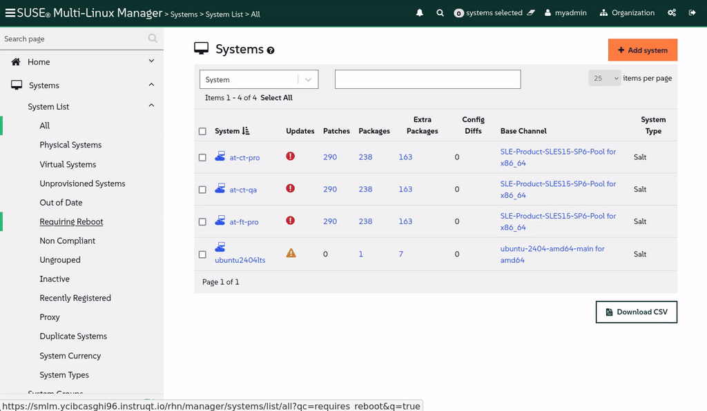

🌌 Gestion de différentes distributions Linux
===================================

<style type="text/css">
  * {
    font-family: suse;
    src: url('https://fonts.google.com/specimen/SUSE');
  }
  .hovereffect {
    border-radius: 25px 25px 25px 25px;
    background: linear-gradient(#30ba78 0 0) var(--hundredpercent, 0) / var(--hundredpercent, 0) no-repeat;
    transition: 0.5s, background-position 0s;
    padding: 5px;
  }
  .hovereffect:hover {
    --hundredpercent: 100%;
    color: white;
    border-radius: 10px 25px 10px 25px;
  }
  .smlmext {
    color: #fe7c3f;
  }
  .smlm {
    color: #fe7c3f;
  }
  .suse {
    color: #30ba78;
  }
  .smls {
    color: #2453ff;
  }
  .smlsext {
    color: #2453ff;
  }
  .companyname {
    color: #008657;
  }
  .liberty {
    color: #efefef;
  }
  .sles {
    color: #90ebcd;
  }

  .highlightcopy {
    color: white;
    font-weight: bold;
    padding: 0 10px;
  }

  .bottoms {
    vertical-align: middle;
    height: 50%;
    width: 50%;
    margin: 0px;
    padding: 0px;
    object-fit: contain;
  }

  img.animatedgif {
    --borderthickness: 5pt;
    --colors: #0000 25%,#30ba78 0;
    padding: 10px;
    background:
      conic-gradient(from 90deg  at top    var(--borderthickness) left  var(--borderthickness),var(--colors)) 0    0,
      conic-gradient(from 180deg at top    var(--borderthickness) right var(--borderthickness),var(--colors)) 100% 0,
      conic-gradient(from 0deg   at bottom var(--borderthickness) left  var(--borderthickness),var(--colors)) 0    100%,
      conic-gradient(from -90deg at bottom var(--borderthickness) right var(--borderthickness),var(--colors)) 100% 100%;
    background-size: 50px 50px;
    background-repeat: no-repeat;
    transition: 1s;
  }

  img.animatedgif:hover {
    background-size: 51% 51%;
  }

  img.logos {
    border-radius: 10px;
  }

</style>


Ici chez [[ Instruqt-Var key="COMPANY_NAME" hostname="zbastion" ]], <b class="smlmext">SUSE Multi-Linux Manager</b> est la clé pour gérer notre flotte diverse de distributions Linux et d'architectures depuis un panneau de verre unique (single pane of glass). Cela nous a aidés à éviter les personnalisations supplémentaires qui compliquaient notre travail en tant qu'ingénieurs, ce qui augmentait par conséquent le coût et le temps nécessaires pour maintenir et implémenter nos politiques système.

Avec cet outil, nous ne sommes pas enfermés dans un seul fournisseur, une seule architecture ou une seule plateforme d'automatisation. Nous sommes libres de choisir ce dont nous avons besoin pour notre environnement et de tous les gérer de la même manière. Imaginez si pour chaque type d'avion dans notre flotte, nous avions besoin d'une tour de contrôle du trafic aérien différente avec sa propre langue et ses propres procédures. La complexité opérationnelle serait ingérable et les coûts seraient prohibitifs.

Nous savons tous qu'un certain modèle d'avion est meilleur pour une route spécifique ; faire voler un gros porteur pour un vol d'une demi-heure n'est pas rentable. Il en va de même pour nos distributions Linux. Bien que les propres distributions de SUSE soient excellentes, certaines de nos applications ont des exigences spécifiques. <b class="smlm">SMLM</b> garantit que nous ne sommes jamais enfermés (vendor lock-in) et que nous pouvons toujours intégrer la meilleure solution pour la tâche à accomplir.


## <b class="hovereffect">Vos Objectifs :</b>

- Intégrer (Onboard) un système Ubuntu 24.04 LTS, un système spécialisé requis par notre équipe marketing.

- Démontrer comment nous gérons ce nouveau système différent en utilisant les mêmes outils et procédures d'application de correctifs que le reste de notre flotte.


Détails du laboratoire
===========

Nom d'utilisateur (Username) :
```txt
[[ Instruqt-Var key="SMLM_USERNAME" hostname="zbastion" ]]
```

Mot de passe (Password) :
```txt
[[ Instruqt-Var key="UNIVERSAL_PWD" hostname="zbastion" ]]
```

URL <b class="smlm">SMLM</b> : <a href="[[ Instruqt-Var key="SMLM_URL" hostname="zbastion" ]]">[[ Instruqt-Var key="SMLM_URL" hostname="zbastion" ]]</a>


Intégration d'Ubuntu
=================

Une nouvelle demande de service est arrivée de notre département marketing. Leurs graphistes dépendent d'une suite créative spécifique qui n'est supportée que sur Ubuntu. Nous allons intégrer leur système afin de pouvoir le gérer et nous assurer qu'il répond à nos normes de sécurité et de conformité, de la même manière que nous le faisons avec les autres.

Commençons.
<br/>

- Accédez au terminal du système depuis l'onglet [button label="Ubuntu 2404 LTS" variant="success"](tab-1)

  Avant d'effectuer des modifications, vérifions d'où il tire les paquets :

```bash,run
grep -v '^#\|^Types:\|Trusted:\|Architectures:' /etc/apt/sources.list.d/*
```

Cette station de travail récupère les logiciels directement depuis les dépôts publics Ubuntu. Cela présente deux problèmes : premièrement, nous n'avons aucun contrôle sur les correctifs appliqués, ce qui est un problème de sécurité. Deuxièmement, comme l'a rapporté l'équipe marketing, chaque fois que ces stations de travail récupèrent des mises à jour, elles peuvent ralentir la connexion internet du bureau, causant de la frustration pour les autres employés.


Plaçons ce système sous notre gestion. Cela résoudra les deux problèmes en le connectant à notre instance interne <b class="smlmext">SUSE Multi-Linux Manager</b> pour tous les besoins logiciels.

Nous allons utiliser l'[button label="web UI" variant="success"](tab-0) pour ce faire :

- Sous `Home` ✈ `Overview`, cliquons sur `Register Systems`

- Remplissez les détails suivants :

  - **Host :**

  ```txt
  ubuntu2404lts
  ```

  - **User :** (Utilisateur)

  ```txt
  root
  ```

  - **Password :** (Mot de passe)

  ```txt
  [[ Instruqt-Var key="UNIVERSAL_PWD" hostname="zbastion" ]]
  ```

  - **Activation Key :** (Clé d'activation)   <b class="highlightcopy">1-ubuntu2404</b>

- Laissez le reste tel quel et cliquez sur


- Le processus d'enregistrement peut prendre quelques minutes, allons sur le [button label="terminal" variant="success"](tab-1) et exécutons la première commande une fois de plus pour voir ce qui a changé :


```bash,run
echo 'Waiting for the registration to complete' ;while [[ ! -f /etc/apt/sources.list.d/susemanager_bootstrap.sources ]] || [[ ! -f /etc/apt/sources.list.d/susemanager:channels.sources ]]; do echo -n '.'; sleep 5; done ; sleep 60; grep -v '^#\|^Types:\|Trusted:\|Architectures:' /etc/apt/sources.list.d/*
```


Nous pouvons voir que de nouveaux fichiers sont apparus :

**/etc/apt/sources.list.d/susemanager:***

Ils pointent le système vers nos canaux gérés et contrôlés centralement dans <b class="smlm">SMLM</b>.


Nous pouvons également voir que le fichier original, **/etc/apt/sources.list.d/ubuntu.sources**, a été modifié pour désactiver tous les dépôts publics mais n'a pas été éliminé, cela nous permettrait de revenir en arrière facilement si nous en avions besoin.


> [!NOTE]
> Utiliser root via SSH avec authentification par mot de passe pour l'enregistrement est juste à des fins de démonstration et n'est pas recommandé pour la production.


> [!NOTE]
> Par défaut, nous devons approuver l'enregistrement de chaque système via l'UI ou via la ligne de commande < salt-key -A -y >, ici <b class="smlm">SMLM</b> a été configuré pour approuver automatiquement.


  <div style='align: middle; margin: 15px;'>
    
  </div>

<br/>


Maintenant, passons à l'onglet [button label="SMLM UI" variant="success"](tab-0)


- Nous naviguons vers `Systems` ✈ `System List` ✈ `All`

  Nous pouvons voir le système que nous venons d'enregistrer `Ubuntu2404lts`, notez que par défaut il sera enregistré sous le nom d'hôte (hostname).

  Cliquons dessus, nous irons directement à `Details` - `Overview` où nous pouvons voir entre autres informations :

  - Le statut du système.
  - Toutes les informations telles que le nom d'hôte, l'adresse IP, le type de virtualisation, le noyau utilisé et les produits installés.
  - Les canaux auxquels il est abonné.

  <div style='align: middle; margin: 15px;'>
    
  </div>


<br/>

Gérer plusieurs distributions Linux
=====================================


Comme mentionné précédemment, chez <b class="companyname">[[ Instruqt-Var key="COMPANY_NAME" hostname="zbastion" ]]</b> nous utilisons différentes distributions Linux, tout comme nous utilisons différents modèles d'avions et compagnies. Cela nous aide à garder une longueur d'avance sur la concurrence en utilisant le produit le plus adapté à chacun de nos besoins.

Avec <b class="smlmext">SUSE Multi-Linux Manager</b>, nous pouvons toutes les gérer avec les mêmes procédures, les mêmes horaires, etc., en utilisant la même interface et les mêmes mécanismes.

Ci-dessous, nous explorerons comment effectuer différentes tâches sur vos systèmes, en suivant le même processus indépendamment de l'OS que nos systèmes exécutent, sans avoir à créer de personnalisations inutiles.


## <b class="hovereffect">Ajouter des informations supplémentaires</b>


Continuons avec le système que nous venons d'enregistrer, nous allons y ajouter quelques paramètres et informations :

- Cliquons sur `Properties`, où nous ajouterons des informations supplémentaires sur le système et modifierons certains paramètres.


  - Activer l'application automatique des correctifs (Enable Automatic application of patches) :

  

    Cela corrigera automatiquement le système lorsqu'il y a des correctifs pertinents.


  - Ajoutez les détails suivants pour le système :


| Champ | Contenu                                                  |
| ---: | :-----                                                    |
| **Description** | <b class="highlightcopy">Multimedia workstation for graphics designers.</b> |
| **Facility Address** | <b class="highlightcopy">Candy eye street, 1</b> |
| **City** | <b class="highlightcopy">Aeolia</b> |
| **Building** | <b class="highlightcopy">Belem Tower 4</b> |
| **Room** | <b class="highlightcopy">Sierra nevada</b> |


- Regardons sur quel matériel il fonctionne :

  - Cliquez sur `Details` ✈ `Hardware`


<br/>

> [!NOTE]
> Tout cela peut être automatisé via l'API.

<br/>

Maintenant, nous allons ajouter des informations supplémentaires au système en utilisant des clés personnalisées, ces informations peuvent être facilement consommées dans vos scripts d'automatisation plus tard.


- Cliquez sur `Details` ✈ `Custom Info`


- Cliquez sur `application` et remplissez **value** (valeur) avec ce qui suit :

```text
Logo Wings designer pro
```


<br/>

> [!NOTE]
> Nous avons déjà créé la clé personnalisée **application** pour vous, si vous souhaitez créer vos propres clés, c'est aussi simple que d'aller dans : `Systems` ✈ `Custom System Info` ✈ `Create key`

<br/><br/>

Retournons à la liste Systems

`Systems` ✈ `System List` ✈ `All`


Cliquons sur n'importe lequel des systèmes et allons dans `Details` ✈ `Custom Info`.

Nous avons déjà peuplé chaque système avec une valeur,

<br/>

Maintenant, allez dans `Details` ✈ `Overview` et remarquez **Installed Products** et **Subscribed Channels**, ceux-ci sont différents de ceux de votre système Ubuntu car ils exécutent un système d'exploitation différent.


  <div style='align: middle; margin: 15px;'>
    
  </div>

<br/>


## <b class="hovereffect">Exécuter des commandes sur plusieurs systèmes à la fois</b>


Faisons quelque chose sur tous les systèmes que nous avons, retournez à `Systems` ✈ `System List` ✈ `All` et sélectionnez tout :


Remarquez la colonne **Base Channel**, nous avons des systèmes exécutant trois OS différents.

<br/>

Ayant sélectionné tous les systèmes que nous voulons opérer, allons effectuer une action de groupe :

`Systems` ✈ `System Set Manager`

Exécutons une commande sur chacun d'eux, pour cela nous pouvons aller dans :

`Misc` ✈ `Remote Command`

puis remplissez les détails suivants et laissez le reste avec les valeurs par défaut :


Script :

```bash,run
cat /etc/os-release
```

Ne modifiez pas le programme (schedule), nous voulons qu'il s'exécute dès que possible, cliquez sur :


<br/>


<br/><br/>

Vous verrez une notification bleue en haut indiquant que la tâche a été planifiée.

Allons voir les résultats, pour cela nous irons dans :

`Schedule` ✈ `Completed Actions`

Nous verrons une liste d'actions, dans le champ **Filter by Action** tapez :

```text
Run
```
Cliquez sur l'entrée supérieure qui apparaît dans la liste, elle devrait être similaire à ceci :


Là, nous pouvons aller dans **Completed Systems** et examiner le résultat en cliquant sur le nom du système.


  <div style='align: middle; margin: 15px;'>
    
  </div>

<br/>


<br/><br/>

Avec ceci, nous terminons cette partie, nous verrons plus d'exemples de la façon dont nous pouvons gérer plusieurs systèmes Linux au cours de l'atelier.


Pourquoi est-ce important pour [[ Instruqt-Var key="COMPANY_NAME" hostname="zbastion" ]] ?
=================================================================================

- Pas de verrouillage fournisseur (vendor lock-in), gardez la liberté de choix et la flexibilité pour réagir rapidement aux marchés changeants.

- Simplifiez et gagnez du temps en évitant le travail supplémentaire sur les personnalisations.

- Une UI unique pour tout gérer réduit la complexité et rendra le dépannage futur, la mise à l'échelle, l'application de correctifs et l'automatisation beaucoup plus agiles et moins chronophages.


Plus d'informations
================

Pour une liste des distributions supportées, veuillez visiter :

[SMLM - Supported Clients and Features](https://documentation.suse.com/multi-linux-manager/5.1/en/docs/client-configuration/supported-features.html)