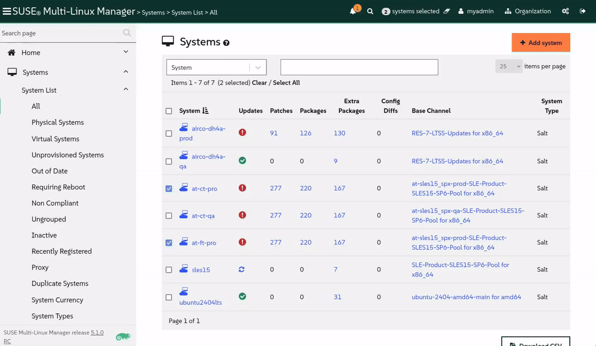
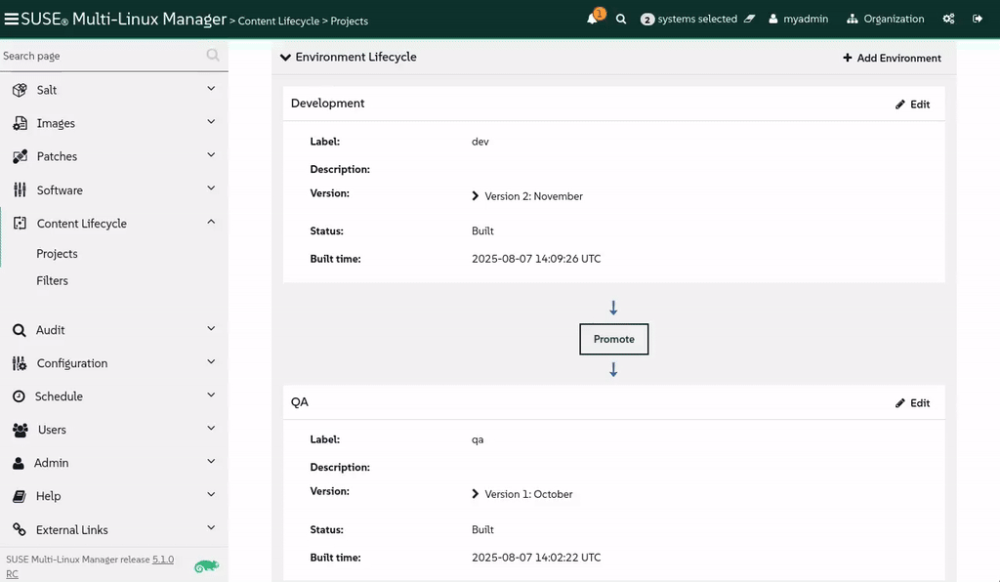

🌌 Gestion du cycle de vie
===================================

<style type="text/css">
  * {
    font-family: suse;
    src: url('https://fonts.google.com/specimen/SUSE');
  }
  .hovereffect {
    border-radius: 25px 25px 25px 25px;
    background: linear-gradient(#30ba78 0 0) var(--hundredpercent, 0) / var(--hundredpercent, 0) no-repeat;
    transition: 0.5s, background-position 0s;
    padding: 5px;
  }
  .hovereffect:hover {
    --hundredpercent: 100%;
    color: white;
    border-radius: 10px 25px 10px 25px;
  }
  .smlmext {
    color: #fe7c3f;
  }
  .smlm {
    color: #fe7c3f;
  }
  .suse {
    color: #30ba78;
  }
  .smls {
    color: #2453ff;
  }
  .smlsext {
    color: #2453ff;
  }
  .companyname {
    color: #008657;
  }
  .liberty {
    color: #efefef;
  }
  .sles {
    color: #90ebcd;
  }
  .highlightcopy {
    color: white;
    font-weight: bold;
    padding: 0 10px;
  }

  .bottoms {
    vertical-align: middle;
    height: 50%;
    width: 50%;
    margin: 0px;
    padding: 0px;
    object-fit: contain;
  }

  img.animatedgif {
    --borderthickness: 5pt;
    --colors: #0000 25%,#30ba78 0;
    padding: 10px;
    background:
      conic-gradient(from 90deg  at top    var(--borderthickness) left  var(--borderthickness),var(--colors)) 0    0,
      conic-gradient(from 180deg at top    var(--borderthickness) right var(--borderthickness),var(--colors)) 100% 0,
      conic-gradient(from 0deg   at bottom var(--borderthickness) left  var(--borderthickness),var(--colors)) 0    100%,
      conic-gradient(from -90deg at bottom var(--borderthickness) right var(--borderthickness),var(--colors)) 100% 100%;
    background-size: 50px 50px;
    background-repeat: no-repeat;
    transition: 1s;
  }

  img.animatedgif:hover {
    background-size: 51% 51%;
  }

  img.logos {
    border-radius: 10px;
  }

</style>


Dans cette partie, nous passerons des tâches de maintenance individuelles à l'établissement d'un processus certifié à l'échelle de la flotte pour gérer les changements. Nous explorerons comment la Gestion du cycle de vie du contenu (Content Lifecycle Management) dans <b class="smlmext">SUSE Multi-Linux Manager</b> fournit la structure et la sécurité que notre compagnie aérienne exige.


Chez [[ Instruqt-Var key="COMPANY_NAME" hostname="zbastion" ]], une nouvelle pièce n'est pas installée sur un avion de ligne dès son arrivée du fabricant. Elle passe par un processus de certification rigoureux.

D'abord, elle est examinée et testée dans un atelier contrôlé (**Développement**). Ensuite, elle est installée sur un avion de test non commercial et soumise à des tests au sol et en vol exténuants (**Assurance Qualité - QA**). Ce n'est qu'après avoir passé tous les contrôles imaginables qu'elle est certifiée pour l'installation sur notre flotte active (**Production**).


Cette approche méthodique et par étapes empêche un seul composant défectueux de clouer un avion au sol, assurant la sécurité de nos passagers et la fiabilité de nos opérations. Nous appliquons exactement la même philosophie à nos systèmes informatiques. Une mise à niveau logicielle ou une nouvelle application est un "composant" qui, s'il est défectueux, pourrait paralyser nos opérations numériques. La Gestion du cycle de vie du contenu est notre processus de certification officiel pour tous les changements logiciels.


## <b class="hovereffect">Vos Objectifs :</b>

- Construire un Projet de Cycle de Vie du Contenu (Content Lifecycle Project).

- Utiliser le projet pour gérer et certifier les mises à jour logicielles pour nos systèmes.


Détails du laboratoire (Lab details)
===========

Nom d'utilisateur (Username) :
```txt
[[ Instruqt-Var key="SMLM_USERNAME" hostname="zbastion" ]]
```

Mot de passe (Password) :
```txt
[[ Instruqt-Var key="UNIVERSAL_PWD" hostname="zbastion" ]]
```

URL <b class="smlm">SMLM</b> : <a href="[[ Instruqt-Var key="SMLM_URL" hostname="zbastion" ]]">[[ Instruqt-Var key="SMLM_URL" hostname="zbastion" ]]</a>


Construire notre voie de certification logicielle
==============================================

Dans cet exercice, nous allons créer un Projet de Cycle de Vie du Contenido pour contrôler le flux des mises à jour logicielles. Cela garantit qu'un correctif est testé de manière approfondie avant d'atteindre nos serveurs de production critiques.

<br/>

Notre objectif est de construire un pipeline `Dev ✈ QA ✈ Prod`.

1.  **Développement (Dev) :** L'atelier initial. Tous les nouveaux correctifs et paquets arrivent ici en premier.
2.  **Assurance Qualité (QA) :** Le terrain d'essai. Nous promouvrons une version spécifique du contenu de Dev vers QA pour que nos équipes de test la valident.
3.  **Production (Prod) :** La flotte active. Seul l'ensemble de correctifs approuvé et certifié par QA est promu en Production, où il peut être appliqué en toute sécurité à nos systèmes en direct.


<br/>

## <b class="hovereffect">Créer le projet</b>

- Naviguez vers `Content Lifecycle` ✈ `Projects` et cliquez sur 

- Remplissez les détails du projet :

- **Project Name** (Nom du projet) :

```txt
Airtrain SLES15 SPx
```

- **Project Label** (Étiquette du projet) :

```txt
at-sles15_spx
```

- **Project Description** (Description du projet) :

```txt
Certified software channel for Airtrain SLES 15 systems.
```


- Cliquez sur 

Maintenant, peuplons-le, cliquez sur `Attach/Detach Sources`


- Sur **New Base Channel**, sélectionnez <b class="sles">SLE-Product-SLES15-SP6-Pool for x86_64</b> et cliquez sur 

<br/>

## <b class="hovereffect">Créer l'environnement Dev</b>

Créer le cycle de vie de l'environnement de Développement

- Cliquez sur `Add Environment`


- Remplissez avec les informations suivantes :
  * **Name :** <b class="highlightcopy">Development</b>
  * **Label :** <b class="highlightcopy">dev</b>

- Cliquez sur 

<br/>

## <b class="hovereffect">Créer l'environnement QA</b>

Créer le cycle de vie de l'environnement d'Assurance Qualité

- Cliquez sur `Add Environment`

- Remplissez avec les informations suivantes :
  * **Name :** <b class="highlightcopy">QA</b>
  * **Label :** <b class="highlightcopy">qa</b>

- Cliquez sur 

<br/>

## <b class="hovereffect">Créer l'environnement Prod</b>

Créer le cycle de vie de l'environnement de Production

- Cliquez sur `Add Environment`

- Remplissez avec les informations suivantes :
  * **Name :** <b class="highlightcopy">Production</b>
  * **Label :** <b class="highlightcopy">prod</b>

- Cliquez sur 

<br/>

## <b class="hovereffect">Peupler (Populate)</b>

Maintenant que nous avons les trois environnements, peuplons-les avec du contenu.

Nous n'utiliserons pas de filtre dans ce cas car <b class="sles">SLES</b> fournit déjà des versions de paquets stables.

La cadence de test de [[ Instruqt-Var key="COMPANY_NAME" hostname="zbastion" ]] est actuellement d'un mois, nous nommerons donc cette build d'après le mois en cours, Octobre.

- Cliquez sur 

- Dans **Version Message** tapez :

```txt
October
```


- Cliquez sur `Build`

> [!NOTE]
> Ce processus peut prendre quelques minutes, vous verrez des étapes comme 'cloning' (clonage), mais vous serez peut-être soulagé de savoir que cela ne nécessite pas beaucoup de stockage. Le processus de clonage s'applique uniquement aux points d'index des paquets, pas aux paquets réels eux-mêmes.


<br/>

## <b class="hovereffect">Promouvoir le contenu</b>

Maintenant, promouvons le contenu vers les étapes suivantes.

- Cliquez sur le bouton `Promote` entre Development et QA
- Un autre écran avec le titre **Promote version 1 into QA** apparaîtra, cliquez simplement sur `Promote` à nouveau.

Répétez la même étape pour Production.


  <div style='align: middle; margin: 15px;'>
    
  </div>

<br/>

Mettre à niveau nos systèmes.
====================

Maintenant, essayons de voir comment cela fonctionne.

Nous allons :
- ajouter certains de nos systèmes au nouvel environnement.
- Créer une nouvelle version du contenu.
- Promouvoir la nouvelle version et mettre à jour les systèmes.

<br/>

## <b class="hovereffect">Ajouter des systèmes</b>

Allons dans `Systems` ✈ `System List` ✈ `All`

- Cliquez sur le système **at-ct-qa**
- Allez dans `Software` ✈ `Software Channels`
- Sur **Custom Channels**, cochez la case pour le canal **at-sles15_spx-qa-...** et cliquez sur 
- Cliquez sur 


Retournez à `Systems` ✈ `System List` ✈ `All`

- Filtrez par :

```txt
at-
```

- Sélectionnez tous les systèmes qui se terminent par **-pro**
- Allez dans `Systems` ✈ `System Set Manager`
- Allez dans `Channels`
- Sur **Custom Channels**, cochez la case pour le canal **at-sles15_spx-prod-...** et cliquez sur 
- Cliquez sur 'include recommended' (inclure recommandé) pour vous abonner à tous les canaux recommandés :

<p style="margin: 1px; padding: 1px; vertical-align: middle; display:inline-block; align:left;"> </p><p style="margin: 1px; padding: 1px;vertical-align: middle; display:inline-block; align:left;"></p> ✈ <p style="margin: 1px; padding: 1px;vertical-align: middle; display:inline-block; align:center;"></p>


  <div style='align: middle; margin: 15px;'>
    
  </div>

<br/>

## <b class="hovereffect">Créer une nouvelle version</b>


Un mois s'est écoulé et nous voulons continuer avec notre processus stable de mises à niveau.
Vous allez créer une copie statique et immuable des canaux logiciels pour l'équipe de développeurs.

Aucun nouveau correctif n'apparaîtra soudainement pour perturber leur travail.

- Retournez à `Content Lifecycle` ✈ `Projects` et cliquez sur le projet que nous venons de créer.

- Cliquez sur 

- Dans **Version Message** tapez :

```txt
November
```


- Cliquez sur `Build`

Remarquez que le numéro de version a automatiquement augmenté.

Maintenant, les développeurs peuvent faire leur travail en utilisant les versions nouvelles et corrigées des bibliothèques et applications fournies par SUSE.


  <div style='align: middle; margin: 15px;'>
    
  </div>


<br/>

## <b class="hovereffect">Promouvoir le contenu de Dev vers QA</b>

Supposons que nos développeurs ont donné leur approbation. Il est temps de créer une version stable pour l'équipe QA afin que tous les tests de pré-production puissent être effectués.

- Cliquez sur le bouton `Promote` entre Development et QA
- Un autre écran avec le titre **Promote version 2 into QA** apparaîtra, cliquez simplement sur `Promote` à nouveau.

Maintenant, allons sur nos systèmes QA et effectuons une mise à niveau.

- `Systems` ✈ `System List` ✈ `All`
- Cliquez sur le système **at-ct-qa**
- Allez dans `Software` ✈ `Packages` ✈ `Upgrade`
- Cliquez sur :

<p style="margin: 1px; padding: 1px; vertical-align: middle; display:inline-block; align:left;"> </p><p style="margin: 1px; padding: 1px;vertical-align: middle; display:inline-block; align:left;"></p> ✈ <p style="margin: 1px; padding: 1px;vertical-align: middle; display:inline-block; align:center;"></p> ✈ <p style="margin: 1px; padding: 1px;vertical-align: middle;display:inline-block; align:right;"> </p>


Maintenant, nos ingénieurs QA peuvent effectuer leurs tests en toute sécurité sans interruption.


> [!NOTE]
> Nous n'avons pas assez de temps pour voir les changements arriver, dans un scénario réel, il devrait y avoir de nouvelles versions de paquets disponibles à promouvoir dans la version 2.

  <div style='align: middle; margin: 15px;'>
    
  </div>


<br/>

## <b class="hovereffect">Promouvoir en Production</b>

L'équipe QA a terminé ses tests rigoureux sur la `v2` et l'a certifiée comme stable et sûre pour la flotte principale. Il est temps de la rendre disponible pour nos systèmes de production.

Nous allons répéter le même processus que nous avons fait pour QA sur notre environnement de production :

- Premièrement, promouvoir le contenu.
  Cela rendra les nouveaux paquets disponibles pour nos serveurs de production.
  Vous avez réussi à garantir que seules les mises à jour testées et approuvées peuvent atteindre vos systèmes les plus critiques.

- Deuxièmement, mettre à niveau nos systèmes de Production, ici la seule différence est que nous allons planifier la mise à niveau pour **demain à 14:00** pour permettre à toutes nos équipes d'être préparées et d'avoir un processus contrôlé.


<br/>

Pourquoi est-ce important pour [[ Instruqt-Var key="COMPANY_NAME" hostname="zbastion" ]] ?
=================================================================================

- Nous construisons une série de barrières de sécurité, facilitant la mise en œuvre d'un principe fondamental de notre stratégie opérationnelle : **la gestion des risques**.
- Un seul mauvais correctif introduit dans l'environnement **Dev** peut être détecté et corrigé bien avant qu'il n'ait la chance d'impacter les systèmes générateurs de revenus.
- Ce processus transforme l'application de correctifs et les mises à jour d'un événement risqué et angoissant en une procédure de maintenance de routine et prévisible, la pierre angulaire d'une compagnie aérienne fiable.


<br/>

Plus d'informations
================

* [Fenêtres de maintenance (Maintenance Windows)](https://documentation.suse.com/multi-linux-manager/5.1/en/docs/administration/maintenance-windows.html)

* [Gestion des correctifs (Patch Management)](https://documentation.suse.com/multi-linux-manager/5.1/en/docs/administration/patch-management.html)

* [Gestion du cycle de vie du contenu (Content Lifecycle Management)](https://documentation.suse.com/multi-linux-manager/5.1/en/docs/administration/content-lifecycle.html)

* [Page produit SUSE Multi-Linux Manager](https://www.suse.com/products/suse-manager/)