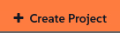

🌌 Gestione del ciclo di vita (Lifecycle management)
===================================

<style type="text/css">
  * {
    font-family: suse;
    src: url('https://fonts.google.com/specimen/SUSE');
  }
  .hovereffect {
    border-radius: 25px 25px 25px 25px;
    background: linear-gradient(#30ba78 0 0) var(--hundredpercent, 0) / var(--hundredpercent, 0) no-repeat;
    transition: 0.5s, background-position 0s;
    padding: 5px;
  }
  .hovereffect:hover {
    --hundredpercent: 100%;
    color: white;
    border-radius: 10px 25px 10px 25px;
  }
  .smlmext {
    color: #fe7c3f;
  }
  .smlm {
    color: #fe7c3f;
  }
  .suse {
    color: #30ba78;
  }
  .smls {
    color: #2453ff;
  }
  .smlsext {
    color: #2453ff;
  }
  .companyname {
    color: #008657;
  }
  .liberty {
    color: #efefef;
  }
  .sles {
    color: #90ebcd;
  }
  .highlightcopy {
    color: white;
    font-weight: bold;
    padding: 0 10px;
  }

  .bottoms {
    vertical-align: middle;
    height: 50%;
    width: 50%;
    margin: 0px;
    padding: 0px;
    object-fit: contain;
  }

  img.animatedgif {
    --borderthickness: 5pt;
    --colors: #0000 25%,#30ba78 0;
    padding: 10px;
    background:
      conic-gradient(from 90deg  at top    var(--borderthickness) left  var(--borderthickness),var(--colors)) 0    0,
      conic-gradient(from 180deg at top    var(--borderthickness) right var(--borderthickness),var(--colors)) 100% 0,
      conic-gradient(from 0deg   at bottom var(--borderthickness) left  var(--borderthickness),var(--colors)) 0    100%,
      conic-gradient(from -90deg at bottom var(--borderthickness) right var(--borderthickness),var(--colors)) 100% 100%;
    background-size: 50px 50px;
    background-repeat: no-repeat;
    transition: 1s;
  }

  img.animatedgif:hover {
    background-size: 51% 51%;
  }

  img.logos {
    border-radius: 10px;
  }

</style>


In questa parte passeremo dalle singole attività di manutenzione alla creazione di un processo certificato per l'intera flotta per la gestione dei cambiamenti. Esploreremo come la Gestione del Ciclo di Vita dei Contenuti (Content Lifecycle Management) in <b class="smlmext">SUSE Multi-Linux Manager</b> fornisca la struttura e la sicurezza richieste dalla nostra compagnia aerea.


Presso [[ Instruqt-Var key="COMPANY_NAME" hostname="zbastion" ]], un nuovo componente non viene installato su un jet passeggeri nel momento in cui arriva dal produttore. Passa attraverso un rigoroso processo di certificazione.

Innanzitutto, viene esaminato e testato in un'officina controllata (**Development** / Sviluppo). Successivamente, viene montato su un aereo di prova non commerciale e sottoposto a estenuanti test a terra e in volo (**Quality Assurance** / Garanzia di Qualità - QA). Solo dopo aver superato ogni controllo immaginabile viene certificato per l'installazione sulla nostra flotta attiva (**Production** / Produzione).


Questo approccio metodico e graduale impedisce che un singolo componente difettoso blocchi un aereo a terra, garantendo la sicurezza dei nostri passeggeri e l'affidabilità delle nostre operazioni. Applichiamo esattamente la stessa filosofia ai nostri sistemi IT. Un aggiornamento software o una nuova applicazione è un "componente" che, se difettoso, potrebbe bloccare le nostre operazioni digitali. La Gestione del Ciclo di Vita dei Contenuti è il nostro processo di certificazione ufficiale per tutte le modifiche software.


## <b class="hovereffect">I Tuoi Obiettivi:</b>

- Costruire un Progetto di Ciclo di Vita dei Contenuti (Content Lifecycle Project).

- Utilizzare il progetto per gestire e certificare gli aggiornamenti software per i nostri sistemi.


Dettagli del laboratorio (Lab details)
===========

Nome utente (Username):
```txt
[[ Instruqt-Var key="SMLM_USERNAME" hostname="zbastion" ]]
```

Password:
```txt
[[ Instruqt-Var key="UNIVERSAL_PWD" hostname="zbastion" ]]
```

URL di <b class="smlm">SMLM</b>: <a href="[[ Instruqt-Var key="SMLM_URL" hostname="zbastion" ]]">[[ Instruqt-Var key="SMLM_URL" hostname="zbastion" ]]</a>


Costruire il Nostro Percorso di Certificazione del Software
==============================================

In questo esercizio, creeremo un Progetto di Ciclo di Vita dei Contenuti per controllare il flusso degli aggiornamenti software. Questo assicura che una patch sia accuratamente testata prima di raggiungere i nostri server di produzione critici.

<br/>

Il nostro obiettivo è costruire una pipeline `Dev ✈ QA ✈ Prod`.

1.  **Development (Dev):** L'officina iniziale. Tutte le nuove patch e i pacchetti arrivano prima qui.
2.  **Quality Assurance (QA):** Il campo di prova. Promuoveremo una versione specifica del contenuto da Dev a QA affinché i nostri team di test la convalidino.
3.  **Production (Prod):** La flotta attiva. Solo il set di patch approvato e certificato dal QA viene promosso in Produzione, dove può essere applicato in sicurezza ai nostri sistemi live.


<br/>

## <b class="hovereffect">Creare il progetto</b>

- Naviga su `Content Lifecycle` ✈ `Projects` e clicca su 

- Compila i dettagli del progetto:

- **Project Name** (Nome Progetto):

```txt
Airtrain SLES15 SPx
```

- **Project Label** (Etichetta Progetto):

```txt
at-sles15_spx
```

- **Project Description** (Descrizione Progetto):

```txt
Certified software channel for Airtrain SLES 15 systems.
```


- Clicca su 

Ora popoliamolo, clicca su `Attach/Detach Sources`


- Su **New Base Channel** seleziona <b class="sles">SLE-Product-SLES15-SP6-Pool for x86_64</b> e clicca su 

<br/>

## <b class="hovereffect">Creare l'ambiente Dev</b>

Crea il Ciclo di Vita dell'Ambiente di Sviluppo (Development Environment Lifecycle)

- Clicca su `Add Environment`


- Compila con quanto segue:
  * **Name:** <b class="highlightcopy">Development</b>
  * **Label:** <b class="highlightcopy">dev</b>

- Clicca su 

<br/>

## <b class="hovereffect">Creare l'ambiente QA</b>

Crea il Ciclo di Vita dell'Ambiente di Garanzia di Qualità (Quality Assurance Environment Lifecycle)

- Clicca su `Add Environment`

- Compila con quanto segue:
  * **Name:** <b class="highlightcopy">QA</b>
  * **Label:** <b class="highlightcopy">qa</b>

- Clicca su 

<br/>

## <b class="hovereffect">Creare l'ambiente Prod</b>

Crea il Ciclo di Vita dell'Ambiente di Produzione (Production Environment Lifecycle)

- Clicca su `Add Environment`

- Compila con quanto segue:
  * **Name:** <b class="highlightcopy">Production</b>
  * **Label:** <b class="highlightcopy">prod</b>

- Clicca su 

<br/>

## <b class="hovereffect">Popolare (Populate)</b>

Ora che abbiamo tutti e tre gli ambienti, popoliamoli con contenuti.

Non useremo un filtro in questo caso poiché <b class="sles">SLES</b> fornisce già versioni stabili dei pacchetti.

La cadenza dei test di [[ Instruqt-Var key="COMPANY_NAME" hostname="zbastion" ]] è attualmente di un mese, quindi chiameremo questa build con il nome del mese corrente, Ottobre (October).

- Clicca su 

- In **Version Message** digita

```txt
October
```


- Clicca su `Build`

> [!NOTE]
> Questo processo potrebbe richiedere un paio di minuti, vedrai alcuni passaggi come 'cloning' (clonazione), ma potresti essere sollevato nel sapere che questo non richiede molto spazio di archiviazione. Il processo di clonazione si applica solo ai punti indice dei pacchetti, non ai pacchetti reali stessi.


<br/>

## <b class="hovereffect">Promuovere i contenuti</b>

Ora, promuoviamo (promote) il contenuto agli stadi successivi.

- Clicca sul pulsante `Promote` tra Development e QA
- Apparirà un'altra schermata con il titolo **Promote version 1 into QA**, clicca semplicemente di nuovo su `Promote`.

Ripeti lo stesso passaggio per Production.


  <div style='align: middle; margin: 15px;'>
    
  </div>

<br/>

Aggiornare i nostri sistemi.
====================

Ora proviamo come funziona.

Stiamo per:
- aggiungere alcuni dei nostri sistemi al nuovo ambiente.
- Creare una nuova versione del contenuto
- Promuovere la nuova versione e aggiornare i sistemi

<br/>

## <b class="hovereffect">Aggiungere sistemi</b>

Andiamo su `Systems` ✈ `System List` ✈ `All`

- Clicca sul sistema **at-ct-qa**
- Vai su `Software` ✈ `Software Channels`
- Su **Custom Channels**, seleziona la casella di controllo per il canale **at-sles15_spx-qa-...** e clicca su 
- Clicca su 


Torna su `Systems` ✈ `System List` ✈ `All`

- Filtra per:

```txt
at-
```

- Seleziona tutti i sistemi che finiscono con **-pro**
- Vai su `Systems` ✈ `System Set Manager`
- Vai su `Channels`
- Su **Custom Channels**, seleziona la casella di controllo per il canale **at-sles15_spx-prod-...** e clicca su 
- Clicca su 'include recommended' per sottoscrivere tutti i canali raccomandati:

<p style="margin: 1px; padding: 1px; vertical-align: middle; display:inline-block; align:left;"> </p><p style="margin: 1px; padding: 1px;vertical-align: middle; display:inline-block; align:left;"></p> ✈ <p style="margin: 1px; padding: 1px;vertical-align: middle; display:inline-block; align:center;"></p>


  <div style='align: middle; margin: 15px;'>
    
  </div>

<br/>

## <b class="hovereffect">Creare una nuova versione</b>


È passato un mese e vogliamo continuare con il nostro processo stabile di aggiornamenti.
Stai per creare una copia statica e immutabile dei canali software per il team di Sviluppatori.

Nessuna nuova patch apparirà improvvisamente a interrompere il loro lavoro.

- Torna su `Content Lifecycle` ✈ `Projects` e clicca sul progetto che abbiamo appena creato.

- Clicca su 

- In **Version Message** digita

```txt
November
```


- Clicca su `Build`

Nota che il numero di versione è aumentato automaticamente.

Ora gli sviluppatori possono svolgere il loro lavoro utilizzando le versioni nuove e con patch di librerie e applicazioni fornite da SUSE.


  <div style='align: middle; margin: 15px;'>
    
  </div>


<br/>

## <b class="hovereffect">Promuovere contenuti da Dev a QA</b>

Supponiamo che i nostri sviluppatori abbiano dato la loro approvazione. È tempo di creare una versione stabile per il team QA in modo che tutti i test di pre-produzione possano essere eseguiti.

- Clicca sul pulsante `Promote` tra Development e QA
- Apparirà un'altra schermata con il titolo **Promote version 2 into QA**, clicca semplicemente di nuovo su `Promote`.

Ora andiamo sui nostri sistemi QA e facciamo un aggiornamento.

- `Systems` ✈ `System List` ✈ `All`
- Clicca sul sistema **at-ct-qa**
- Vai su `Software` ✈ `Packages` ✈ `Upgrade`
- Clicca su:

<p style="margin: 1px; padding: 1px; vertical-align: middle; display:inline-block; align:left;"> </p><p style="margin: 1px; padding: 1px;vertical-align: middle; display:inline-block; align:left;"></p> ✈ <p style="margin: 1px; padding: 1px;vertical-align: middle; display:inline-block; align:center;"></p> ✈ <p style="margin: 1px; padding: 1px;vertical-align: middle;display:inline-block; align:right;"> </p>


Ora i nostri ingegneri QA possono eseguire i loro test in sicurezza senza interruzioni.


> [!NOTE]
> Non abbiamo abbastanza tempo per vedere i cambiamenti arrivare, in uno scenario reale dovrebbero esserci nuove versioni dei pacchetti disponibili da promuovere nella versione 2.

  <div style='align: middle; margin: 15px;'>
    
  </div>


<br/>

## <b class="hovereffect">Promuovere in Produzione</b>

Il team QA ha completato i suoi rigorosi test sulla `v2` e l'ha certificata come stabile e sicura per la flotta principale. È tempo di renderla disponibile ai nostri sistemi di produzione.

Ripeteremo lo stesso processo che abbiamo fatto per QA sul nostro ambiente di produzione:

- Primo, promuovi il contenuto.
  Questo renderà i nuovi pacchetti disponibili ai nostri server di produzione.
  Hai garantito con successo che solo gli aggiornamenti testati e approvati possano raggiungere i tuoi sistemi più critici.

- Secondo, aggiorna i nostri sistemi di Produzione, qui l'unica differenza è che pianificheremo l'aggiornamento per **domani alle 14:00** per consentire a tutti i nostri team di essere preparati e avere un processo controllato.


<br/>

Perché è importante per [[ Instruqt-Var key="COMPANY_NAME" hostname="zbastion" ]]?
=================================================================================

- Costruiamo una serie di cancelli di sicurezza, rendendo più facile implementare un principio fondamentale della nostra strategia operativa: **gestione del rischio** (risk management).
- Una singola patch difettosa introdotta nell'ambiente **Dev** può essere intercettata e corretta molto prima che abbia la possibilità di impattare i sistemi che generano entrate.
- Questo processo trasforma l'applicazione di patch e aggiornamenti da un evento rischioso e snervante in una procedura di manutenzione di routine e prevedibile, la pietra angolare di una compagnia aerea affidabile.


<br/>

Maggiori informazioni
================

* [Finestre di Manutenzione (Maintenance Windows)](https://documentation.suse.com/multi-linux-manager/5.1/en/docs/administration/maintenance-windows.html)

* [Gestione delle Patch (Patch Management)](https://documentation.suse.com/multi-linux-manager/5.1/en/docs/administration/patch-management.html)

* [Gestione del Ciclo di Vita dei Contenuti (Content Lifecycle Management)](https://documentation.suse.com/multi-linux-manager/5.1/en/docs/administration/content-lifecycle.html)

* [Pagina del Prodotto SUSE Multi-Linux Manager](https://www.suse.com/products/suse-manager/)