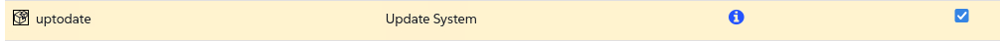

🌌 Automazione e gestione della configurazione
===================================

<style type="text/css">
  * {
    font-family: suse;
    src: url('https://fonts.google.com/specimen/SUSE');
  }
  .hovereffect {
    border-radius: 25px 25px 25px 25px;
    background: linear-gradient(#30ba78 0 0) var(--hundredpercent, 0) / var(--hundredpercent, 0) no-repeat;
    transition: 0.5s, background-position 0s;
    padding: 5px;
  }
  .hovereffect:hover {
    --hundredpercent: 100%;
    color: white;
    border-radius: 10px 25px 10px 25px;
  }
  .smlmext {
    color: #fe7c3f;
  }
  .smlm {
    color: #fe7c3f;
  }
  .suse {
    color: #30ba78;
  }
  .smls {
    color: #2453ff;
  }
  .smlsext {
    color: #2453ff;
  }
  .companyname {
    color: #008657;
  }
  .liberty {
    color: #efefef;
  }
  .sles {
    color: #90ebcd;
  }
  .highlightcopy {
    color: white;
    font-weight: bold;
    padding: 0 10px;
  }

  .bottoms {
    vertical-align: middle;
    height: 50%;
    width: 50%;
    margin: 0px;
    padding: 0px;
    object-fit: contain;
  }

  img.animatedgif {
    --borderthickness: 5pt;
    --colors: #0000 25%,#30ba78 0;
    padding: 10px;
    background:
      conic-gradient(from 90deg  at top    var(--borderthickness) left  var(--borderthickness),var(--colors)) 0    0,
      conic-gradient(from 180deg at top    var(--borderthickness) right var(--borderthickness),var(--colors)) 100% 0,
      conic-gradient(from 0deg   at bottom var(--borderthickness) left  var(--borderthickness),var(--colors)) 0    100%,
      conic-gradient(from -90deg at bottom var(--borderthickness) right var(--borderthickness),var(--colors)) 100% 100%;
    background-size: 50px 50px;
    background-repeat: no-repeat;
    transition: 1s;
  }

  img.animatedgif:hover {
    background-size: 51% 51%;
  }

  img.logos {
    border-radius: 10px;
  }

</style>


In questa sezione esamineremo alcune delle opzioni disponibili per automatizzare le attività.

In questo laboratorio, passiamo dall'esecuzione di attività manuali alla creazione di automazioni utilizzando alcune delle opzioni che abbiamo a disposizione.
<b class="smlmext">SUSE Multi-Linux Manager</b> agisce come il "pilota automatico" per le nostre operazioni IT, consentendoci di imporre standard di configurazione e automatizzare le attività di routine con precisione e affidabilità su tutta la nostra flotta.

Invece di configurare manualmente centinaia di server sperando di non perdere un passaggio, definiamo il processo e lo stato e riduciamo l'operazione umana alla definizione di una pianificazione, una volta sola.


## <b class="hovereffect">I Tuoi Obiettivi:</b>

- Creare una pianificazione che esegua regolarmente aggiornamenti sui tuoi sistemi di sviluppo.

- Creare uno script per mostrare un banner di accesso diverso a seconda dell'ambiente del sistema.

Dettagli del laboratorio (Lab details)
===========

Nome utente (Username):
```txt
[[ Instruqt-Var key="SMLM_USERNAME" hostname="zbastion" ]]
```

Password:
```txt
[[ Instruqt-Var key="UNIVERSAL_PWD" hostname="zbastion" ]]
```

URL di <b class="smlm">SMLM</b>: <a href="[[ Instruqt-Var key="SMLM_URL" hostname="zbastion" ]]">[[ Instruqt-Var key="SMLM_URL" hostname="zbastion" ]]</a>


Configurare aggiornamenti ricorrenti (Setup recurring updates)
=======================

Vogliamo che gli sviluppatori lavorino con gli ultimi aggiornamenti stabili forniti da SUSE, ma non possiamo fare affidamento sul fatto che le persone si ricordino di aggiornare i loro sistemi ogni giorno, quindi creeremo una pianificazione ricorrente che fa esattamente questo.


Applicheremo questo a tutti i sistemi nel gruppo dev in modo che non debba essere fatto su ogni sistema.

- Andiamo su `Systems` ✈ `System Groups`
- Clicca sul gruppo `dev`.

Abbiamo appena notato che non ha sistemi assegnati, aggiungiamone uno.

- Clicca su `Target Systems` e seleziona `sles15`
- Poi clicca su 

Ora che abbiamo un sistema, creiamo l'azione ricorrente.

- Vai su `Recurring Actions`
- Clicca su 
- Ora popoliamo il modulo con i seguenti dettagli:
	+ **Action Type:** 'Custom state'
 	+ **Schedule Name:** 'Update Dev systems'
	+ **Daily:** '03:00'
	+ **Configure states to execute:** Assicurati che **uptodate:** sia selezionato
	

- Clicca su

<p style="margin: 1px; padding: 1px; vertical-align: middle; display:inline-block; align:left;"> </p><p style="margin: 1px; padding: 1px;vertical-align: middle; display:inline-block; align:left;">

</p> ✈
<p style="margin: 1px; padding: 1px;vertical-align: middle; display:inline-block; align:center;">

</p> ✈
<p style="margin: 1px; padding: 1px;vertical-align: middle;display:inline-block; align:right;">

</p>


Per osservare il nostro elenco di azioni ricorrenti possiamo andare su `Schedule` ✈ `Recurring Actions`

Ora tutti i sistemi dev verranno aggiornati quotidianamente alle 3 del mattino, orario UTC.


  <div style='align: middle; margin: 15px;'>
    
  </div>

<br/>


Assicurati che ogni sistema abbia un messaggio di accesso
==========================================


Stiamo per creare un canale di configurazione per assicurarci che ogni sistema che gestiamo contenga un messaggio di accesso adeguato.


- Andiamo su `Configuration` ✈ `Channels`
- Clicca su 
- Compila il modulo con i seguenti dettagli:
	+ **Name:** <b class="highlightcopy">Uniform experience</b>
	+ **Label:** <b class="highlightcopy">uniform_experienace</b>
	+ **Description:** <b class="highlightcopy">Create a uniform experience across systems</b>
- Clicca su 

Ora che abbiamo creato il canale di configurazione, popoliamolo.

- Vai su `Add Files` ✈ `Create File`
- Compila i seguenti dettagli:
	+ **Filename/Path:** <b class="highlightcopy">/etc/motd</b>
	+ **File Contents:**
<pre>
This system is the property of [[ Instruqt-Var key="COMPANY_NAME" hostname="zbastion" ]].

Server ID: {{ grains['id'] }}


Running Application "{{ pillar['custom_info']['application'] }}"

No applications running on this server


No applications running on this server

</pre>


- Clicca su 

Ora iscriviamo ogni sistema nell'organizzazione al nuovo canale di configurazione.

- andiamo su `Admin` ✈ `Organizations`
- Clicca sull'organizzazione **Organization** (Questa è l'organizzazione predefinita)
- Vai su `States` e seleziona il canale che abbiamo appena creato.

- Clicca su


<p style="margin: 1px; padding: 1px; vertical-align: middle; display:inline-block; align:left;"> </p><p style="margin: 1px; padding: 1px;vertical-align: middle; display:inline-block; align:left;">

</p> ✈
<p style="margin: 1px; padding: 1px;vertical-align: middle; display:inline-block; align:center;">

</p> ✈
<p style="margin: 1px; padding: 1px;vertical-align: middle; display:inline-block; align:center;">

</p>


Questo non accadrà immediatamente, controlliamo i sistemi. Eseguiremo un semplice comando tramite l'interfaccia web; se eseguito troppo presto, potresti vedere sistemi con il vecchio messaggio e sistemi che hanno già ottenuto il file aggiornato.

- Andiamo su `Salt` ✈ `Remote Commands`
- Digita quanto segue:

- Clicca su `Find targets`
- Dovresti vedere un elenco di sistemi, clicca su `Run command`

Ora dovresti vedere qualcosa simile a questo:


> [!NOTE]
> Questo processo potrebbe richiedere un paio di minuti, se non vedi il MOTD per favore riesegui il comando dopo qualche minuto.


  <div style='align: middle; margin: 15px;'>
    
  </div>

<br/>


Perché è importante per [[ Instruqt-Var key="COMPANY_NAME" hostname="zbastion" ]]?
=================================================================================


- Quando si gestiscono migliaia di sistemi non possiamo permetterci di fare tutto uno per uno, le attività devono essere automatizzate in modo da gestire "bestiame" (cattle), non "animali domestici" (pets).


- Definendo lo "stato corretto" eliminiamo la deriva della configurazione (configuration drift). Ogni server nella flotta opera dallo stesso playbook, proprio come ogni pilota usa la stessa checklist.


- Le attività che richiederebbero ore per essere eseguite manualmente su centinaia di server vengono completate in pochi minuti. Questo libera i nostri ingegneri per lavorare sull'innovazione e il miglioramento, non sul lavoro manuale ripetitivo.


- L'automazione è la difesa definitiva contro l'errore umano. Un passaggio dimenticato o un errore di battitura durante la configurazione manuale può portare a un'interruzione. Un processo automatizzato e testato viene eseguito perfettamente ogni volta, migliorando l'affidabilità e la sicurezza dell'intera nostra compagnia aerea.


Maggiori informazioni
================


* [Pagina del Prodotto SUSE Multi-Linux Manager](https://www.suse.com/products/suse-manager/)

* [Integrazione Ansible](https://documentation.suse.com/multi-linux-manager/5.1/en/docs/administration/ansible-integration.html)

* [Guida Salt](https://documentation.suse.com/multi-linux-manager/5.1/en/docs/specialized-guides/salt/salt-overview.html)