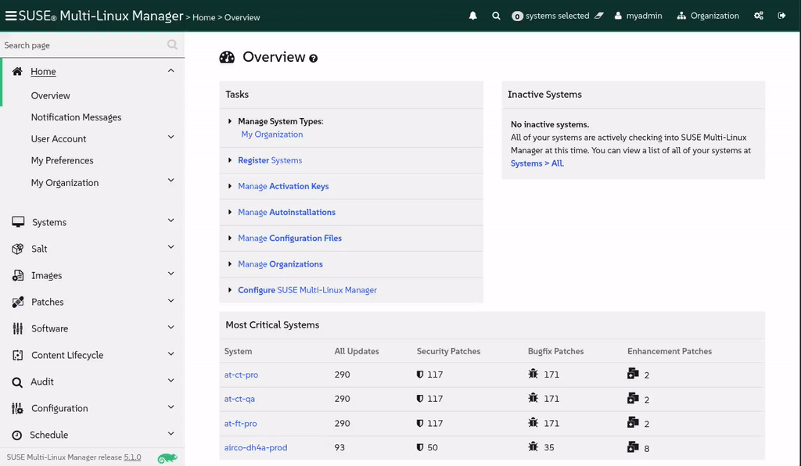

🌌 レガシーシステムの延長サポート
===================================

<style type="text/css">
  * {
    font-family: suse;
    src: url('https://fonts.google.com/specimen/SUSE');
  }
  .hovereffect {
    border-radius: 25px 25px 25px 25px;
    background: linear-gradient(#30ba78 0 0) var(--hundredpercent, 0) / var(--hundredpercent, 0) no-repeat;
    transition: 0.5s, background-position 0s;
    padding: 5px;
  }
  .hovereffect:hover {
    --hundredpercent: 100%;
    color: white;
    border-radius: 10px 25px 10px 25px;
  }
  .smlmext {
    color: #fe7c3f;
  }
  .smlm {
    color: #fe7c3f;
  }
  .suse {
    color: #30ba78;
  }
  .smls {
    color: #2453ff;
  }
  .smlsext {
    color: #2453ff;
  }
  .companyname {
    color: #008657;
  }
  .liberty {
    color: #efefef;
  }
  .sles {
    color: #90ebcd;
  }
  .highlightcopy {
    color: white;
    font-weight: bold;
    padding: 0 10px;
  }

  .bottoms {
    vertical-align: middle;
    height: 50%;
    width: 50%;
    margin: 0px;
    padding: 0px;
    object-fit: contain;
  }

  img.animatedgif {
    --borderthickness: 5pt;
    --colors: #0000 25%,#30ba78 0;
    padding: 10px;
    background:
      conic-gradient(from 90deg  at top    var(--borderthickness) left  var(--borderthickness),var(--colors)) 0    0,
      conic-gradient(from 180deg at top    var(--borderthickness) right var(--borderthickness),var(--colors)) 100% 0,
      conic-gradient(from 0deg   at bottom var(--borderthickness) left  var(--borderthickness),var(--colors)) 0    100%,
      conic-gradient(from -90deg at bottom var(--borderthickness) right var(--borderthickness),var(--colors)) 100% 100%;
    background-size: 50px 50px;
    background-repeat: no-repeat;
    transition: 1s;
  }

  img.animatedgif:hover {
    background-size: 51% 51%;
  }
  img.logos {
    border-radius: 10px;
  }
  ul {
    list-style-image: url('../assets/logos/chameleon_icon.png')
  }
</style>


# レガシーフリートの寿命を延ばす

どの航空会社にも、長年役立ってきた信頼できる古い飛行機がありますが、まだ代替機がない場合があります。私たちにとって、そのレガシーフリートの一部は CentOS 7 システムです。それらは安定していますが、寿命（end-of-life）を迎えており、元の製造元から重要なセキュリティ更新プログラムを受け取れなくなっています。航空会社にとって、サポートなしで飛行することは、決して冒すことのできないリスクです。

従来の解決策は、すべてを完全に、かつコストをかけて交換することでした。
しかし、最小限の中断でそれらをその場で近代化する、寿命延長アップグレードを実行できるとしたらどうでしょうか？ それこそが、この課題の使命です。<b class="smlmext">SUSE Multi-Linux Manager</b> の力と <b class="smlsext">SUSE Multi-Linux Support</b> を併用して、これらのシステムを安全に移行し、より現代的な OS に置き換えることができるまでサービスを維持します。


## <b class="hovereffect">フライトプラン:</b>

- Centos 7 を実行している現在のレガシーシステムを調査する

- QA システムをオンボード（登録）し、利用可能なパッチを適用する

- 更新があれば特定して適用する

- liberate フォーミュラを使用してシステムを解放（Liberate）する

- 両方のシステム間で何が変わったかを観察する

- これが移行（マイグレーション）であるかどうかを特定する

<br/>

## <b class="hovereffect">私たちの飛行機</b>

- CentOS 7 QA ✈ 私たちのテストおよび開発サーバー。

- CentOS 7 Prod ✈ すでに <b class="smlm">SMLM</b> に登録されている本番サーバー

<br/><br/>


ラボの詳細 (Lab details)
===========

ユーザー名 (Username):
```txt
[[ Instruqt-Var key="SMLM_USERNAME" hostname="zbastion" ]]
```

パスワード (Password):
```txt
[[ Instruqt-Var key="UNIVERSAL_PWD" hostname="zbastion" ]]
```

<b class="smlm">SMLM</b> URL: <a href="[[ Instruqt-Var key="SMLM_URL" hostname="zbastion" ]]">[[ Instruqt-Var key="SMLM_URL" hostname="zbastion" ]]</a>


Centos 7 QA のオンボード (Onboarding Centos 7 QA)
======================


## <b class="hovereffect">現在のレガシーシステムの調査</b>

[button label="Centos 7 QA" variant="success"](tab-1) タブからシステムターミナルにアクセスします。

システムの現在のバージョンを確認します：

```bash,run
rpm -qi centos-release centos-logos
```


次に、以下のコマンドを実行してシステムを <b class="smlm">SMLM</b> に登録します：


```bash,run
curl -Sks "smlm.${_SANDBOX_ID}.instruqt.io"/pub/bootstrap/generic_bootstrap.sh | SMLM_DNS="smlm.${_SANDBOX_ID}.instruqt.io" ACTIVATION_KEYS=1-liberty7ltss PROFILENAME='airco-dh4a-qa' bash ; echo "Let's wait 2 minutes for all the background processes to finish"; sleep 120
```


これは前のラボで Ubuntu をオンボードするために使用したものと似ていますが、変更点は次のとおりです：

- **Activation key** (アクティベーションキー): デフォルトでシステムに適用される設定への参照です。この場合、システムが登録されるソフトウェアチャンネルのみを示すために作成されています。

- **Profile name** (プロファイル名): 指定しない場合、ホスト名が使用されますが、この場合は Centos 7 Prod で使用したのと同じ命名規則を持つ、より意味のある名前にしたいと考えています。


**オプション:** 好奇心があり、アップグレードして Liberate フォーミュラを実行したときに何が起こるかを確認したい場合は、両方のシステム（ [button label="Centos 7 QA" variant="success"](tab-1) および [button label="Centos 7 Prod" variant="success"](tab-2) ）で以下のコマンドを実行できます：


```bash,run
journalctl -f
```

そして、ターミナルに表示されるログを確認します。


<br/><br/>


## <b class="hovereffect"><b class="liberty">Liberty</b> リポジトリからの更新の特定と適用</b>

この Centos 7 システムには、アップストリームで提供される最新のパッケージが付属しています。新しいバグが修正されていることを確認し、トラブルが発生したときに助けてくれる親切なサポート担当者がいるようにしたいと考えています。登録プロセス中に Centos 7 システムを SUSE 提供のソフトウェアリポジトリにすでにサブスクライブしているので、すべてにパッチを適用しましょう：


それでは、[button label="SMLM UI" variant="success"](tab-0) タブに切り替えましょう。


- 左側のメニューの `Systems` ✈ `System List` に移動します。

- ホスト **airco-dh4a-qa** を見つけてクリックします。

- `Software` ✈ `Packages` を選択します。

- `Update Packages List` をクリックします。完了するまで約1分かかります。

- `Software` ✈ `Patches` を選択します。

- 利用可能なパッチのリストが表示されます。

`Select All` をクリックし、次に右上の `Apply Patches` をクリックして、最後に `Confirm` をクリックします。<b class="smlmext">SUSE Multi-Linux Manager</b> は、CentOS システムでのアップグレード手順をスケジュールし、実行します。


> [!NOTE]
> システムに適用できるパッチのリストが表示される前に、パッケージのリストを取得するのに数分かかる場合があります。


これには時間がかかる場合があるため、裏側で何が起こっているかを見てみましょう。
`Events` タブに移動し、次に `History` に移動します。システムが <b class="smlm">SMLM</b> に登録されてから発生したイベントのリストが表示されます。最初の数行に、*Combined Patch* に類似した内容を含むイベントが見つかるはずです。


それをクリックするとすべての詳細を確認できます。自由に見て回ってください。そうでなければ、アイコンが緑色になるまで待ちます：


既存のパッケージのバグを修正するパッチを適用したばかりです。これらのパッチが適用されたパッケージは SUSE から直接提供されていますが、これは移行（マイグレーション）ではありません。

<br/>

まだ更新していない本番システムと比較してみましょう。

`Software` ✈ `Packages` ✈ `Profiles` に移動してください。

本番バージョンであるシステム `airco-dh4a-prod` を選択し、以下をクリックします：


ほとんどのパッケージバージョンは変更されておらず、同じバージョン（ **X.X.X**-xyz ）のままですが、パッチが適用されている（ X.X.X-**xyz** ）ことがわかります。

次のセクションに進む前に、保存されたプロファイルを作成しましょう。これは、次のセクションで liberate フォーミュラを適用した後の違いをより明確に確認するのに役立ちます。


`Software` ✈ `Packages` ✈ `Profile` に移動し、`Create System Profile` をクリックしてください。名前は次のようにすることができます：

```txt
before_liberation
```


  <div style='align: middle; margin: 15px;'>
    
  </div>


<br/><br/>


システムの解放 (Liberate)（オプション）
==============================

これは **オプション** のステップであり、サポートを受けるために必須ではありません。

それでは、システムを解放（Liberate）しましょう：

- `Formulas` タブに移動し、**Liberate** を検索します。見つかったら選択し、右上の `Save` をクリックします。

画面上部に青いメッセージが表示されます。見えない場合は上にスクロールしてください：


`Highstate` と書かれている場所をクリックすると、別のタブ（`States` ✈ `Highstate`）に移動します。

下部の概要に liberate フォーミュラがリストされていることがわかります。

解放プロセスを開始するには、以下をクリックします：


これには時間がかかります。`Events` -> `History` を確認してください。**Apply highstate scheduled** というイベントが表示されるはずです。

終了するまで数分待ちましょう。その間、ターミナル [button label="Centos 7 QA" variant="success"](tab-1) を見て何が起こっているか観察できます。


  <div style='align: middle; margin: 15px;'>
    
  </div>

<br/><br/>

## <b class="hovereffect">何が変わったかを観察する</b>


完了したら、システムを再度比較して違いを確認しましょう。まだそこにいない場合は、システム名 `airco-dh4a-qa` をクリックします。

次に `Software` ✈ `Packages` ✈ `Profile` に移動します。

**Compare to Stored Profile** の下で以下をクリックします： 

変更されたのは以下のパッケージのみであることがわかります：

- **centos-logos** が **sles_es-logos** に置き換えられました

- **centos-release** が **sles_es-release-server** に置き換えられました

残りは同じままですが、<b class="liberty">Liberty Linux</b> 用に <b class="suse">SUSE</b> が提供するすべてのサポート、アップグレード、およびパッチを利用できるようになりました。

同じことが CentOS や RHEL のより新しいバージョンにも当てはまります。実際のソフトウェアやライブラリに変更を加えることなく、それらを <b class="liberty">Liberty</b> に変換し、<b class="suse">SUSE</b> のサポートを受けることができます。


  <div style='align: middle; margin: 15px;'>
    
  </div>

<br/>


本番サーバーの解放 (Liberate)（オプション）
=========================================

QA で古い Centos 7 サーバーにパッチを適用して解放する方法を見ました。次は本番システムで同じことを行う番ですが、今回は異なる順序で行います。

- まず、**Liberate** フォーミュラを適用します。

  本番サーバー `airco-dh4a-prod` に移動し、`Create System Profile` を行いましょう。

  その後、QA システムで行ったように **Liberate** フォーミュラを適用しましょう。

- 完了したら、作成したばかりのプロファイルとシステムを比較しましょう。ご覧のとおり、唯一の変更は **centos-logos** と **centos-release** パッケージであり、残りはまったく同じままです。


これは移行（マイグレーション）ですか？
==================

移行には、まったく新しいサーバーの構築、すべてのアプリケーションのゼロからの再インストール、データの慎重な移動が含まれます。これは時間がかかり、高価で、リスクを伴うプロセスです。

私たちが行ったことは、はるかにエレガントでした。私たちはインプレースアップグレード（in-place upgrade）を実行しました。

サーバーのアイデンティティ、ホスト名、アプリケーション、およびユーザーデータは完全に手つかずのままでした。単に更新の基礎となるソースを変更しただけであり、それらの寿命を迎えたコンポーネントは、パッチを受け取る完全にサポートされたコンポーネントになりました。

私たちはシステムの寿命を延ばし、セキュリティコンプライアンスを回復させ、完全な移行による中断なしにすべてを行いました。それが [[ Instruqt-Var key="COMPANY_NAME" hostname="zbastion" ]] を高く飛ばし続ける効率性です。


[[ Instruqt-Var key="COMPANY_NAME" hostname="zbastion" ]] にとってなぜ重要なのですか？
=================================================================================

- [[ Instruqt-Var key="COMPANY_NAME" hostname="zbastion" ]] が稼働中のシステムをサポートし続けることを可能にし、ベンダーのニーズではなくビジネスのニーズに応じて移行するための時間を与えます。

- 延長サポートを提供することで、サポートされていないシステムを持つことによるリスクを軽減します。このアプローチは、即時の移行の必要性を回避し、すべてが通常どおり実行されますが、今ではあなたの電話に応答できる専門家グループがいます。

- 長い移行を経ることなくサポートプロバイダーを変更する自由を与え、それを大規模に行うことができます。


詳細情報
================

- [Registering RHEL 7 or CentOS Linux 7 with SUSE Manager](https://documentation.suse.com/liberty/7/html/suma-quickstart/art-suma-quickstart.html)
- [Running OpenSCAP compliance scans for SUSE Multi-Linux Support 7](https://documentation.suse.com/liberty/7/html/compliance-scans/art-compliance-scans.html)
- [Registering CentOS Linux 7 with the SUSE Customer Center](https://documentation.suse.com/liberty/7/html/quickstart-scc/art-quickstart-scc.html)
- [SUSE Multi-Linux Support 9](https://documentation.suse.com/liberty/9/)