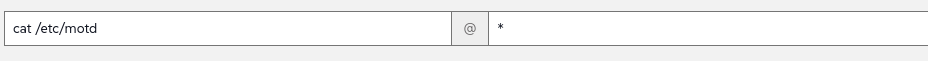

🌌 自動化と構成管理
===================================

<style type="text/css">
  * {
    font-family: suse;
    src: url('https://fonts.google.com/specimen/SUSE');
  }
  .hovereffect {
    border-radius: 25px 25px 25px 25px;
    background: linear-gradient(#30ba78 0 0) var(--hundredpercent, 0) / var(--hundredpercent, 0) no-repeat;
    transition: 0.5s, background-position 0s;
    padding: 5px;
  }
  .hovereffect:hover {
    --hundredpercent: 100%;
    color: white;
    border-radius: 10px 25px 10px 25px;
  }
  .smlmext {
    color: #fe7c3f;
  }
  .smlm {
    color: #fe7c3f;
  }
  .suse {
    color: #30ba78;
  }
  .smls {
    color: #2453ff;
  }
  .smlsext {
    color: #2453ff;
  }
  .companyname {
    color: #008657;
  }
  .liberty {
    color: #efefef;
  }
  .sles {
    color: #90ebcd;
  }
  .highlightcopy {
    color: white;
    font-weight: bold;
    padding: 0 10px;
  }

  .bottoms {
    vertical-align: middle;
    height: 50%;
    width: 50%;
    margin: 0px;
    padding: 0px;
    object-fit: contain;
  }

  img.animatedgif {
    --borderthickness: 5pt;
    --colors: #0000 25%,#30ba78 0;
    padding: 10px;
    background:
      conic-gradient(from 90deg  at top    var(--borderthickness) left  var(--borderthickness),var(--colors)) 0    0,
      conic-gradient(from 180deg at top    var(--borderthickness) right var(--borderthickness),var(--colors)) 100% 0,
      conic-gradient(from 0deg   at bottom var(--borderthickness) left  var(--borderthickness),var(--colors)) 0    100%,
      conic-gradient(from -90deg at bottom var(--borderthickness) right var(--borderthickness),var(--colors)) 100% 100%;
    background-size: 50px 50px;
    background-repeat: no-repeat;
    transition: 1s;
  }

  img.animatedgif:hover {
    background-size: 51% 51%;
  }

  img.logos {
    border-radius: 10px;
  }

</style>


このセクションでは、タスクを自動化するために利用可能なオプションのいくつかを見ていきます。

このラボでは、手動タスクの実行から、利用可能なオプションのいくつかを使用して自動化を作成することへと移行します。
<b class="smlmext">SUSE Multi-Linux Manager</b> は、当社の IT 運用の「オートパイロット」として機能し、構成基準を強制し、フリート全体で日常的なタスクを正確かつ確実に自動化できるようにします。

何百ものサーバーを手動で構成し、手順を飛ばさないことを祈る代わりに、プロセスと状態を定義し、人間の操作を一度だけのスケジュール定義に減らします。


## <b class="hovereffect">あなたの目標:</b>

- 開発システムで定期的に更新を実行するスケジュールを作成します。

- システムの環境に応じて異なるログインバナーを表示するスクリプトを作成します。

ラボの詳細 (Lab details)
===========

ユーザー名 (Username):
```txt
[[ Instruqt-Var key="SMLM_USERNAME" hostname="zbastion" ]]
```

パスワード (Password):
```txt
[[ Instruqt-Var key="UNIVERSAL_PWD" hostname="zbastion" ]]
```

<b class="smlm">SMLM</b> URL: <a href="[[ Instruqt-Var key="SMLM_URL" hostname="zbastion" ]]">[[ Instruqt-Var key="SMLM_URL" hostname="zbastion" ]]</a>


定期的な更新のセットアップ (Setup recurring updates)
=======================

開発者が SUSE によって提供される最新の安定した更新プログラムを使用して作業できるようにしたいと考えていますが、毎日システムを更新することを忘れないように人々に頼ることはできません。そのため、まさにそれを行う定期的なスケジュールを作成します。


これを dev グループ内のすべてのシステムに適用して、すべてのシステムでこれを行う必要がないようにします。

- `Systems` ✈ `System Groups` に移動しましょう。
- `dev` グループをクリックします。

システムが割り当てられていないことに気付きました。追加しましょう。

- `Target Systems` をクリックし、`sles15` を選択します。
- その後、 をクリックします。

システムができたので、定期的なアクションを作成しましょう。

- `Recurring Actions` に移動します。
-  をクリックします。
- 以下の詳細でフォームに入力しましょう：
	+ **Action Type:** 'Custom state'
 	+ **Schedule Name:** 'Update Dev systems'
	+ **Daily:** '03:00'
	+ **Configure states to execute:** **uptodate:** が選択されていることを確認してください
	

- 以下をクリックします：

<p style="margin: 1px; padding: 1px; vertical-align: middle; display:inline-block; align:left;"> </p><p style="margin: 1px; padding: 1px;vertical-align: middle; display:inline-block; align:left;">

</p> ✈
<p style="margin: 1px; padding: 1px;vertical-align: middle; display:inline-block; align:center;">

</p> ✈
<p style="margin: 1px; padding: 1px;vertical-align: middle;display:inline-block; align:right;">

</p>


定期的なアクションのリストを確認するには、`Schedule` ✈ `Recurring Actions` に移動します。

これで、すべての開発システムは毎日 UTC 時間の午前 3 時に更新されます。


  <div style='align: middle; margin: 15px;'>
    
  </div>

<br/>


すべてのシステムにログインメッセージがあることを確認する
==========================================


管理するすべてのシステムに適切なログインメッセージが含まれていることを確認するために、構成チャンネルを作成します。


- `Configuration` ✈ `Channels` に移動しましょう。
-  をクリックします。
- 以下の詳細でフォームに入力します：
	+ **Name:** <b class="highlightcopy">Uniform experience</b>
	+ **Label:** <b class="highlightcopy">uniform_experienace</b>
	+ **Description:** <b class="highlightcopy">Create a uniform experience across systems</b>
-  をクリックします。

構成チャンネルを作成したので、データを入力しましょう。

- `Add Files` ✈ `Create File` に移動します。
- 以下の詳細を入力します：
	+ **Filename/Path:** <b class="highlightcopy">/etc/motd</b>
	+ **File Contents:**
<pre>
This system is the property of [[ Instruqt-Var key="COMPANY_NAME" hostname="zbastion" ]].

Server ID: {{ grains['id'] }}


Running Application "{{ pillar['custom_info']['application'] }}"

No applications running on this server


No applications running on this server

</pre>


-  をクリックします。

それでは、組織内のすべてのシステムを新しい構成チャンネルにサブスクライブしましょう。

- `Admin` ✈ `Organizations` に移動しましょう。
- **Organization** という組織をクリックします（これがデフォルトの組織です）。
- `States` に移動し、作成したばかりのチャンネルを選択します。

- 以下をクリックします：


<p style="margin: 1px; padding: 1px; vertical-align: middle; display:inline-block; align:left;"> </p><p style="margin: 1px; padding: 1px;vertical-align: middle; display:inline-block; align:left;">

</p> ✈
<p style="margin: 1px; padding: 1px;vertical-align: middle; display:inline-block; align:center;">

</p> ✈
<p style="margin: 1px; padding: 1px;vertical-align: middle; display:inline-block; align:center;">

</p>


これはすぐには起こりません。システムを確認しましょう。Web UI を介して簡単なコマンドを実行します。実行が早すぎると、古いメッセージが表示されるシステムと、ファイルがすでに更新されたシステムが表示される場合があります。

- `Salt` ✈ `Remote Commands` に移動しましょう。
- 以下を入力します：

- `Find targets` をクリックします。
- システムのリストが表示されるはずです。`Run command` をクリックしてください。

次のような画面が表示されるはずです：


> [!NOTE]
> このプロセスには数分かかる場合があります。MOTD が表示されない場合は、数分後にコマンドを再実行してください。


  <div style='align: middle; margin: 15px;'>
    
  </div>

<br/>


[[ Instruqt-Var key="COMPANY_NAME" hostname="zbastion" ]] にとってなぜ重要なのですか？
=================================================================================


- 数千のシステムを管理する場合、すべてを 1 つずつ行う余裕はありません。タスクを自動化して、ペットではなく家畜 (cattle) として管理する必要があります。


- 「正しい状態」を定義することで、構成ドリフト (configuration drift) を排除します。すべてのパイロットが同じチェックリストを使用するのと同じように、フリート内のすべてのサーバーは同じプレイブックから動作します。


- 何百ものサーバーで手動で実行するのに数時間かかるタスクが、数分で完了します。これにより、エンジニアは反復的な手作業ではなく、革新と改善に取り組むことができます。


- 自動化はヒューマンエラーに対する究極の防御策です。手動構成中に手順を忘れたり、タイプミスをしたりすると、停止につながる可能性があります。自動化され、テストされたプロセスは毎回完璧に実行され、航空会社全体の信頼性とセキュリティを向上させます。


詳細情報
================


* [SUSE Multi-Linux Manager 製品ページ](https://www.suse.com/products/suse-manager/)

* [Ansible 統合](https://documentation.suse.com/multi-linux-manager/5.1/en/docs/administration/ansible-integration.html)

* [Salt ガイド](https://documentation.suse.com/multi-linux-manager/5.1/en/docs/specialized-guides/salt/salt-overview.html)