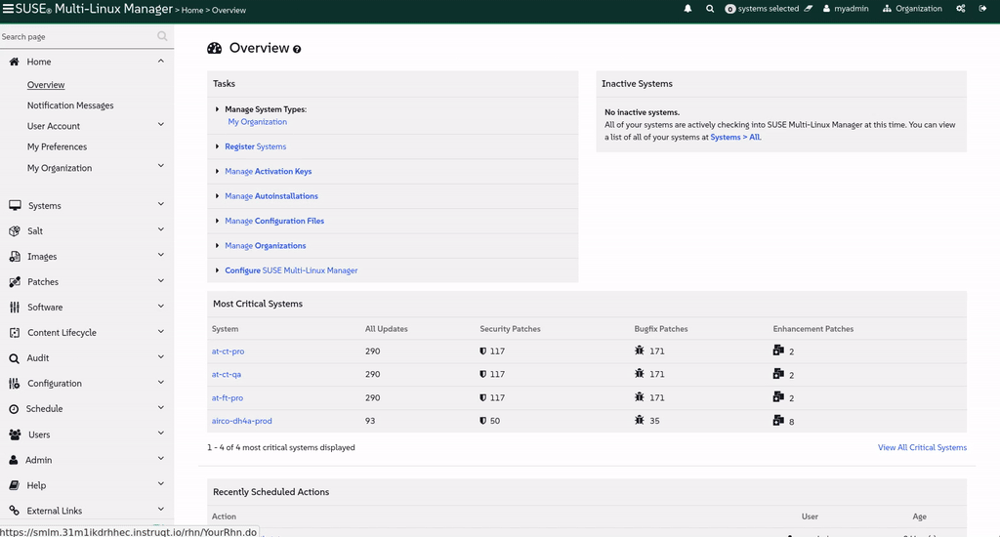

<b style="font-family: suse; src: url('https://fonts.google.com/specimen/SUSE'); color: #30ba78">SUSE</b> Multi-Linux Hands-on Workshop에 오신 것을 환영합니다
==================================================================

<link  rel="stylesheet" href="https://raw.githubusercontent.com/SUSE-Technical-Marketing/lab-setup/refs/heads/develop/web/css/instruqt.css" type="text/css" crossorigin="anonymous" fetchpriority="high" />

<style type="text/css">

  @import url("https://raw.githubusercontent.com/SUSE-Technical-Marketing/lab-setup/refs/heads/develop/web/css/instruqt.css");
  @import "https://raw.githubusercontent.com/SUSE-Technical-Marketing/lab-setup/refs/heads/develop/web/css/instruqt.css";

  * {
    font-family: suse;
    src: url('https://fonts.google.com/specimen/SUSE');
/*    background-color: #30ba78; */
  }
  .hovereffect {
    border-radius: 25px 25px 25px 25px;
    background: linear-gradient(#30ba78 0 0) var(--hundredpercent, 0) / var(--hundredpercent, 0) no-repeat;
    transition: 0.5s, background-position 0s;
    padding: 5px;
  }
  .hovereffect:hover {
    --hundredpercent: 100%;
    color: white;
    border-radius: 10px 25px 10px 25px;
  }
  .smlmext {
    color: #fe7c3f;
  }
  .smlm {
    color: #fe7c3f;
  }
  .suse {
    color: #30ba78;
  }
  .highlightcopy {
    color: white;
    font-weight: bold;
    padding: 0 10px;
  }


</style>


이 워크샵에서 여러분은 <b class="smlmext">SUSE Multi-Linux Manager</b> (<b class="smlm">SMLM</b>)가 할 수 있는 마법의 일부를 탐구하게 될 것입니다; 이것은 통일된 인터페이스에서 대규모로 여러 Linux 배포판을 관리하기 위한 <b class="suse">SUSE</b>의 솔루션입니다. 또한 Linux 시스템을 위한 당사의 전문적이고 신뢰할 수 있는 지원 솔루션인 <b class="smlsext">SUSE Multi-Linux Support</b> (<b class="smls">SMLS</b>)를 통해 기존 레거시 프로덕션 서버를 어떻게 지원 상태로 유지할 수 있는지 발견하게 될 것입니다.

&emsp;&emsp; 여러분은 모든 비행기에 Linux 서버가 탑재된 항공사 <b class="companyname">[[ Instruqt-Var key="COMPANY_NAME" hostname="zbastion" ]]</b>의 **엔지니어(engineer)** 역할을 맡게 됩니다.

&emsp;&emsp; 여느 비행기 부품과 마찬가지로, 이 서버들이 데이터 센터의 지상에 있든 구름 위를 날고 있든 관계없이 안정적이고 신뢰할 수 있는 상태를 유지하는 것이 중요합니다 ☁ ☁ ☁


&emsp;&emsp; 일부 비행기 모델은 다른 Linux 종류나 다른 CPU 아키텍처를 필요로 할 것입니다. 이는 <b class="smlm">SMLM</b>에게 문제가 되지 않습니다; 여러분은 쉬운 표준화 및 관리를 포기하지 않고도 필요에 가장 적합한 Linux 배포판과 CPU 아키텍처를 자유롭게 선택할 수 있습니다.


&emsp;&emsp; Linux 환경 관리를 담당하는 엔지니어로서, 여러분은 시스템 관리를 용이하게 하고 자동화하며 발생할 수 있는 예외적인 문제를 해결하기 위해 <b class="smlm">SMLM</b> 및 <b class="smls">SMLS</b>가 제공하는 몇 가지 솔루션을 살펴보게 될 것입니다.


다양한 과제를 진행하면서 다음 도구들을 사용할 수 있습니다:

 ✈ **SUSE Multi-Linux Manager**:
   전체 Linux 스택을 관리하기 위한 단일 창(single pane of glass).

 ✈ **Centos 7**:
   일부 구형 항공기 및 지상 시스템에서 여전히 사용 중인 레거시 배포판.

 ✈ **Ubuntu 24**: 그래픽 디자인 애플리케이션을 실행하기 위해 마케팅 부서에서 요구하는 특정 Linux 배포판.

 ✈ **SLES 15**: 가장 중요한 시스템의 중추를 형성하는 <b class="suse">SUSE</b>의 매우 신뢰할 수 있고 안정적이며 안전한 Linux 배포판.


## <b class="smlmext hovereffect">SUSE Multi-Linux Manager</b>

이는 소프트웨어 정의 인프라를 위한 동급 최고의 오픈 소스 인프라 관리 솔루션입니다.

&emsp;&emsp; <b class="smlmext">SUSE Multi-Linux Manager</b>는 기업의 DevOps 및 IT Operations 팀이 복잡성을 줄이고 IT 자산에 대한 제어권을 되찾도록 돕기 위해 설계되었으며, 다양한 하드웨어 아키텍처, 하이퍼바이저뿐만 아니라 컨테이너, IoT 및 클라우드 플랫폼 전반에 걸쳐 Linux 시스템을 관리할 수 있는 단일하지만 매우 강력한 도구입니다.

&emsp;&emsp; 이는 Linux 서버 및 IoT 장치 프로비저닝, 패치 적용 및 구성을 자동화하여 더 빠르고 일관되며 반복 가능한 서버 배포를 가능하게 함으로써 운영을 최적화하고 비용을 절감하도록 돕습니다. 또한 개발, 테스트 및 프로덕션 환경 전반에 걸친 시스템, VM 및 컨테이너에 대한 자동화된 모니터링, 추적, 감사 및 보고 기능을 통해 내부 보안 정책 및 외부 규정 준수를 보장할 수 있습니다.


## <b class="smlsext hovereffect">SUSE Multi-Linux Support</b>


이는 기존의 Red Hat Enterprise Linux (RHEL), CentOS, <b class="liberty">SUSE Liberty Linux</b> 및 <b class="sles">SUSE Linux Enterprise Server</b> (<b class="sles">SLES</b>)를 포함한 다양한 Linux 배포판에 대한 기술 지원 및 유지 관리를 제공하는 포괄적인 서비스입니다(제공 상품에 따라 다름).

&emsp;&emsp; 이를 통해 조직은 단일 지원 프레임워크 하에서 혼합된 Linux 환경을 효율적으로 관리할 수 있습니다.
구매한 패키지에 따라 <b class="smlsext">SUSE Multi-Linux Support</b>에는 이러한 배포판을 관리하기 위한 멀티 Linux 관리 도구인 <b class="smlmext">SUSE Multi-Linux Manager</b>가 포함될 수도 있습니다.


 🌅 Instruqt UI 탐색하기
=======================
첫 번째 작업을 시작하기 전에 잠시 시간을 내어 Instruqt UI를 살펴보겠습니다.

+ 화면의 **오른쪽**은 이러한 지침과 탐색 컨트롤을 제공합니다.

+ **왼쪽**은 실습 환경을 구성하는 다양한 머신과 서비스에 대한 액세스를 제공합니다.

Instruqt UI 내에서 왼쪽 패널 상단의 탭을 클릭하여 [button label="SMLM UI" variant="success"](tab-0)와 사용 가능한 [button label="terminals" variant="success"](tab-1) 사이를 이동할 수 있습니다.


> [!NOTE]
> 웹 UI에서는 자동 새로 고침이 발생하지 않으며, 경우에 따라 업데이트를 확인하기 위해 Instruqt의 내부 웹 브라우저를 새로 고침해야 할 수도 있습니다.


🛫 <b class="smlmext">SUSE Multi-Linux Manager</b>에 로그인하기 🛫
========================================
환경에 익숙해져 봅시다.

- [button label="SMLM UI" variant="success"](tab-0)에서 실습실 내부의 <b class="smlmext">SUSE Multi-Linux Manager</b>를 엽니다.


- 다음 자격 증명으로 로그인합니다:

  - 사용자 이름(Username):
```txt
[[ Instruqt-Var key="SMLM_USERNAME" hostname="zbastion" ]]
```
  - 비밀번호(Password):

```txt
[[ Instruqt-Var key="UNIVERSAL_PWD" hostname="zbastion" ]]
```

모든 것이 잘 진행되었다면, `[[ Instruqt-Var key="SMLM_USERNAME" hostname="zbastion" ]]` 사용자로 로그인된 <b class="smlmext">SUSE Multi-Linux Manager</b> UI의 **Overview** 페이지가 표시되어야 합니다.

> [!NOTE]
> 브라우저를 통해 직접 <b class="smlmext">SUSE Multi-Linux Manager</b> UI에 액세스하고 싶은 경우 다음과 같이 할 수도 있습니다:

<b class="smlm">SMLM</b> URL: <a href="[[ Instruqt-Var key="SMLM_URL" hostname="zbastion" ]]">[[ Instruqt-Var key="SMLM_URL" hostname="zbastion" ]]</a>


> [!NOTE]
> 페이지가 올바르게 로드되지 않으면 실습 환경이 시작된 후 브라우저 탭을 새로 고침해야 할 수도 있습니다.


🗺  <b class="smlmext">SUSE Multi-Linux Manager</b> 탐색하기 🗺
======================================

이륙하기 전에 제어 장치에 익숙해집시다. 이것은 철저한 투어가 아니라 워크샵 전체에서 사용할 주요 도구에 대한 간략한 개요입니다. 호기심을 갖고 탐색해 보시기 바랍니다.


시작해 보겠습니다.


- **Systems 메뉴** 

  왼쪽 패널에서 `systems`를 클릭합니다. 이것은 등록된 모든 서버를 보여주는 자산(fleet) 개요입니다. 목록은 지금은 작지만, 연습을 완료함에 따라 늘어날 것입니다.

   - **System Lists**

     이 섹션은 편리하고 미리 필터링된 보기를 제공합니다. 예를 들어, `Out of Date` 목록은 업데이트가 필요한 서버를 즉시 보여주어 수동 검색을 수행하는 수고를 덜어줍니다. </p>

  <br/>

  - **System Groups**

    자산을 논리적으로 구성하기 위해 `System Groups`를 사용합니다; 어떤 기준에 따라서든 분류할 수 있습니다. 이렇게 하면 작업을 적용하거나 정책을 정의할 때 시간을 절약할 수 있습니다. 생성된 후에는 예를 들어 `activation keys`를 사용하여 시스템을 하나 이상의 그룹에 자동으로 연결할 수 있습니다.


    `+ Create Group`을 클릭하여 지금 하나를 생성해 보십시오.

  <br/>

  - **일괄 작업(Batch operations)**

    `System Set Manager`는 여러 시스템에서 동시에 작업을 수행할 수 있는 강력한 방법을 제공합니다.


    변경 사항을 하나씩 적용하는 대신, System List에서 개별적으로 또는 기존 System Groups를 활용하여 시스템 컬렉션을 선택한 다음 단일 작업으로 모든 시스템에서 작업을 실행할 수 있습니다.

  <br/>

  - **Provisioning**

    <b class="smlmext">SUSE Multi-Linux Manager</b>는 새로운 시스템 프로비저닝 및 기존 시스템 재프로비저닝을 위한 포괄적인 도구를 제공합니다. 이 기능은 시스템 배포를 위한 표준화되고 반복 가능한 프로세스를 수립하는 데 도움이 됩니다.


    예를 들어, `Autoinstallation` 섹션 내에서 배포판 및 Kickstart/AutoYaST 프로필을 정의할 수 있으며, 이를 통해 시스템 배포 방식, 설치할 소프트웨어, 스토리지 공간 분배 방식 등을 지정할 수 있습니다.


    설정하기 쉬운 이 모든 자동화 메커니즘은 Salt 또는 Ansible과 같은 복잡하지만 더 강력한 자동화 솔루션과 결합될 수 있어, 각 과제에 가장 적합한 솔루션을 선택할 수 있는 자유를 유지합니다.


  <div style='align: middle; margin: 15px;'>
    
  </div>

<br/>


- **Patches 메뉴** 

  - **Patching**

    IT에서 가장 흔한 작업 중 하나는 시스템을 최신 상태로 유지하고 때로는 서둘러 보안 패치를 적용하는 것입니다!
    SMLM을 사용하면 유형별로 분류된 **관련** 패치 목록을 쉽게 볼 수 있으며, 영향을 받는 모든 시스템 및 패키지를 포함하여 알아야 할 모든 정보가 제공됩니다.

    벤더가 제공한 패치 외에도 자체 패치를 만들 수도 있습니다. 나중에 전체 자산에 대한 패치 및 정기 업데이트를 관리하기 위해 사용할 수 있는 다양한 옵션을 살펴보겠습니다.

  <div style='align: middle; margin: 15px;'>
    
  </div>

<br/>
- **소프트웨어 채널(Software channels)** 

  `Channel List`에서 사용 가능한 모든 패키지 채널/리포지토리/스트림을 볼 수 있습니다; 또한 소프트웨어를 구성하거나 자체 패키지를 업로드하기 위해 새로운 소프트웨어 채널을 만들 수도 있습니다.

  현재 보고 있는 모든 채널은 SMLM이 공식 소스에서 검색한 것이며 쉽게 동기화 상태를 유지할 수 있습니다.

  `Package Search`에서는 특정 패키지를 검색하고 콘텐츠 및 메타데이터를 검사할 수 있습니다.

  <div style='align: middle; margin: 15px;'>
    
  </div>

<br/>

- **Configuration** 

  등록 시 또는 그 이후에 시스템에 특정 구성을 관리하고 적용하는 것도 가능합니다; 이를 위해 `Configuration` 섹션을 검사할 수 있습니다.

  SMLM은 시스템 간에 리비전을 관리하고, 구성 파일을 배포 및 비교할 수 있는 쉬운 방법을 제공합니다. 그리고 모든 것을 구성 채널로 쉽게 그룹화할 수 있습니다.

  <div style='align: middle; margin: 15px;'>
    
  </div>

<br/>

- **Scheduling** 

  `Schedule`에서 예약된 작업을 관찰 및 관리하고 특정 유지 관리 기간을 정의할 수 있습니다. 이는 많은 시스템을 관리할 때 정기적인 작업을 자동화하거나 카나리아 배포(canary deployments)를 수행하는 데 특히 유용합니다. 워크샵 후반부에 이것이 실제로 작동하는 것을 보게 될 것입니다.

<br/>
<br/>

SUSE Multi-Linux Manager는 시스템을 관리할 수 있는 많은 가능성을 제공합니다; 이 워크샵에서 모든 것을 다룰 수는 없지만, 언제나 그렇듯이 자유롭게 질문하고 탐색해 보십시오.

> [!NOTE]
> 사용자는 전체 관리자 권한을 가지고 있으므로 연습을 마친 후에만 변경하는 것이 좋습니다.