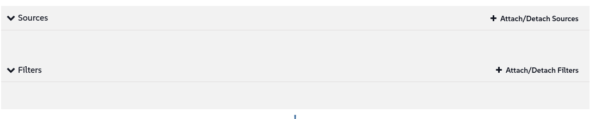

🌌 라이프사이클 관리 (Lifecycle management)
===================================

<style type="text/css">
  * {
    font-family: suse;
    src: url('https://fonts.google.com/specimen/SUSE');
  }
  .hovereffect {
    border-radius: 25px 25px 25px 25px;
    background: linear-gradient(#30ba78 0 0) var(--hundredpercent, 0) / var(--hundredpercent, 0) no-repeat;
    transition: 0.5s, background-position 0s;
    padding: 5px;
  }
  .hovereffect:hover {
    --hundredpercent: 100%;
    color: white;
    border-radius: 10px 25px 10px 25px;
  }
  .smlmext {
    color: #fe7c3f;
  }
  .smlm {
    color: #fe7c3f;
  }
  .suse {
    color: #30ba78;
  }
  .smls {
    color: #2453ff;
  }
  .smlsext {
    color: #2453ff;
  }
  .companyname {
    color: #008657;
  }
  .liberty {
    color: #efefef;
  }
  .sles {
    color: #90ebcd;
  }
  .highlightcopy {
    color: white;
    font-weight: bold;
    padding: 0 10px;
  }

  .bottoms {
    vertical-align: middle;
    height: 50%;
    width: 50%;
    margin: 0px;
    padding: 0px;
    object-fit: contain;
  }

  img.animatedgif {
    --borderthickness: 5pt;
    --colors: #0000 25%,#30ba78 0;
    padding: 10px;
    background:
      conic-gradient(from 90deg  at top    var(--borderthickness) left  var(--borderthickness),var(--colors)) 0    0,
      conic-gradient(from 180deg at top    var(--borderthickness) right var(--borderthickness),var(--colors)) 100% 0,
      conic-gradient(from 0deg   at bottom var(--borderthickness) left  var(--borderthickness),var(--colors)) 0    100%,
      conic-gradient(from -90deg at bottom var(--borderthickness) right var(--borderthickness),var(--colors)) 100% 100%;
    background-size: 50px 50px;
    background-repeat: no-repeat;
    transition: 1s;
  }

  img.animatedgif:hover {
    background-size: 51% 51%;
  }

  img.logos {
    border-radius: 10px;
  }

</style>


이 부분에서는 개별 유지 관리 작업에서 벗어나 변경 관리를 위한 전체 자산(fleet) 규모의 인증된 프로세스를 수립하는 단계로 넘어갑니다. <b class="smlmext">SUSE Multi-Linux Manager</b>의 콘텐츠 라이프사이클 관리(Content Lifecycle Management)가 우리 항공사가 요구하는 구조와 안전성을 어떻게 제공하는지 살펴보겠습니다.


[[ Instruqt-Var key="COMPANY_NAME" hostname="zbastion" ]]에서는 제조업체로부터 새 부품이 도착하자마자 여객기에 설치하지 않습니다. 엄격한 인증 과정을 거칩니다.

먼저, 통제된 작업장에서 검사 및 테스트를 거칩니다(**Development - 개발**). 다음으로, 비상업용 테스트 항공기에 장착되어 혹독한 지상 및 비행 테스트를 거칩니다(**Quality Assurance - 품질 보증/QA**). 생각할 수 있는 모든 점검을 통과한 후에야 비로소 활성 자산 전체에 설치할 수 있도록 인증됩니다(**Production - 프로덕션**).


이러한 체계적이고 단계적인 접근 방식은 단일 결함 부품으로 인해 비행기가 이륙하지 못하는 사태를 방지하여 승객의 안전과 운항의 신뢰성을 보장합니다. 우리는 이와 똑같은 철학을 IT 시스템에도 적용합니다. 소프트웨어 업그레이드나 새 애플리케이션은 결함이 있을 경우 디지털 운영을 중단시킬 수 있는 "부품"입니다. 콘텐츠 라이프사이클 관리는 모든 소프트웨어 변경에 대한 당사의 공식 인증 프로세스입니다.


## <b class="hovereffect">여러분의 목표:</b>

- 콘텐츠 라이프사이클 프로젝트(Content Lifecycle Project)를 구축합니다.

- 프로젝트를 사용하여 시스템에 대한 소프트웨어 업데이트를 관리하고 인증합니다.


Lab details
===========

사용자 이름 (Username):
```txt
[[ Instruqt-Var key="SMLM_USERNAME" hostname="zbastion" ]]
```

비밀번호 (Password):
```txt
[[ Instruqt-Var key="UNIVERSAL_PWD" hostname="zbastion" ]]
```

<b class="smlm">SMLM</b> URL: <a href="[[ Instruqt-Var key="SMLM_URL" hostname="zbastion" ]]">[[ Instruqt-Var key="SMLM_URL" hostname="zbastion" ]]</a>


소프트웨어 인증 경로 구축
==============================================

이 연습에서는 소프트웨어 업데이트 흐름을 제어하기 위한 콘텐츠 라이프사이클 프로젝트를 생성합니다. 이를 통해 패치가 중요한 프로덕션 서버에 도달하기 전에 철저히 테스트되도록 보장합니다.

<br/>

우리의 목표는 `Dev ✈ QA ✈ Prod` 파이프라인을 구축하는 것입니다.

1.  **개발 (Dev):** 초기 작업장. 모든 새로운 패치와 패키지가 가장 먼저 이곳에 도착합니다.
2.  **품질 보증 (QA):** 테스트 장소. 테스트 팀이 검증할 수 있도록 Dev에서 QA로 특정 버전의 콘텐츠를 승격(promote)합니다.
3.  **프로덕션 (Prod):** 활성 자산. QA 승인을 받고 인증된 패치 세트만 프로덕션으로 승격되어 라이브 시스템에 안전하게 적용될 수 있습니다.


<br/>

## <b class="hovereffect">프로젝트 생성</b>

- `Content Lifecycle` ✈ `Projects`로 이동하여 을 클릭합니다.

- 프로젝트 세부 정보를 입력합니다:

- **Project Name** (프로젝트 이름):

```txt
Airtrain SLES15 SPx
```

- **Project Label** (프로젝트 라벨):

```txt
at-sles15_spx
```

- **Project Description** (프로젝트 설명):

```txt
Certified software channel for Airtrain SLES 15 systems.
```


- 을 클릭합니다.

이제 채워보겠습니다. `Attach/Detach Sources`를 클릭하십시오.



- **New Base Channel**에서 <b class="sles">SLE-Product-SLES15-SP6-Pool for x86_64</b>를 선택하고 을 클릭합니다.

<br/>

## <b class="hovereffect">Dev 환경 생성</b>

개발 환경 라이프사이클(Development Environment Lifecycle) 생성

- `Add Environment`를 클릭합니다.


- 다음 내용으로 채웁니다:
  * **Name:** <b class="highlightcopy">Development</b>
  * **Label:** <b class="highlightcopy">dev</b>

- 을 클릭합니다.

<br/>

## <b class="hovereffect">QA 환경 생성</b>

품질 보증 환경 라이프사이클(Quality Assurance Environment Lifecycle) 생성

- `Add Environment`를 클릭합니다.

- 다음 내용으로 채웁니다:
  * **Name:** <b class="highlightcopy">QA</b>
  * **Label:** <b class="highlightcopy">qa</b>

- 을 클릭합니다.

<br/>

## <b class="hovereffect">Prod 환경 생성</b>

프로덕션 환경 라이프사이클(Production Environment Lifecycle) 생성

- `Add Environment`를 클릭합니다.

- 다음 내용으로 채웁니다:
  * **Name:** <b class="highlightcopy">Production</b>
  * **Label:** <b class="highlightcopy">prod</b>

- 을 클릭합니다.

<br/>

## <b class="hovereffect">채우기 (Populate)</b>

이제 세 가지 환경이 모두 준비되었으므로 콘텐츠를 채워보겠습니다.

<b class="sles">SLES</b>가 이미 안정적인 패키지 버전을 제공하므로 이 경우에는 필터를 사용하지 않겠습니다.

[[ Instruqt-Var key="COMPANY_NAME" hostname="zbastion" ]]의 테스트 주기는 현재 한 달이므로, 이 빌드의 이름을 현재 달인 10월(October)로 지정하겠습니다.

- 을 클릭합니다.

- **Version Message**에 다음을 입력합니다:

```txt
October
```


- `Build`를 클릭합니다.

> [!NOTE]
> 이 프로세스는 몇 분 정도 걸릴 수 있으며 'cloning(복제 중)'과 같은 단계가 표시되지만, 많은 저장 공간이 필요하지 않다는 점을 알면 안심이 될 것입니다. 복제 프로세스는 패키지 인덱스 포인트에만 적용되며 실제 패키지 자체에는 적용되지 않습니다.


<br/>

## <b class="hovereffect">콘텐츠 승격 (Promoting)</b>

이제 콘텐츠를 다음 단계로 승격(promote)해 보겠습니다.

- Development와 QA 사이의 `Promote` 버튼을 클릭합니다.
- **Promote version 1 into QA**라는 제목의 다른 화면이 나타나면 `Promote`를 다시 클릭하십시오.

Production에 대해서도 같은 단계를 반복합니다.


  <div style='align: middle; margin: 15px;'>
    
  </div>

<br/>

시스템 업그레이드
====================

이제 어떻게 작동하는지 시험해 봅시다.

우리는 다음을 수행할 것입니다:
- 일부 시스템을 새 환경에 추가합니다.
- 콘텐츠의 새 버전을 생성합니다.
- 새 버전을 승격하고 시스템을 업데이트합니다.

<br/>

## <b class="hovereffect">시스템 추가</b>

`Systems` ✈ `System List` ✈ `All`로 이동합시다.

- **at-ct-qa** 시스템을 클릭합니다.
- `Software` ✈ `Software Channels`로 이동합니다.
- **Custom Channels**에서 **at-sles15_spx-qa-...** 채널의 체크박스를 선택하고 을 클릭합니다.
- 을 클릭합니다.


`Systems` ✈ `System List` ✈ `All`로 돌아갑니다.

- 다음으로 필터링:

```txt
at-
```

- **-pro**로 끝나는 모든 시스템을 선택합니다.
- `Systems` ✈ `System Set Manager`로 이동합니다.
- `Channels`로 이동합니다.
- **Custom Channels**에서 **at-sles15_spx-prod-...** 채널의 체크박스를 선택하고 을 클릭합니다.
- 'include recommended'(권장 포함)를 클릭하여 모든 권장 채널을 구독합니다:

<p style="margin: 1px; padding: 1px; vertical-align: middle; display:inline-block; align:left;"> </p><p style="margin: 1px; padding: 1px;vertical-align: middle; display:inline-block; align:left;"></p> ✈ <p style="margin: 1px; padding: 1px;vertical-align: middle; display:inline-block; align:center;"></p>


  <div style='align: middle; margin: 15px;'>
    
  </div>

<br/>

## <b class="hovereffect">새 버전 생성</b>


한 달이 지났고 안정적인 업그레이드 프로세스를 계속 진행하고 싶습니다.
개발자 팀을 위해 소프트웨어 채널의 정적이고 변경되지 않는 복사본을 생성하려고 합니다.

새로운 패치가 갑자기 나타나 그들의 작업을 방해하지 않을 것입니다.

- `Content Lifecycle` ✈ `Projects`로 돌아가서 방금 만든 프로젝트를 클릭합니다.

- 을 클릭합니다.

- **Version Message**에 다음을 입력합니다:

```txt
November
```


- `Build`를 클릭합니다.

버전 번호가 자동으로 증가한 것을 확인하십시오.

이제 개발자는 SUSE에서 제공하는 라이브러리 및 애플리케이션의 새로운 패치 버전을 사용하여 작업을 수행할 수 있습니다.


  <div style='align: middle; margin: 15px;'>
    
  </div>


<br/>

## <b class="hovereffect">Dev에서 QA로 콘텐츠 승격</b>

개발자들이 승인을 했다고 가정해 봅시다. 모든 사전 프로덕션 테스트를 수행할 수 있도록 QA 팀을 위한 안정적인 버전을 만들 차례입니다.

- Development와 QA 사이의 `Promote` 버튼을 클릭합니다.
- **Promote version 2 into QA**라는 제목의 다른 화면이 나타나면 `Promote`를 다시 클릭하십시오.

이제 QA 시스템으로 이동하여 업그레이드를 수행해 봅시다.

- `Systems` ✈ `System List` ✈ `All`
- **at-ct-qa** 시스템을 클릭합니다.
- `Software` ✈ `Packages` ✈ `Upgrade`로 이동합니다.
- 다음을 클릭합니다:

<p style="margin: 1px; padding: 1px; vertical-align: middle; display:inline-block; align:left;"> </p><p style="margin: 1px; padding: 1px;vertical-align: middle; display:inline-block; align:left;"></p> ✈ <p style="margin: 1px; padding: 1px;vertical-align: middle; display:inline-block; align:center;"></p> ✈ <p style="margin: 1px; padding: 1px;vertical-align: middle;display:inline-block; align:right;"> </p>


이제 QA 엔지니어들은 중단 없이 안전하게 테스트를 수행할 수 있습니다.


> [!NOTE]
> 변경 사항이 적용되는 것을 볼 충분한 시간이 없지만, 실제 시나리오에서는 버전 2에서 승격할 수 있는 패키지의 새 버전이 있어야 합니다.

  <div style='align: middle; margin: 15px;'>
    
  </div>


<br/>

## <b class="hovereffect">프로덕션으로 승격</b>

QA 팀은 `v2`에 대한 엄격한 테스트를 완료하고 주요 자산(fleet)에 대해 안정적이고 안전하다고 인증했습니다. 이제 프로덕션 시스템에서 사용할 수 있도록 할 차례입니다.

프로덕션 환경에 대해서도 QA에서 수행한 것과 동일한 프로세스를 반복할 것입니다:

- 첫째, 콘텐츠를 승격합니다.
  이렇게 하면 프로덕션 서버에서 새 패키지를 사용할 수 있게 됩니다.
  테스트되고 승인된 업데이트만 가장 중요한 시스템에 도달할 수 있도록 성공적으로 보장했습니다.

- 둘째, 프로덕션 시스템을 업그레이드합니다. 여기서 유일한 차이점은 모든 팀이 준비되고 통제된 프로세스를 가질 수 있도록 업그레이드를 **내일 14:00**로 예약한다는 것입니다.


<br/>

이것이 [[ Instruqt-Var key="COMPANY_NAME" hostname="zbastion" ]]에 중요한 이유는 무엇입니까?
=================================================================================

- 우리는 일련의 안전 게이트를 구축하여 운영 전략의 핵심 원칙인 **위험 관리(risk management)**를 쉽게 구현할 수 있도록 합니다.
- **Dev** 환경에 도입된 단 하나의 잘못된 패치라도 수익 창출 시스템에 영향을 미칠 기회를 갖기 훨씬 전에 발견하고 수정할 수 있습니다.
- 이 프로세스는 패치 및 업데이트를 위험하고 신경 쓰이는 이벤트에서 신뢰할 수 있는 항공사의 초석인 예측 가능한 일상적인 유지 관리 절차로 변환합니다.


<br/>

추가 정보
================

* [유지 관리 기간 (Maintenance Windows)](https://documentation.suse.com/multi-linux-manager/5.1/en/docs/administration/maintenance-windows.html)

* [패치 관리 (Patch Management)](https://documentation.suse.com/multi-linux-manager/5.1/en/docs/administration/patch-management.html)

* [콘텐츠 라이프사이클 관리 (Content Lifecycle Management)](https://documentation.suse.com/multi-linux-manager/5.1/en/docs/administration/content-lifecycle.html)

* [SUSE Multi-Linux Manager 제품 페이지](https://www.suse.com/products/suse-manager/)