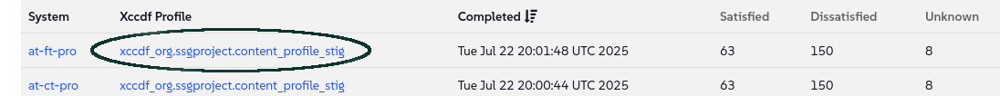

🌌 Segurança e aplicação de patches
===================================

<style type="text/css">
  * {
    font-family: suse;
    src: url('https://fonts.google.com/specimen/SUSE');
  }
  .hovereffect {
    border-radius: 25px 25px 25px 25px;
    background: linear-gradient(#30ba78 0 0) var(--hundredpercent, 0) / var(--hundredpercent, 0) no-repeat;
    transition: 0.5s, background-position 0s;
    padding: 5px;
  }
  .hovereffect:hover {
    --hundredpercent: 100%;
    color: white;
    border-radius: 10px 25px 10px 25px;
  }
  .smlmext {
    color: #fe7c3f;
  }
  .smlm {
    color: #fe7c3f;
  }
  .suse {
    color: #30ba78;
  }
  .smls {
    color: #2453ff;
  }
  .smlsext {
    color: #2453ff;
  }
  .companyname {
    color: #008657;
  }
  .liberty {
    color: #efefef;
  }
  .sles {
    color: #90ebcd;
  }
  .highlightcopy {
    color: white;
    font-weight: bold;
    padding: 0 10px;
  }

  .bottoms {
    vertical-align: middle;
    height: 50%;
    width: 50%;
    margin: 0px;
    padding: 0px;
    object-fit: contain;
  }

  img.animatedgif {
    --borderthickness: 5pt;
    --colors: #0000 25%,#30ba78 0;
    padding: 10px;
    background:
      conic-gradient(from 90deg  at top    var(--borderthickness) left  var(--borderthickness),var(--colors)) 0    0,
      conic-gradient(from 180deg at top    var(--borderthickness) right var(--borderthickness),var(--colors)) 100% 0,
      conic-gradient(from 0deg   at bottom var(--borderthickness) left  var(--borderthickness),var(--colors)) 0    100%,
      conic-gradient(from -90deg at bottom var(--borderthickness) right var(--borderthickness),var(--colors)) 100% 100%;
    background-size: 50px 50px;
    background-repeat: no-repeat;
    transition: 1s;
  }

  img.animatedgif:hover {
    background-size: 51% 51%;
  }

  img.logos {
    border-radius: 10px;
  }

</style>


Neste laboratório, abordaremos uma das responsabilidades mais importantes que temos: garantir a segurança de toda a nossa frota digital. Exploraremos como o <b class="smlmext">SUSE Multi-Linux Manager</b> nos permite responder a ameaças de segurança com a velocidade e a precisão exigidas por uma companhia aérea de classe mundial.


## <b class="hovereffect">Seus Objetivos:</b>

- Realizar uma auditoria de conformidade de segurança em seus sistemas usando OpenSCAP.

- Identificar sistemas afetados por vulnerabilidades de segurança relevantes.

- Aplicar os patches necessários a todos os sistemas afetados simultaneamente.


Detalhes do laboratório (Lab details)
===========

Usuário (Username):
```txt
[[ Instruqt-Var key="SMLM_USERNAME" hostname="zbastion" ]]
```

Senha (Password):
```txt
[[ Instruqt-Var key="UNIVERSAL_PWD" hostname="zbastion" ]]
```

URL do <b class="smlm">SMLM</b>: <a href="[[ Instruqt-Var key="SMLM_URL" hostname="zbastion" ]]">[[ Instruqt-Var key="SMLM_URL" hostname="zbastion" ]]</a>


Audite seus sistemas
==================

Queremos auditar nossos sistemas de produção para garantir que estejam em conformidade.

Já verificamos que os seguintes pacotes estão instalados:

- openscap-utils
- scap-security-guide


Selecione o grupo de produção

- Vamos para `Systems` ✈ `System Groups`
- Encontre o grupo **prod** e clique em `Use in SSM`


Seremos direcionados para a página **System Set Manager Overview**, como vimos anteriormente; a partir daqui podemos aplicar ações a vários sistemas de uma só vez.

- Vá para a aba `Audit`
- Em `OpenSCAP`, complete o formulário com os seguintes detalhes, deixe o restante com os padrões:
  - **Command-line Arguments:** <b class="highlightcopy">--profile xccdf_org.ssgproject.content_profile_stig</b>
  - **Path to XCCDF document:** <b class="highlightcopy">/usr/share/xml/scap/ssg/content/ssg-sle15-ds.xml</b>
- Pressione


<p style="margin: 1px; padding: 1px; vertical-align: middle; display:inline-block; align:left;">
</p>
<p style="margin: 1px; padding: 1px;vertical-align: middle; display:inline-block; align:left;">

</p> ✈
<p style="margin: 1px; padding: 1px;vertical-align: middle; display:inline-block; align:center;">

</p>


Isso levará alguns minutos.


Para ver os resultados, vamos para `Audit` ✈ `OpenSCAP` ✈ `All Scans`



Se clicarmos em um desses resultados, podemos ver um detalhamento mais aprofundado.

- Clicando em **report.html**, você pode visualizar uma versão mais agradável do relatório que foi gerado pelo OpenSCAP.


Não se preocupe com os problemas relatados.


  <div style='align: middle; margin: 15px;'>
    
  </div>

<br/>


Identificar sistemas afetados por vulnerabilidades
============================================

Queremos ver quais sistemas são afetados por vulnerabilidades.

- Agora, vamos navegar para `Patches` ✈ `Patch List` ✈ `Relevant`

  Aqui podemos ver uma lista de todos os patches relevantes disponíveis para nossos sistemas, vamos olhar para os **Security Patches** (Patches de Segurança).

- Clicando no nome de um **Advisory** (Aviso), você pode visualizar uma página detalhada mostrando quais pacotes e sistemas ele afeta, entre outros detalhes.

- No lado direito da lista, a coluna **CVEs** fornece links diretos para os relatórios oficiais de vulnerabilidade.

  Também é possível criar nossos próprios patches, mas não abordaremos isso nesta trilha; para mais informações, consulte os links no final da trilha.


## <b class="hovereffect">Aplicar patches nos sistemas afetados</b>

Aplicar patches em nossos sistemas é tão simples quanto seguir estes passos:

- Vá para `Systems` ✈ `System Set Manager`
- Navegue para a aba `Patches` ✈ selecione **Security Advisory** na lista suspensa e clique em `Show`


- Clique em `Select All` ✈ `Apply Patches` ✈ 


  <div style='align: middle; margin: 15px;'>
    
  </div>

<br/>


Por que isso é importante para a [[ Instruqt-Var key="COMPANY_NAME" hostname="zbastion" ]]?
=================================================================================


- Ao sermos capazes de agir rápido, estamos reduzindo a janela de exposição. Quando uma nova vulnerabilidade é descoberta, uma corrida começa entre nós e os agentes maliciosos tentando explorá-la. Um processo de aplicação de patches manual e complexo deixa nossos sistemas críticos expostos por muito tempo.

- O <b class="smlmext">SUSE Multi-Linux Manager</b> fornece uma visão única e unificada da postura de segurança de toda a nossa frota e nos permite remediar ameaças com um processo consistente e confiável.

- Ser capaz de verificar facilmente a conformidade de nossos sistemas com diferentes estruturas de segurança nos permite implementar medidas corretivas mais rapidamente e aderir a regulamentações rigorosas da indústria.


Mais informações
================


* [Auditoria](https://documentation.suse.com/multi-linux-manager/5.1/en/docs/administration/auditing.html)
* [Segurança da SUSE](https://www.suse.com/support/security/)
* [Segurança do Sistema com OpenSCAP](https://documentation.suse.com/multi-linux-manager/5.1/en/docs/administration/openscap.html)
* [Gerenciar Patches](https://documentation.suse.com/multi-linux-manager/5.1/en/docs/administration/patch-management.html)