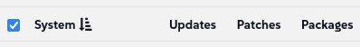

🌌 Farklı Linux dağıtımlarını yönetme
===================================

<style type="text/css">
  * {
    font-family: suse;
    src: url('https://fonts.google.com/specimen/SUSE');
  }
  .hovereffect {
    border-radius: 25px 25px 25px 25px;
    background: linear-gradient(#30ba78 0 0) var(--hundredpercent, 0) / var(--hundredpercent, 0) no-repeat;
    transition: 0.5s, background-position 0s;
    padding: 5px;
  }
  .hovereffect:hover {
    --hundredpercent: 100%;
    color: white;
    border-radius: 10px 25px 10px 25px;
  }
  .smlmext {
    color: #fe7c3f;
  }
  .smlm {
    color: #fe7c3f;
  }
  .suse {
    color: #30ba78;
  }
  .smls {
    color: #2453ff;
  }
  .smlsext {
    color: #2453ff;
  }
  .companyname {
    color: #008657;
  }
  .liberty {
    color: #efefef;
  }
  .sles {
    color: #90ebcd;
  }

  .highlightcopy {
    color: white;
    font-weight: bold;
    padding: 0 10px;
  }

  .bottoms {
    vertical-align: middle;
    height: 50%;
    width: 50%;
    margin: 0px;
    padding: 0px;
    object-fit: contain;
  }

  img.animatedgif {
    --borderthickness: 5pt;
    --colors: #0000 25%,#30ba78 0;
    padding: 10px;
    background:
      conic-gradient(from 90deg  at top    var(--borderthickness) left  var(--borderthickness),var(--colors)) 0    0,
      conic-gradient(from 180deg at top    var(--borderthickness) right var(--borderthickness),var(--colors)) 100% 0,
      conic-gradient(from 0deg   at bottom var(--borderthickness) left  var(--borderthickness),var(--colors)) 0    100%,
      conic-gradient(from -90deg at bottom var(--borderthickness) right var(--borderthickness),var(--colors)) 100% 100%;
    background-size: 50px 50px;
    background-repeat: no-repeat;
    transition: 1s;
  }

  img.animatedgif:hover {
    background-size: 51% 51%;
  }

  img.logos {
    border-radius: 10px;
  }

</style>


Burada [[ Instruqt-Var key="COMPANY_NAME" hostname="zbastion" ]] içinde, <b class="smlmext">SUSE Multi-Linux Manager</b>, çeşitli Linux dağıtımları ve mimarileri filomuzu tek bir cam panelden (single pane of glass) yönetmenin anahtarıdır. Bu, mühendisler olarak işlerimizi zorlaştıran ekstra özelleştirmelerden kaçınmamıza yardımcı oldu, bu da sistem politikalarımızı sürdürmek ve uygulamak için gereken maliyeti ve zamanı artırıyordu.

Bu araçla, tek bir satıcıya, mimariye veya otomasyon platformuna kilitli değiliz. Ortamımız için neye ihtiyacımız olduğunu seçmekte ve hepsini aynı şekilde yönetmekte özgürüz. Filomuzdaki her uçak tipi için, kendi dili ve prosedürleri olan farklı bir hava trafik kontrol kulesine ihtiyacımız olduğunu hayal edin. Operasyonel karmaşıklık yönetilemez olurdu ve maliyetler engelleyici olurdu.

Hepimiz belirli bir uçak modelinin belirli bir rota için daha iyi olduğunu biliyoruz; yarım saatlik bir uçuş için jumbo jet uçurmak maliyet açısından verimli değildir. Aynısı Linux dağıtımlarımız için de geçerlidir. SUSE'nin kendi dağıtımları mükemmel olsa da, bazı uygulamalarımızın özel gereksinimleri vardır. <b class="smlm">SMLM</b>, asla kilitli kalmamamızı (vendor lock-in) ve eldeki görev için her zaman en iyi çözümü entegre edebilmemizi sağlar.


## <b class="hovereffect">Hedefleriniz:</b>

- Pazarlama ekibimiz tarafından ihtiyaç duyulan özel bir sistem olan bir Ubuntu 24.04 LTS sistemini dahil edin (Onboard).

- Bu yeni, farklı sistemi, filomuzun geri kalanıyla aynı araçları ve yama prosedürlerini kullanarak nasıl yönettiğimizi gösterin.


Laboratuvar detayları (Lab details)
===========

Kullanıcı Adı (Username):
```txt
[[ Instruqt-Var key="SMLM_USERNAME" hostname="zbastion" ]]
```

Şifre (Password):
```txt
[[ Instruqt-Var key="UNIVERSAL_PWD" hostname="zbastion" ]]
```

<b class="smlm">SMLM</b> URL: <a href="[[ Instruqt-Var key="SMLM_URL" hostname="zbastion" ]]">[[ Instruqt-Var key="SMLM_URL" hostname="zbastion" ]]</a>


Ubuntu'yu Dahil Etme (Onboarding Ubuntu)
=================

Pazarlama departmanımızdan yeni bir hizmet talebi geldi. Grafik tasarımcıları, yalnızca Ubuntu üzerinde desteklenen belirli bir yaratıcı süite güveniyor. Sistemlerini dahil edeceğiz, böylece yönetebilir ve diğerleriyle yaptığımız gibi güvenlik ve uyumluluk standartlarımızı karşıladığından emin olabiliriz.

Hadi başlayalım.
<br/>

- [button label="Ubuntu 2404 LTS" variant="success"](tab-1) sekmesinden sistem terminaline erişin

  Herhangi bir değişiklik yapmadan önce paketleri nereden sağladığını kontrol edelim:

```bash,run
grep -v '^#\|^Types:\|Trusted:\|Architectures:' /etc/apt/sources.list.d/*
```

Bu iş istasyonu yazılımı doğrudan genel Ubuntu depolarından çekiyor. Bu iki sorun teşkil ediyor: birincisi, uygulanan yamalar üzerinde hiçbir kontrolümüz yok, bu da bir güvenlik endişesidir. İkincisi, pazarlama ekibinin bildirdiği gibi, bu iş istasyonları her güncelleme aldığında ofis internet bağlantısını yavaşlatabilir ve diğer çalışanlar için hayal kırıklığına neden olabilir.


Bu sistemi yönetimimiz altına alalım. Bu, tüm yazılım ihtiyaçları için onu dahili <b class="smlmext">SUSE Multi-Linux Manager</b> örneğimize bağlayarak her iki sorunu da çözecektir.

Bunu yapmak için [button label="web UI" variant="success"](tab-0) kullanacağız:

- `Home` ✈ `Overview` altında, `Register Systems` üzerine tıklayalım

- Aşağıdaki detayları doldurun:

  - **Host:**

  ```txt
  ubuntu2404lts
  ```

  - **User:** (Kullanıcı)

  ```txt
  root
  ```

  - **Password:** (Şifre)

  ```txt
  [[ Instruqt-Var key="UNIVERSAL_PWD" hostname="zbastion" ]]
  ```

  - **Activation Key:** (Aktivasyon Anahtarı)   <b class="highlightcopy">1-ubuntu2404</b>

- Gerisini olduğu gibi bırakın ve şuna tıklayın


- Kayıt işleminin tamamlanması birkaç dakika sürebilir, [button label="terminal" variant="success"](tab-1)'e gidelim ve neyin değiştiğini görmek için ilk komutu bir kez daha çalıştıralım:


```bash,run
echo 'Waiting for the registration to complete' ;while [[ ! -f /etc/apt/sources.list.d/susemanager_bootstrap.sources ]] || [[ ! -f /etc/apt/sources.list.d/susemanager:channels.sources ]]; do echo -n '.'; sleep 5; done ; sleep 60; grep -v '^#\|^Types:\|Trusted:\|Architectures:' /etc/apt/sources.list.d/*
```


Yeni dosyaların göründüğünü görebiliriz:

**/etc/apt/sources.list.d/susemanager:***

Sistemi <b class="smlm">SMLM</b> içindeki merkezi olarak yönetilen ve kontrol edilen kanallarımıza yönlendirirler.


Ayrıca orijinal dosyanın, **/etc/apt/sources.list.d/ubuntu.sources**, tüm genel depoları devre dışı bırakacak şekilde değiştirildiğini ancak silinmediğini görebiliriz, bu da gerekirse kolayca geri almamızı (roll back) sağlar.


> [!NOTE]
> Kayıt için şifre doğrulaması ile SSH üzerinden root kullanmak sadece gösterim amaçlıdır ve üretim (production) için önerilmez.


> [!NOTE]
> Varsayılan olarak her sistemin kaydını UI veya komut satırı < salt-key -A -y > üzerinden onaylamamız gerekir, burada <b class="smlm">SMLM</b> otomatik onaylama (auto approve) için yapılandırılmıştır.


  <div style='align: middle; margin: 15px;'>
    
  </div>

<br/>


Şimdi [button label="SMLM UI" variant="success"](tab-0) sekmesine geçelim


- `Systems` ✈ `System List` ✈ `All` yolunu izliyoruz

  Az önce kaydettiğimiz `Ubuntu2404lts` sistemini görebiliriz, varsayılan olarak ana bilgisayar adı (hostname) altında kaydedileceğini unutmayın.

  Üzerine tıklayalım, doğrudan diğer bilgilerin yanı sıra şunları görebileceğimiz `Details` - `Overview` bölümüne gideceğiz:

  - Sistem durumu.
  - Ana bilgisayar adı, IP adresi, sanallaştırma türü, kullanılan Çekirdek (Kernel) ve yüklü ürünler gibi tüm bilgiler.
  - Abone olduğu kanallar.

  <div style='align: middle; margin: 15px;'>
    
  </div>


<br/>

Birden fazla Linux dağıtımını yönetme
=====================================


Daha önce belirtildiği gibi, <b class="companyname">[[ Instruqt-Var key="COMPANY_NAME" hostname="zbastion" ]]</b>'da, farklı uçak modelleri ve şirketleri kullandığımız gibi farklı Linux dağıtımları kullanıyoruz. Bu, ihtiyaçlarımızın her biri için en uygun ürünü kullanarak rekabette önde kalmamıza yardımcı olur.

<b class="smlmext">SUSE Multi-Linux Manager</b> ile hepsini aynı prosedürler, aynı programlar vb. ile aynı arayüz ve mekanizmaları kullanarak yönetebiliriz.

Aşağıda, sistemlerimizin hangi işletim sistemini (OS) çalıştırdığından bağımsız olarak aynı süreci izleyerek, gereksiz özelleştirmeler oluşturmak zorunda kalmadan sistemlerinizde farklı görevlerin nasıl gerçekleştirileceğini keşfedeceğiz.


## <b class="hovereffect">Ek bilgi ekleyin</b>


Az önce kaydettiğimiz sistemle devam edelim, ona birkaç ayar ve bilgi ekleyeceğiz:

- Sistem hakkında ek bilgiler ekleyeceğimiz ve bazı ayarları değiştireceğimiz `Properties`'e tıklayalım.


  - Yamaların otomatik uygulanmasını etkinleştir (Enable Automatic application of patches):

  

    Bu, ilgili yamalar olduğunda sisteme otomatik olarak yama uygulayacaktır.


  - Sistem için aşağıdaki detayları ekleyin:


| Alan (Field) | İçerik (Content)                                                  |
| ---: | :-----                                                    |
| **Description** | <b class="highlightcopy">Multimedia workstation for graphics designers.</b> |
| **Facility Address** | <b class="highlightcopy">Candy eye street, 1</b> |
| **City** | <b class="highlightcopy">Aeolia</b> |
| **Building** | <b class="highlightcopy">Belem Tower 4</b> |
| **Room** | <b class="highlightcopy">Sierra nevada</b> |


- Hangi donanım üzerinde çalıştığına bakalım:

  - `Details` ✈ `Hardware` üzerine tıklayın


<br/>

> [!NOTE]
> Bütün bunlar API aracılığıyla otomatikleştirilebilir.

<br/>

Şimdi özel anahtarlar (custom keys) kullanarak sisteme bazı ek bilgiler ekleyeceğiz, bu bilgiler daha sonra otomasyon komut dosyalarınızda (scripts) kolayca kullanılabilir.


- `Details` ✈ `Custom Info` üzerine tıklayın


- `application` üzerine tıklayın ve **value** (değer) kısmını şununla doldurun:

```text
Logo Wings designer pro
```


<br/>

> [!NOTE]
> Sizin için özel anahtar **application**'ı zaten oluşturduk, kendi anahtarlarınızı oluşturmak istiyorsanız şu adrese gitmek kadar basittir: `Systems` ✈ `Custom System Info` ✈ `Create key`

<br/><br/>

Systems listesine geri dönelim

`Systems` ✈ `System List` ✈ `All`


Sistemlerden herhangi birine tıklayalım ve `Details` ✈ `Custom Info`'ya gidelim.

Her sistemi zaten bir değerle doldurduk,

<br/>

Şimdi `Details` ✈ `Overview`'a gidin ve **Installed Products** ve **Subscribed Channels**'a dikkat edin, bunlar farklı bir işletim sistemi çalıştırdıkları için Ubuntu sisteminizdekilerden farklıdır.


  <div style='align: middle; margin: 15px;'>
    
  </div>

<br/>


## <b class="hovereffect">Birden fazla sistemde aynı anda komut çalıştırın</b>


Sahip olduğumuz tüm sistemlerde bir şeyler yapalım, `Systems` ✈ `System List` ✈ `All`'a geri dönün ve hepsini seçin:



**Base Channel** sütununa dikkat edin, üç farklı işletim sistemi çalıştıran sistemlerimiz var.

<br/>

İşlem yapmak istediğimiz tüm sistemleri seçtikten sonra bir grup eylemi gerçekleştirmeye gidelim:

`Systems` ✈ `System Set Manager`

Hepsinde bir komut çalıştıralım, bunun için şuraya gidebiliriz:

`Misc` ✈ `Remote Command`

ardından aşağıdaki detayları doldurun ve gerisini varsayılan değerlerle bırakın:


Komut Dosyası (Script):

```bash,run
cat /etc/os-release
```

Zamanlamayı (schedule) değiştirmeyin, mümkün olan en kısa sürede çalışmasını istiyoruz, şuna tıklayın:


<br/>


<br/><br/>

Üst kısımda görevin zamanlandığını belirten mavi bir bildirim göreceksiniz.

Sonuçları görmeye gidelim, bunun için şuraya gideceğiz:

`Schedule` ✈ `Completed Actions`

Bir eylemler listesi göreceğiz, **Filter by Action** alanına şunu yazın:

```text
Run
```
Listede görünen en üstteki girişe tıklayın, şuna benzer olmalıdır:


Orada **Completed Systems**'a gidebilir ve sistem adına tıklayarak sonucu inceleyebiliriz.


  <div style='align: middle; margin: 15px;'>
    
  </div>

<br/>


<br/><br/>

Bununla bu kısmı tamamlıyoruz, çalıştay boyunca birden fazla Linux sistemini nasıl yönetebileceğimize dair daha fazla örnek göreceğiz.


[[ Instruqt-Var key="COMPANY_NAME" hostname="zbastion" ]] için bu neden önemlidir?
=================================================================================

- Satıcı kilidi (vendor lock-in) yok, değişen pazarlara hızlı tepki vermek için seçim özgürlüğünü ve esnekliği koruyun.

- Özelleştirmeler üzerinde ekstra işten kaçınarak basitleştirin ve zamandan tasarruf edin.

- Her şeyi yönetmek için tek bir UI, karmaşıklığı azaltır ve gelecekteki sorun giderme (troubleshooting), ölçeklendirme, yama uygulama ve otomasyonu çok daha çevik ve daha az zaman alıcı hale getirir.


Daha fazla bilgi
================

Desteklenen dağıtımların bir listesi için lütfen ziyaret edin:

[SMLM - Supported Clients and Features](https://documentation.suse.com/multi-linux-manager/5.1/en/docs/client-configuration/supported-features.html)