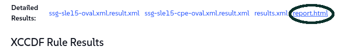

🌌 Güvenlik ve yama uygulama
===================================

<style type="text/css">
  * {
    font-family: suse;
    src: url('https://fonts.google.com/specimen/SUSE');
  }
  .hovereffect {
    border-radius: 25px 25px 25px 25px;
    background: linear-gradient(#30ba78 0 0) var(--hundredpercent, 0) / var(--hundredpercent, 0) no-repeat;
    transition: 0.5s, background-position 0s;
    padding: 5px;
  }
  .hovereffect:hover {
    --hundredpercent: 100%;
    color: white;
    border-radius: 10px 25px 10px 25px;
  }
  .smlmext {
    color: #fe7c3f;
  }
  .smlm {
    color: #fe7c3f;
  }
  .suse {
    color: #30ba78;
  }
  .smls {
    color: #2453ff;
  }
  .smlsext {
    color: #2453ff;
  }
  .companyname {
    color: #008657;
  }
  .liberty {
    color: #efefef;
  }
  .sles {
    color: #90ebcd;
  }
  .highlightcopy {
    color: white;
    font-weight: bold;
    padding: 0 10px;
  }

  .bottoms {
    vertical-align: middle;
    height: 50%;
    width: 50%;
    margin: 0px;
    padding: 0px;
    object-fit: contain;
  }

  img.animatedgif {
    --borderthickness: 5pt;
    --colors: #0000 25%,#30ba78 0;
    padding: 10px;
    background:
      conic-gradient(from 90deg  at top    var(--borderthickness) left  var(--borderthickness),var(--colors)) 0    0,
      conic-gradient(from 180deg at top    var(--borderthickness) right var(--borderthickness),var(--colors)) 100% 0,
      conic-gradient(from 0deg   at bottom var(--borderthickness) left  var(--borderthickness),var(--colors)) 0    100%,
      conic-gradient(from -90deg at bottom var(--borderthickness) right var(--borderthickness),var(--colors)) 100% 100%;
    background-size: 50px 50px;
    background-repeat: no-repeat;
    transition: 1s;
  }

  img.animatedgif:hover {
    background-size: 51% 51%;
  }

  img.logos {
    border-radius: 10px;
  }

</style>


Bu laboratuvarda, sahip olduğumuz en önemli sorumluluklardan birini ele alacağız: tüm dijital filomuzun güvenliğini sağlamak. <b class="smlmext">SUSE Multi-Linux Manager</b>'ın, dünya standartlarında bir havayolu şirketinin gerektirdiği hız ve hassasiyetle güvenlik tehditlerine yanıt vermemize nasıl olanak tanıdığını keşfedeceğiz.


## <b class="hovereffect">Hedefleriniz:</b>

- OpenSCAP kullanarak sistemlerinizde bir güvenlik uyumluluğu denetimi gerçekleştirin.

- İlgili güvenlik açıklarından etkilenen sistemleri belirleyin.

- Gerekli yamaları etkilenen tüm sistemlere aynı anda uygulayın.


Laboratuvar detayları (Lab details)
===========

Kullanıcı Adı (Username):
```txt
[[ Instruqt-Var key="SMLM_USERNAME" hostname="zbastion" ]]
```

Şifre (Password):
```txt
[[ Instruqt-Var key="UNIVERSAL_PWD" hostname="zbastion" ]]
```

<b class="smlm">SMLM</b> URL: <a href="[[ Instruqt-Var key="SMLM_URL" hostname="zbastion" ]]">[[ Instruqt-Var key="SMLM_URL" hostname="zbastion" ]]</a>


Sistemlerinizi denetleyin
==================

Üretim sistemlerimizi, uyumlu olduklarından emin olmak için denetlemek istiyoruz.

Aşağıdaki paketlerin kurulu olduğunu zaten doğruladık:

- openscap-utils
- scap-security-guide


Üretim grubunu seçin

- `Systems` ✈ `System Groups` yoluna gidelim.
- **prod** grubunu bulun ve `Use in SSM` üzerine tıklayın.


**System Set Manager Overview** sayfasına yönlendirileceğiz, daha önce gördüğümüz gibi, buradan birden fazla sisteme aynı anda eylem uygulayabiliriz.

- `Audit` sekmesine gidin.
- `OpenSCAP` altında formu aşağıdaki ayrıntılarla doldurun, geri kalanını varsayılan değerlerde bırakın:
  - **Command-line Arguments (Komut Satırı Argümanları):** <b class="highlightcopy">--profile xccdf_org.ssgproject.content_profile_stig</b>
  - **Path to XCCDF document (XCCDF belgesine yol):** <b class="highlightcopy">/usr/share/xml/scap/ssg/content/ssg-sle15-ds.xml</b>
- Şuna basın:


<p style="margin: 1px; padding: 1px; vertical-align: middle; display:inline-block; align:left;">
</p>
<p style="margin: 1px; padding: 1px;vertical-align: middle; display:inline-block; align:left;">

</p> ✈
<p style="margin: 1px; padding: 1px;vertical-align: middle; display:inline-block; align:center;">

</p>


Bu işlem birkaç dakika sürecektir.


Sonuçları görmek için `Audit` ✈ `OpenSCAP` ✈ `All Scans` yoluna gidelim.


Bu sonuçlardan birine tıklarsak, daha ayrıntılı bir döküm görebiliriz.

- **report.html** üzerine tıklayarak, OpenSCAP tarafından oluşturulan raporun daha güzel bir sürümünü görüntüleyebilirsiniz.




Rapor edilen sorunlar hakkında endişelenmeyin.


  <div style='align: middle; margin: 15px;'>
    
  </div>

<br/>


Güvenlik açıklarından etkilenen sistemleri belirleme
============================================

Hangi sistemlerin güvenlik açıklarından etkilendiğini görmek istiyoruz.

- Şimdi, `Patches` ✈ `Patch List` ✈ `Relevant` yoluna gidelim.

  Burada sistemlerimiz için mevcut olan tüm ilgili yamaların bir listesini görebiliriz, hadi **Security Patches**'a (Güvenlik Yamaları) bakalım.

- Bir **Advisory** (Bildiri) adına tıklayarak, diğer ayrıntıların yanı sıra hangi paketleri ve sistemleri etkilediğini gösteren ayrıntılı bir sayfayı görüntüleyebilirsiniz.

- Listenin sağ tarafında, **CVEs** sütunu resmi güvenlik açığı raporlarına doğrudan bağlantılar sağlar.

  Kendi yamalarımızı oluşturmak da mümkündür, ancak bu bölümde bunu ele almayacağız, daha fazla bilgi için lütfen bölümün sonundaki bağlantılara başvurun.


## <b class="hovereffect">Etkilenen sistemleri yamalama</b>

Sistemlerimizi yamalamak şu adımları izlemek kadar basittir:

- `Systems` ✈ `System Set Manager` yoluna gidin.
- `Patches` sekmesine gidin ✈ açılır listeden **Security Advisory** seçeneğini seçin ve `Show` düğmesine tıklayın.


- `Select All`'a tıklayın ✈ `Apply Patches` ✈ 


  <div style='align: middle; margin: 15px;'>
    
  </div>

<br/>


[[ Instruqt-Var key="COMPANY_NAME" hostname="zbastion" ]] için bu neden önemlidir?
=================================================================================


- Hızlı hareket edebilerek, maruz kalma süresini azaltıyoruz. Yeni bir güvenlik açığı keşfedildiğinde, bizimle ondan yararlanmaya çalışan kötü niyetli aktörler arasında bir yarış başlar. Karmaşık, manuel bir yama süreci, kritik sistemlerimizi çok uzun süre savunmasız bırakır.

- <b class="smlmext">SUSE Multi-Linux Manager</b>, tüm filomuzun güvenlik duruşuna dair tek, birleşik bir görünüm sağlar ve tehditleri tutarlı, güvenilir bir süreçle gidermemize olanak tanır.

- Sistemlerimizin farklı güvenlik çerçevelerine karşı uyumluluğunu kolayca kontrol edebilmek, düzeltici önlemleri daha hızlı uygulamamıza ve sıkı endüstri düzenlemelerine uymamıza olanak tanır.


Daha fazla bilgi
================


* [Denetim (Auditing)](https://documentation.suse.com/multi-linux-manager/5.1/en/docs/administration/auditing.html)
* [SUSE Güvenliği (SUSE Security)](https://www.suse.com/support/security/)
* [OpenSCAP ile Sistem Güvenliği](https://documentation.suse.com/multi-linux-manager/5.1/en/docs/administration/openscap.html)
* [Yamaları Yönetme](https://documentation.suse.com/multi-linux-manager/5.1/en/docs/administration/patch-management.html)