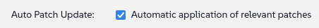

🌌 管理不同的 Linux 发行版
===================================

<style type="text/css">
  * {
    font-family: suse;
    src: url('https://fonts.google.com/specimen/SUSE');
  }
  .hovereffect {
    border-radius: 25px 25px 25px 25px;
    background: linear-gradient(#30ba78 0 0) var(--hundredpercent, 0) / var(--hundredpercent, 0) no-repeat;
    transition: 0.5s, background-position 0s;
    padding: 5px;
  }
  .hovereffect:hover {
    --hundredpercent: 100%;
    color: white;
    border-radius: 10px 25px 10px 25px;
  }
  .smlmext {
    color: #fe7c3f;
  }
  .smlm {
    color: #fe7c3f;
  }
  .suse {
    color: #30ba78;
  }
  .smls {
    color: #2453ff;
  }
  .smlsext {
    color: #2453ff;
  }
  .companyname {
    color: #008657;
  }
  .liberty {
    color: #efefef;
  }
  .sles {
    color: #90ebcd;
  }

  .highlightcopy {
    color: white;
    font-weight: bold;
    padding: 0 10px;
  }

  .bottoms {
    vertical-align: middle;
    height: 50%;
    width: 50%;
    margin: 0px;
    padding: 0px;
    object-fit: contain;
  }

  img.animatedgif {
    --borderthickness: 5pt;
    --colors: #0000 25%,#30ba78 0;
    padding: 10px;
    background:
      conic-gradient(from 90deg  at top    var(--borderthickness) left  var(--borderthickness),var(--colors)) 0    0,
      conic-gradient(from 180deg at top    var(--borderthickness) right var(--borderthickness),var(--colors)) 100% 0,
      conic-gradient(from 0deg   at bottom var(--borderthickness) left  var(--borderthickness),var(--colors)) 0    100%,
      conic-gradient(from -90deg at bottom var(--borderthickness) right var(--borderthickness),var(--colors)) 100% 100%;
    background-size: 50px 50px;
    background-repeat: no-repeat;
    transition: 1s;
  }

  img.animatedgif:hover {
    background-size: 51% 51%;
  }

  img.logos {
    border-radius: 10px;
  }

</style>


在 [[ Instruqt-Var key="COMPANY_NAME" hostname="zbastion" ]]，<b class="smlmext">SUSE Multi-Linux Manager</b> 是我们从单一管理界面 (single pane of glass) 管理多样化的 Linux 发行版和架构机队的关键。这帮助我们避免了过去让工程师的工作变得复杂的额外定制，从而减少了维护和实施系统策略所需的成本和时间。

有了这个工具，我们不会被锁定在单一供应商、架构或自动化平台上。我们可以自由选择环境所需的内容，并以相同的方式管理它们。想象一下，如果我们要为机队中的每种飞机类型配备一个拥有自己语言和程序的独立空中交通管制塔。操作复杂性将变得无法管理，成本也将高得令人望而却步。

我们都知道某种飞机型号更适合特定的航线；用大型喷气式客机执飞半小时的航班并不划算。这同样适用于我们的 Linux 发行版。虽然 SUSE 自己的发行版非常出色，但我们的一些应用程序有特定的要求。<b class="smlm">SMLM</b> 确保我们永远不会被锁定 (vendor lock-in)，并且始终可以集成当前任务的最佳解决方案。


## <b class="hovereffect">您的目标：</b>

- 接入 (Onboard) 一个 Ubuntu 24.04 LTS 系统，这是我们需要营销团队使用的专用系统。

- 演示我们如何使用与机队其他部分相同的工具和补丁程序来管理这个新的、不同的系统。


实验室详情 (Lab details)
===========

用户名 (Username):
```txt
[[ Instruqt-Var key="SMLM_USERNAME" hostname="zbastion" ]]
```

密码 (Password):
```txt
[[ Instruqt-Var key="UNIVERSAL_PWD" hostname="zbastion" ]]
```

<b class="smlm">SMLM</b> URL: <a href="[[ Instruqt-Var key="SMLM_URL" hostname="zbastion" ]]">[[ Instruqt-Var key="SMLM_URL" hostname="zbastion" ]]</a>


接入 Ubuntu (Onboarding Ubuntu)
=================

我们的营销部门发来了一个新的服务请求。他们的平面设计师依赖于一个仅在 Ubuntu 上受支持的特定创意套件。我们将接入他们的系统，以便我们可以对其进行管理，并确保其符合我们的安全和合规标准，就像我们对待其他系统一样。

让我们开始吧。
<br/>

- 从标签页 [button label="Ubuntu 2404 LTS" variant="success"](tab-1) 访问系统终端

  在进行任何更改之前，让我们检查它从哪里获取软件包：

```bash,run
grep -v '^#\|^Types:\|Trusted:\|Architectures:' /etc/apt/sources.list.d/*
```

该工作站直接从公共 Ubuntu 存储库提取软件。这带来了两个问题：首先，我们无法控制正在应用的补丁，这是一个安全隐患。其次，正如营销团队报告的那样，每次这些工作站获取更新时，它们都会拖慢办公室的互联网连接，导致其他员工感到沮丧。


让我们将此系统纳入我们的管理之下。这将通过将其连接到我们的内部 <b class="smlmext">SUSE Multi-Linux Manager</b> 实例来满足所有软件需求，从而解决这两个问题。

我们将使用 [button label="web UI" variant="success"](tab-0) 来执行此操作：

- 在 `Home` ✈ `Overview` 下，让我们点击 `Register Systems`

- 填写以下详细信息：

  - **Host:**

  ```txt
  ubuntu2404lts
  ```

  - **User:** (用户)

  ```txt
  root
  ```

  - **Password:** (密码)

  ```txt
  [[ Instruqt-Var key="UNIVERSAL_PWD" hostname="zbastion" ]]
  ```

  - **Activation Key:** (激活密钥)   <b class="highlightcopy">1-ubuntu2404</b>

- 保持其余部分不变并点击


- 注册过程可能需要几分钟才能完成，让我们前往 [button label="terminal" variant="success"](tab-1) 并再次运行第一个命令以查看发生了什么变化：


```bash,run
echo 'Waiting for the registration to complete' ;while [[ ! -f /etc/apt/sources.list.d/susemanager_bootstrap.sources ]] || [[ ! -f /etc/apt/sources.list.d/susemanager:channels.sources ]]; do echo -n '.'; sleep 5; done ; sleep 60; grep -v '^#\|^Types:\|Trusted:\|Architectures:' /etc/apt/sources.list.d/*
```


我们可以看到出现了新文件：

**/etc/apt/sources.list.d/susemanager:***

它们将系统指向 <b class="smlm">SMLM</b> 中我们集中管理和控制的频道。


我们还可以看到原始文件 **/etc/apt/sources.list.d/ubuntu.sources** 已被修改以禁用所有公共存储库，但并未被删除，如果我们需要，这将允许我们轻松回滚 (roll back)。


> [!NOTE]
> 使用带有密码身份验证的 SSH 的 root 进行注册仅用于演示目的，不建议用于生产环境。


> [!NOTE]
> 默认情况下，我们必须通过 UI 或命令行 < salt-key -A -y > 批准每个系统的注册，这里 <b class="smlm">SMLM</b> 已配置为自动批准 (auto approve)。


  <div style='align: middle; margin: 15px;'>
    
  </div>

<br/>


现在让我们切换到 [button label="SMLM UI" variant="success"](tab-0) 标签页


- 我们导航到 `Systems` ✈ `System List` ✈ `All`

  我们可以看到我们刚刚注册的系统 `Ubuntu2404lts`，请注意默认情况下它将在主机名 (hostname) 下注册。

  让我们点击它，我们将直接进入 `Details` - `Overview`，在那里我们可以看到以下信息：

  - 系统状态。
  - 所有信息，如主机名、IP 地址、虚拟化类型、使用的内核和安装的产品。
  - 它订阅的频道。

  <div style='align: middle; margin: 15px;'>
    
  </div>


<br/>

管理多个 Linux 发行版
=====================================


如前所述，在 <b class="companyname">[[ Instruqt-Var key="COMPANY_NAME" hostname="zbastion" ]]</b>，我们使用不同的 Linux 发行版，就像我们使用不同的飞机型号和公司一样。这有助于我们通过使用最适合我们每种需求的产品来保持竞争优势。

使用 <b class="smlmext">SUSE Multi-Linux Manager</b>，我们可以使用相同的程序、相同的时间表等，使用相同的界面和机制来管理所有这些系统。

下面我们将探讨如何在您的系统上执行不同的任务，无论我们的系统运行的是哪种操作系统，都遵循相同的流程，而无需创建不必要的定制。


## <b class="hovereffect">添加额外信息</b>


让我们继续刚刚注册的系统，我们将向其添加一些设置和信息：

- 让我们点击 `Properties`，在这里我们将添加有关系统的额外信息并更改一些设置。


  - 启用补丁自动应用 (Enable Automatic application of patches):

  

    当有相关补丁时，这将自动修补系统。


  - 为系统添加以下详细信息：


| 字段 (Field) | 内容 (Content)                                                  |
| ---: | :-----                                                    |
| **Description** | <b class="highlightcopy">Multimedia workstation for graphics designers.</b> |
| **Facility Address** | <b class="highlightcopy">Candy eye street, 1</b> |
| **City** | <b class="highlightcopy">Aeolia</b> |
| **Building** | <b class="highlightcopy">Belem Tower 4</b> |
| **Room** | <b class="highlightcopy">Sierra nevada</b> |


- 让我们看看它运行在什么硬件上：

  - 点击 `Details` ✈ `Hardware`


<br/>

> [!NOTE]
> 所有这些都可以通过 API 自动化。

<br/>

现在我们将使用自定义键 (custom keys) 向系统添加一些额外信息，这些信息稍后可以在您的自动化脚本中轻松使用。


- 点击 `Details` ✈ `Custom Info`


- 点击 `application` 并用以下内容填写 **value** (值)：

```text
Logo Wings designer pro
```


<br/>

> [!NOTE]
> 我们已经为您创建了自定义键 **application**，如果您想创建自己的键，只需前往：`Systems` ✈ `Custom System Info` ✈ `Create key`

<br/><br/>

让我们回到 Systems 列表

`Systems` ✈ `System List` ✈ `All`


让我们点击任何一个系统并前往 `Details` ✈ `Custom Info`。

我们已经为每个系统填充了一个值，

<br/>

现在前往 `Details` ✈ `Overview` 并注意 **Installed Products** 和 **Subscribed Channels**，这些与您的 Ubuntu 系统不同，因为它们运行的是不同的操作系统。


  <div style='align: middle; margin: 15px;'>
    
  </div>

<br/>


## <b class="hovereffect">一次在多个系统上运行命令</b>


让我们在我们拥有的所有系统上做点什么，回到 `Systems` ✈ `System List` ✈ `All` 并全选：


注意 **Base Channel** 列，我们有运行三种不同操作系统的系统。

<br/>

选中我们要操作的所有系统后，让我们执行一个组操作 (group action)：

`Systems` ✈ `System Set Manager`

让我们在它们所有上面运行一个命令，为此我们可以前往：

`Misc` ✈ `Remote Command`

然后填写以下详细信息，其余部分保留默认值：


脚本 (Script):

```bash,run
cat /etc/os-release
```

不要修改时间表 (schedule)，我们希望它尽快运行，点击：


<br/>


<br/><br/>

您会在顶部看到一个蓝色通知，指示任务已计划。

让我们去看看结果，为此我们将前往：

`Schedule` ✈ `Completed Actions`

我们将看到一个操作列表，在 **Filter by Action** 字段中输入：

```text
Run
```
点击列表中出现的顶部条目，应该类似于这样：


在那里我们可以前往 **Completed Systems** 并通过点击系统名称来检查结果。


  <div style='align: middle; margin: 15px;'>
    
  </div>

<br/>


<br/><br/>

至此我们完成了这一部分，我们将在研讨会期间看到更多关于我们如何管理多个 Linux 系统的示例。


这对 [[ Instruqt-Var key="COMPANY_NAME" hostname="zbastion" ]] 有什么重要意义？
=================================================================================

- 没有供应商锁定 (vendor lock-in)，保持选择的自由和灵活性，以快速应对不断变化的市场。

- 简化并节省时间，避免在定制上进行额外工作。

- 用于管理所有内容的单一 UI 降低了复杂性，并使未来的故障排除、扩展、补丁和自动化更加敏捷且更省时。


更多信息
================

有关支持的发行版列表，请访问：

[SMLM - Supported Clients and Features](https://documentation.suse.com/multi-linux-manager/5.1/en/docs/client-configuration/supported-features.html)