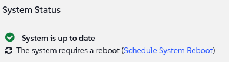

🌌 简单可靠的维护
===================================

<style type="text/css">
  * {
    font-family: suse;
    src: url('https://fonts.google.com/specimen/SUSE');
  }
  .hovereffect {
    border-radius: 25px 25px 25px 25px;
    background: linear-gradient(#30ba78 0 0) var(--hundredpercent, 0) / var(--hundredpercent, 0) no-repeat;
    transition: 0.5s, background-position 0s;
    padding: 5px;
  }
  .hovereffect:hover {
    --hundredpercent: 100%;
    color: white;
    border-radius: 10px 25px 10px 25px;
  }
  .smlmext {
    color: #fe7c3f;
  }
  .smlm {
    color: #fe7c3f;
  }
  .suse {
    color: #30ba78;
  }
  .smls {
    color: #2453ff;
  }
  .smlsext {
    color: #2453ff;
  }
  .companyname {
    color: #008657;
  }
  .liberty {
    color: #efefef;
  }
  .sles {
    color: #90ebcd;
  }
  .highlightcopy {
    color: white;
    font-weight: bold;
    padding: 0 10px;
  }

  .bottoms {
    vertical-align: middle;
    height: 50%;
    width: 50%;
    margin: 0px;
    padding: 0px;
    object-fit: contain;
  }

  img.animatedgif {
    --borderthickness: 5pt;
    --colors: #0000 25%,#30ba78 0;
    padding: 10px;
    background:
      conic-gradient(from 90deg  at top    var(--borderthickness) left  var(--borderthickness),var(--colors)) 0    0,
      conic-gradient(from 180deg at top    var(--borderthickness) right var(--borderthickness),var(--colors)) 100% 0,
      conic-gradient(from 0deg   at bottom var(--borderthickness) left  var(--borderthickness),var(--colors)) 0    100%,
      conic-gradient(from -90deg at bottom var(--borderthickness) right var(--borderthickness),var(--colors)) 100% 100%;
    background-size: 50px 50px;
    background-repeat: no-repeat;
    transition: 1s;
  }

  img.animatedgif:hover {
    background-size: 51% 51%;
  }
  img.logos {
    border-radius: 10px;
  }
</style>


到目前为止，我们一直专注于管理我们混合机队的多样性，甚至延长了我们遗留系统的寿命。现在，我们将注意力转向我们航空公司的核心：我们的旗舰 <b class="sles">SUSE Linux Enterprise Server</b> (<b class="sles">SLES</b>) 系统。


将这些视为我们最先进的长途喷气式飞机。它们的可靠性至关重要，而保持它们处于最佳状态涉及定期、计划性的服务补丁和升级。接下来的这个练习正是如此：我们将通过版本升级的过程，这是管理任何关键系统生命周期中的常见任务。


虽然我们使用 SLES 作为示例，但请记住我们通用控制塔的关键原则：您即将执行的过程与您用于任何其他 Linux 发行版的过程是相同的。界面和方法论不会改变。


## <b class="hovereffect">您的目标：</b>

- 接入 (Onboard) 一个新的 SLES 15 SP5 系统，作为我们的测试飞机。
- 执行从 SP5 到 SP6 的重大服务升级 (major service upgrade)。


实验室详情 (Lab details)
===========

用户名 (Username):
```txt
[[ Instruqt-Var key="SMLM_USERNAME" hostname="zbastion" ]]
```

密码 (Password):
```txt
[[ Instruqt-Var key="UNIVERSAL_PWD" hostname="zbastion" ]]
```

<b class="smlm">SMLM</b> URL: <a href="[[ Instruqt-Var key="SMLM_URL" hostname="zbastion" ]]">[[ Instruqt-Var key="SMLM_URL" hostname="zbastion" ]]</a>


接入和准备 (Onboarding and preparation)
==========================

从标签页 [button label="SLES 15" variant="success"](tab-1) 访问系统终端


让我们将该系统在 <b class="smlm">SMLM</b> 中注册为 **sles15**

```bash,run
curl -Sks "smlm.${_SANDBOX_ID}.instruqt.io"/pub/bootstrap/generic_bootstrap.sh | HOSTNAME="smlm.${_SANDBOX_ID}.instruqt.io" ACTIVATION_KEYS=1-sles15sp5 bash ; echo "Wait 45 seconds for it to finish"; sleep 45
```


现在，让我们切换到 [button label="SMLM UI" variant="success"](tab-0) 标签页


执行升级 (Executing the upgrade)
=====================

我们应该很快就能在系统列表中看到它，前往 `Systems` ✈ `System List` ✈ `All`，如果您没有看到它，请点击内部浏览器上的刷新。


让我们点击它并前往 `Software` ✈ `Packages` ✈ `Upgrade`。


为了确保顺利迁移，最好应用最新的更新。


<p style="margin: 1px; padding: 1px; vertical-align: middle; display:inline-block; align:left;">点击 </p><p style="margin: 1px; padding: 1px;vertical-align: middle; display:inline-block; align:left;"></p> ✈ <p style="margin: 1px; padding: 1px;vertical-align: middle; display:inline-block; align:center;"></p> ✈ <p style="margin: 1px; padding: 1px;vertical-align: middle;display:inline-block; align:right;"> </p>


这可能需要一些时间才能完成。

<br/>


## <b class="hovereffect">产品迁移 (Product migration)</b>


完成后，请前往 `Software` ✈ `Product Migration`


<p style="margin: 1px; padding: 1px; vertical-align: middle; display:inline-block; align:left;">您将看到一个名为 **Target Products** 的部分。确保已选中 <b style="font-family: suse; src: url('https://fonts.google.com/specimen/SUSE'); color: #90ebcd">SUSE Linux Enterprise Server 15 SP6 x86_64</b>，然后按下： </p><p style="margin: 1px; padding: 1px;vertical-align: middle; display:inline-block; align:left;"></p>

系统将向您显示一个包含摘要和附加选项的确认屏幕。保持默认值不变并点击： 

系统会要求您先进行一次试运行 (dry run)，忽略它并按下： 

这将需要一些时间。要监控状态，请前往 `Events` ✈ `History` 并观察 **Product Migration** 事件。一旦其状态图标变为绿色，迁移即告完成。您可以通过导航到 `Software` ✈ `Software Channels` 并确认系统现在已订阅新的 SP6 频道来验证这一点。

  <div style='align: middle; margin: 15px;'>
    
  </div>

<br/>

## <b class="hovereffect">迁移后重启 (Post-Migration Reboot)</b>

- 导航回 `Systems` ✈ `System List` ✈ `All`

- 注意 `sles15` 系统旁边现在有一个重启图标：


  这表明需要重启，通常是因为重大的内核更新。

- 点击它，我们将看到类似于此的内容：



- 点击 `Schedule System Reboot`，在随后的屏幕中点击 

> [!NOTE]
> 重启不会立即发生。

<br/>


## <b class="hovereffect">调度 (Scheduling) 的重要性</b>

我们已将这些操作安排为立即发生，但这并不总是可取的。<b class="smlm">SMLM</b> 支持创建维护窗口 (Maintenance Windows) (`Schedule` ✈ `Maintenance Windows`)，这允许您确保像重启这样的重大事件仅在这些预先批准的时段内发生。


调度对于生产系统特别有用，因为它允许对系统组进行精心计划的更改，甚至可以进行分阶段的“金丝雀” (canary) 部署。

<br/>

> [!NOTE]
> 可以使用 KLP 进行内核实时补丁 (live patching)，这使得无需重启即可将最新的安全更新应用于 Linux 内核。


这对 [[ Instruqt-Var key="COMPANY_NAME" hostname="zbastion" ]] 有什么重要意义？
=================================================================================

- 系统升级和其他例行任务必须简单且可重复，否则，我们就有犯下代价高昂错误的风险。有了这些工具，我们可以精确控制执行操作的时间和地点，充满信心地为我们的机队安排关键维护。


- 我们可以控制何时何地执行操作，并在我们的地面机队上安排维护作业。


更多信息
================

- [Live kernel patching with KLP](https://documentation.suse.com/en-us/sles/15-SP7/html/SLES-all/cha-klp.html)

- [Maintenance Windows](https://documentation.suse.com/multi-linux-manager/5.1/en/docs/administration/maintenance-windows.html)

- [Administration Guide](https://documentation.suse.com/multi-linux-manager/5.1/en/docs/administration/admin-overview.html)