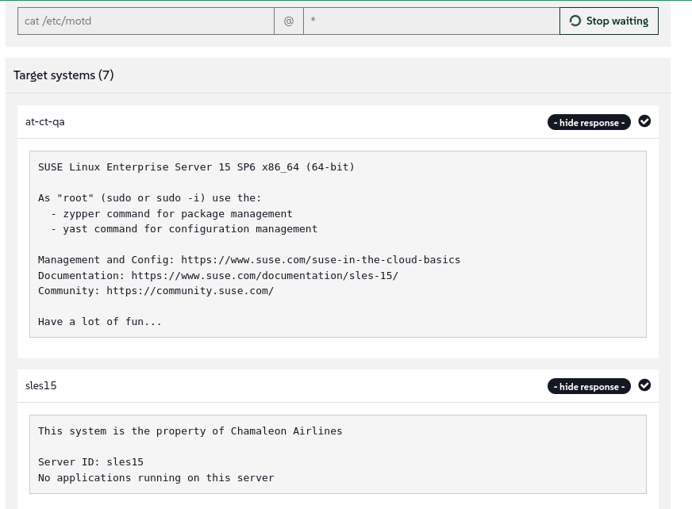

🌌 自动化与配置管理
===================================

<style type="text/css">
  * {
    font-family: suse;
    src: url('https://fonts.google.com/specimen/SUSE');
  }
  .hovereffect {
    border-radius: 25px 25px 25px 25px;
    background: linear-gradient(#30ba78 0 0) var(--hundredpercent, 0) / var(--hundredpercent, 0) no-repeat;
    transition: 0.5s, background-position 0s;
    padding: 5px;
  }
  .hovereffect:hover {
    --hundredpercent: 100%;
    color: white;
    border-radius: 10px 25px 10px 25px;
  }
  .smlmext {
    color: #fe7c3f;
  }
  .smlm {
    color: #fe7c3f;
  }
  .suse {
    color: #30ba78;
  }
  .smls {
    color: #2453ff;
  }
  .smlsext {
    color: #2453ff;
  }
  .companyname {
    color: #008657;
  }
  .liberty {
    color: #efefef;
  }
  .sles {
    color: #90ebcd;
  }
  .highlightcopy {
    color: white;
    font-weight: bold;
    padding: 0 10px;
  }

  .bottoms {
    vertical-align: middle;
    height: 50%;
    width: 50%;
    margin: 0px;
    padding: 0px;
    object-fit: contain;
  }

  img.animatedgif {
    --borderthickness: 5pt;
    --colors: #0000 25%,#30ba78 0;
    padding: 10px;
    background:
      conic-gradient(from 90deg  at top    var(--borderthickness) left  var(--borderthickness),var(--colors)) 0    0,
      conic-gradient(from 180deg at top    var(--borderthickness) right var(--borderthickness),var(--colors)) 100% 0,
      conic-gradient(from 0deg   at bottom var(--borderthickness) left  var(--borderthickness),var(--colors)) 0    100%,
      conic-gradient(from -90deg at bottom var(--borderthickness) right var(--borderthickness),var(--colors)) 100% 100%;
    background-size: 50px 50px;
    background-repeat: no-repeat;
    transition: 1s;
  }

  img.animatedgif:hover {
    background-size: 51% 51%;
  }

  img.logos {
    border-radius: 10px;
  }

</style>


在本节中，我们将查看一些可用于自动化任务的选项。

在本实验室中，我们从执行手动任务转向使用我们可用的一些选项来创建一些自动化。<b class="smlmext">SUSE Multi-Linux Manager</b> 充当我们 IT 运营的“自动驾驶仪”，允许我们在整个机队中精确且可靠地强制执行配置标准并自动化日常任务。

我们不再手动配置数百台服务器并希望不要错过任何步骤，而是定义流程和状态，并将人工操作减少到仅定义一次时间表。


## <b class="hovereffect">您的目标：</b>

- 创建一个在您的开发系统上定期执行更新的计划。

- 创建一个脚本，根据系统的环境显示不同的登录横幅。

实验室详情 (Lab details)
===========

用户名 (Username):
```txt
[[ Instruqt-Var key="SMLM_USERNAME" hostname="zbastion" ]]
```

密码 (Password):
```txt
[[ Instruqt-Var key="UNIVERSAL_PWD" hostname="zbastion" ]]
```

<b class="smlm">SMLM</b> URL: <a href="[[ Instruqt-Var key="SMLM_URL" hostname="zbastion" ]]">[[ Instruqt-Var key="SMLM_URL" hostname="zbastion" ]]</a>


设置定期更新 (Setup recurring updates)
=======================

我们希望开发人员使用 SUSE 提供的最新稳定更新，但我们不能依赖人们记得每天更新他们的系统，所以我们将创建一个定期计划来做到这一点。


我们将把这个应用到 dev 组中的所有系统，这样就不必在每个系统上单独操作。

- 让我们前往 `Systems` ✈ `System Groups`
- 点击 `dev` 组。

我们刚刚注意到它没有分配系统，让我们添加一个。

- 点击 `Target Systems` 并选择 `sles15`
- 然后点击 

现在我们有了一个系统，让我们创建定期操作。

- 前往 `Recurring Actions`
- 点击 
- 现在让我们用以下详细信息填充表单：
	+ **Action Type (操作类型):** 'Custom state'
 	+ **Schedule Name (计划名称):** 'Update Dev systems'
	+ **Daily (每日):** '03:00'
	+ **Configure states to execute (配置要执行的状态):** 确保选中 **uptodate:**
	

- 点击

<p style="margin: 1px; padding: 1px; vertical-align: middle; display:inline-block; align:left;"> </p><p style="margin: 1px; padding: 1px;vertical-align: middle; display:inline-block; align:left;">

</p> ✈
<p style="margin: 1px; padding: 1px;vertical-align: middle; display:inline-block; align:center;">

</p> ✈
<p style="margin: 1px; padding: 1px;vertical-align: middle;display:inline-block; align:right;">

</p>


要观察我们的定期操作列表，我们可以前往 `Schedule` ✈ `Recurring Actions`

现在，所有 dev 系统将在每天 UTC 时间凌晨 3 点更新。


  <div style='align: middle; margin: 15px;'>
    
  </div>

<br/>


确保每个系统都有登录消息
==========================================


我们将创建一个配置通道，以确保我们管理的每个系统都包含适当的登录消息。


- 让我们前往 `Configuration` ✈ `Channels`
- 点击 
- 用以下详细信息填写表单：
	+ **Name:** <b class="highlightcopy">Uniform experience</b>
	+ **Label:** <b class="highlightcopy">uniform_experienace</b>
	+ **Description:** <b class="highlightcopy">Create a uniform experience across systems</b>
- 点击 

现在我们已经创建了配置通道，让我们填充它。

- 前往 `Add Files` ✈ `Create File`
- 填写以下详细信息：
	+ **Filename/Path:** <b class="highlightcopy">/etc/motd</b>
	+ **File Contents:**
<pre>
This system is the property of [[ Instruqt-Var key="COMPANY_NAME" hostname="zbastion" ]].

Server ID: {{ grains['id'] }}


Running Application "{{ pillar['custom_info']['application'] }}"

No applications running on this server


No applications running on this server

</pre>


- 点击 

现在让我们将组织中的每个系统订阅到新的配置通道。

- 让我们前往 `Admin` ✈ `Organizations`
- 点击组织 **Organization** (这是默认组织)
- 前往 `States` 并选择我们刚刚创建的通道。

- 点击


<p style="margin: 1px; padding: 1px; vertical-align: middle; display:inline-block; align:left;"> </p><p style="margin: 1px; padding: 1px;vertical-align: middle; display:inline-block; align:left;">

</p> ✈
<p style="margin: 1px; padding: 1px;vertical-align: middle; display:inline-block; align:center;">

</p> ✈
<p style="margin: 1px; padding: 1px;vertical-align: middle; display:inline-block; align:center;">

</p>


这不会立即发生，让我们检查一下系统。我们将通过 Web UI 运行一个简单的命令，如果运行得太早，您可能会看到带有旧消息的系统和已经更新文件的系统。

- 让我们前往 `Salt` ✈ `Remote Commands`
- 输入以下内容：

- 点击 `Find targets`
- 您应该会看到系统列表，点击 `Run command`

现在您应该会看到类似这样的内容：



> [!NOTE]
> 这个过程可能需要几分钟，如果您没有看到 MOTD，请在几分钟后重新运行该命令。


  <div style='align: middle; margin: 15px;'>
    
  </div>

<br/>


为什么这对 [[ Instruqt-Var key="COMPANY_NAME" hostname="zbastion" ]] 很重要？
=================================================================================


- 在管理数千个系统时，我们无法承受逐个操作的代价，任务需要自动化，以便我们管理的是“牲畜” (cattle)，而不是“宠物” (pets)。


- 通过定义“正确状态”，我们消除了配置漂移 (configuration drift)。机队中的每台服务器都按照相同的剧本运行，就像每个飞行员都使用相同的检查清单一样。


- 那些如果手动在数百台服务器上执行需要数小时的任务，现在只需几分钟即可完成。这解放了我们的工程师，让他们致力于创新和改进，而不是重复的手工劳动。


- 自动化是防止人为错误的终极防线。手动配置过程中遗忘的步骤或拼写错误可能会导致中断。自动化、经过测试的流程每次都能完美执行，从而增强了我们整个航空公司的可靠性和安全性。


更多信息
================


* [SUSE Multi-Linux Manager 产品页面](https://www.suse.com/products/suse-manager/)

* [Ansible 集成](https://documentation.suse.com/multi-linux-manager/5.1/en/docs/administration/ansible-integration.html)

* [Salt 指南](https://documentation.suse.com/multi-linux-manager/5.1/en/docs/specialized-guides/salt/salt-overview.html)