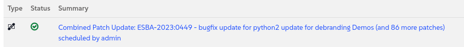

🌌 Extended support for legacy systems
===================================


# Extending the Life of Our Legacy Fleet

In any airline, you have older, reliable planes that have served you for years but for which you have no replacement yet. For us, a part of that legacy fleet is our CentOS 7 systems. They are stable but end-of-life, meaning they no longer receive critical security updates from their original manufacturer. For an airline, flying without support is a risk we simply cannot take.

The traditional solution would be a full, costly replacement of every single one.
But what if we could perform a life-extension upgrade, modernizing them in place with minimal disruption? That is precisely the mission for this challenge. We will use the power of SUSE Manager to safely transition these systems and keep them in service until we can replace them with a more modern OS.


### Our flight plan:

- Examine the current legacy systems running Centos 7

- Onboard the QA system and apply any patches available

- Identify and apply updates if any.

- Liberate the system with the liberate formula.

- Observe what has changed between both systems

- Identify if this is a migration.

<br/>

### Our airplanes

- CentOS 7 QA ✈ Our test and development server.

- CentOS 7 Prod ✈ Our production server already registered in SMLM

<br/><br/>


Lab details
===========

Username:
```txt
[[ Instruqt-Var key="SMLM_ADMIN_USERNAME" hostname="zbastion" ]]
```

Password:
```txt
[[ Instruqt-Var key="SMLM_ADMIN_PASSWORD" hostname="zbastion" ]]
```

SMLM URL:
```txt
[[ Instruqt-Var key="SMLM_URL" hostname="zbastion" ]]
```


Onboarding Centos 7 QA
======================


### Examing the current legacy systems

Access the system terminal from the tab [button label="Centos 7 QA" variant="success"](tab-1)

Check the current version of the system:

```bash,run
rpm -qi centos-release centos-logos
```


Now run the follwing command to register the system into SMLM:


```bash,run
curl -Sks "smlm.${_SANDBOX_ID}.instruqt.io"/pub/bootstrap/generic_bootstrap.sh | SMLM_DNS="smlm.${_SANDBOX_ID}.instruqt.io" ACTIVATION_KEYS=1-liberty7ltss PROFILENAME='airco-dh4a-qa' bash ; sleep 120
```


This is similar to the one we used to onboard Ubuntu in the previous lab, what changes is:

- **Activation key**: Is a reference to the settings that will be applied to the system by default, in this case it has been created to only indicate which software channels the system will be registered to.

- **Profile name**: If we don't specify it will use the hostname but in this case we want it to have a more meaningful name with the same naming convention we used with Centos 7 Prod.


<br/><br/>


### Identify and apply updates from Liberty repositories


Now lets switch to the [button label="SMLM UI" variant="success"](tab-0) tab


- Go to `Systems` ✈ `System List` in the left-hand menu.

- Find your host **airco-dh4a-qa** and click on it.


- Select the `Software` ✈ `Patches`

- You will see a list of available patches.

Click on `Select All`, then `Apply Patches` in the upper right finally `Confirm`. SUSE Manager will now schedule and perform the upgrade procedure on the CentOS system.


> [!NOTE]
> It may take a few minutes for the patches to appear. You can force it by going to `Software` ✈ `Packages` and press `Update Package List` and wait for 1 minute.


Since this may take a while, let's see what happens under the hood.
Go to `Events` tab, then to `History`, you should see a list of events that have happened since the system was registered into SMLM, in the first rows we should be able to find one event that contains something similar to *Combined Patch*.


If we click on it we can see all the details, feel free to have a look, otherwise wait until the icon is green:



We just applied patches, there is neither migration nor upgrade.

If we go to `Software` ✈ `Packages` ✈ `Upgrade` we can see there are some available upgrades, let's apply them too.

`Select All` ✈ `Upgrade Packages` ✈ `Confirm`


Let's compare it against the production system.

Please go to `Software` ✈ `Packages` ✈ `Profiles`

Select the system `airco-dh4a-prod`, which is the production version of the system we just liberated,  then click on `Compare`


We can see most of the package versions has not changed, still the same version ( **X.X.X**-xyz ) but with a patch applied ( X.X.X-**xyz** ).

Before we move onto the next secion lets create a stored profile, this will help us to see the differences more clearly after we apply the liberate formula in the next secion.


Please go to `Software` ✈ `Packages` ✈ `Profile` and click on `Create System Profile`. For the name you can call it **before_liberation**.


<br/><br/>


Liberate the system
====================

Now let's liberate the system:

- Go to `Formulas` tab and search for **Liberate**, once found select it and click on top right 	`Save`

You will see a message in blue:


Click on where it says `Highstate`, you will be directed to another tab (`States` ✈ `Highstate`).

You can see in the summary at the buttom that the liberate formula is there.

Click on `Apply Highstate` to start the liberation process.


This will take some time, please check `Events` -> `History` , you should see a an event called **Apply highstate scheduled**

This may take a couple of minutes.

<br/><br/>


Observe what has changed
=============================================


Once it's completed let's compare the system again to see the difference, if we are not there already lets click on the system name `airco-dh4a-qa`.

Then go to `Software` ✈ `Packages` ✈ `Profile`

Under  **Compare to Stored Profile** click `Compare`.


We can see the only that has changed is the following packages:

- **centos-logos**, replaced by **sles_es-logos**

- **centos-release**, replaced by **sles_es-release-server**

The rest remains the same but now you have all the support, upgrades and patches provided by SUSE for Liberty Linux.

The same applies to more modern versions of Centos and RHEL, you can transform them to Liberty and have them supported by SUSE without having to make any changes to the actual software and libraries.


### Is it a migration?


A migration involves building a brand-new server, reinstalling all applications from scratch, and carefully moving the data over, a process that is time-consuming, expensive, and fraught with risk.

What we did was far more elegant. We performed an in-place upgrade.

The server's identity, hostname, applications, and user data remained completely untouched. We simply changed its underlying source for updates, swapping out the end-of-life components for fully supported ones.

We've successfully extended the life of our system, brought it back into security compliance, and did it all without the disruption of a full migration. That's the efficiency that keeps [[ Instruqt-Var key="COMPANY_NAME" hostname="zbastion" ]] flying high.


Liberate the production server (optional)
=========================================

We have seen how to patch and Liberate our old Centos 7 server in QA, now it's time to do the same with the production system, but this time we will do so in a different order.

- First, we will apply the Liberate formula

  Lets go to our production server `airco-dh4a-prod` and `Create System Profile`

  Afterwards lets apply the Liberate formula like we did with the QA system.

- Once it's completed, let's compare the system with the profile we just created, as we can see the only change has been the centos-logos and centos-release pacakges, the rest remains exactly the same.


Why is it important for [[ Instruqt-Var key="COMPANY_NAME" hostname="zbastion" ]]?
=================================================================================

- It allows [[ Instruqt-Var key="COMPANY_NAME" hostname="zbastion" ]] to keep their running systems supported, granting them time to migrate depending on their business needs rather than the vendor needs.

- It mitigates the risk that imply having unsupported systems by offering extended support, this way avoids having to perform an inmediate migration, everything runs as usual but now there is a group of experts that can answer your calls.

- It gives you the freedom to change support provider without going through lenghtly migrations, and at scale.


More information
================

- [Registering RHEL 7 or CentOS Linux 7 with SUSE Manager](https://documentation.suse.com/liberty/7/html/suma-quickstart/art-suma-quickstart.html)
- [Running OpenSCAP compliance scans for SUSE Multi-Linux Support 7](https://documentation.suse.com/liberty/7/html/compliance-scans/art-compliance-scans.html)
- [Registering CentOS Linux 7 with the SUSE Customer Center](https://documentation.suse.com/liberty/7/html/quickstart-scc/art-quickstart-scc.html)
- [SUSE Multi-Linux Support 9](https://documentation.suse.com/liberty/9/)
