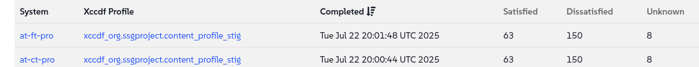
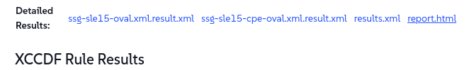

🌌 Security and patching
===================================


In this lab, we will tackle one of the most important responsibilities we have: ensuring the security of our entire digital fleet. We'll explore how **SUSE Multi-Linux Manager** allows us to respond to security threats with the speed and precision required by a world-class airline.


### Your Objectives:

- Perform an audit of your systems

- Identify systems affected by vulnerabilities

- Patch systems affected


Lab details
===========

Username:
```txt
[[ Instruqt-Var key="SMLM_ADMIN_USERNAME" hostname="zbastion" ]]
```

Password:
```txt
[[ Instruqt-Var key="SMLM_ADMIN_PASSWORD" hostname="zbastion" ]]
```

SMLM URL:
```txt
[[ Instruqt-Var key="SMLM_URL" hostname="zbastion" ]]
```


Audit your systems
==================

We want to audit our production systems to make sure they are compliant.

Make sure the following packages are installed:

- openscap-utils
- scap-security-guide


Select the production group

- Let's go to `Systems` ✈ `System Groups`
- Find group **prod** and click on `Use in SSM`


We will be directed to the **System Set Manager Overview** page, as we saw earlier, from here we can apply actions to multiple systems at once.

- Go to `Audit` tab
- Under `OpenSCAP` complete the form with the following details, leave the rest with the defaults:
  - **Command-line Arguments:** '--profile xccdf_org.ssgproject.content_profile_stig'
  - **Path to XCCDF document:** '/usr/share/xml/scap/ssg/content/ssg-sle15-ds.xml'
- Press 
- Press 

This will take a couple of minutes.


To see the restuls lets go to `Audit` ✈ `OpenSCAP` ✈ `All Scans`



If we click on one of theese results we can see a more detailed view.

- By clicking on **report.html** we can see a nicer view of the report.




Don't worry about the problems reported.


Identify systems affected by vulnerabilities
============================================

We want to see which systems are affected by vulnerabilities.

- Let's navigate to 	`Patches` ✈ `Patch List` ✈ `Relevant`

Here we can see a list of all relevant patches available for our systems, let's look at the **Security Patches**.

- By clicking in the **Advisory** it will take us to a page where we can find more information about which packages and systems it affects amongst other details.

- On the right side of the list we have a **CVEs** column with links to the actual CVEs included in the advisory.

It is also possible to create our own patches, but we won't cover it in this track, for more information please consult the links at the end of the track.


### Patch systems affected

To patch our systems is as simple as:

- going to `Systems` ✈ `System Set Manager`
- `Patches` ✈ Select **Security Advisory** and click `Show`


- `Select All` ✈ `Apply Patches` ✈ 


Why is it important for [[ Instruqt-Var key="COMPANY_NAME" hostname="zbastion" ]]?
=================================================================================


- By being able to act fast we are reducing the window of exposure. When a new vulnerability is discovered, a race begins between us and the malicious actors trying to exploit it. A complex, manual patching process leaves our critical systems for far too long.

- SUSE Multi-Linux Manager provides a single, unified view of our entire fleet's security posture and allow us to remediate threats with a consistent, reliable process.

- Being able to check our systems compliance against different security frameworks easily allow us to implement corrective measures faster to comply with industry regulations.


More information
================


* [Auditing](https://documentation.suse.com/multi-linux-manager/5.1/en/docs/administration/auditing.html)
* [SUSE Security](https://www.suse.com/support/security/)
* [System Security with OpenSCAP](https://documentation.suse.com/multi-linux-manager/5.1/en/docs/administration/openscap.html)
* [Manage Patches](https://documentation.suse.com/multi-linux-manager/5.1/en/docs/administration/patch-management.html)


