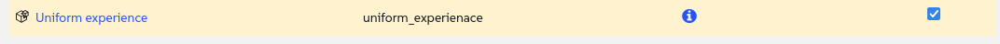

🌌 Automation and configuration management
===================================


In this section we are going to look at some of the options available to automate tasks.

In this lab, we move from doing manual tasks to create some automation using some of the options we have available.
**SUSE Multi-Linux Manager** acts as the "autopilot" for our IT operations, allowing us to enforce configuration standards and automate routine tasks with precision and reliability across our entire fleet.

Instead of manually configuring hundreds of servers and hoping we don't miss a step, we define the process and state and reduce the human operation to define a schedule, once.


### Your Objectives:

- Create a schedule that regulary perform updates on your development systems

- Create a script to show a different login banner depending on the system's environment

Lab details
===========

Username:
```txt
[[ Instruqt-Var key="SMLM_ADMIN_USERNAME" hostname="zbastion" ]]
```

Password:
```txt
[[ Instruqt-Var key="SMLM_ADMIN_PASSWORD" hostname="zbastion" ]]
```

SMLM URL:
```txt
[[ Instruqt-Var key="SMLM_URL" hostname="zbastion" ]]
```


Setup recurring updates
=======================

We want developer to work with the latest stable updates provided by SUSE, but we can't rely on people remembering to update their systems every day, so we are going to create a recurring schedule that does exactly that.


We are going to apply this to all the systems in the dev group so that this doesn't have to be done on every system.

- Let's go to `Systems` ✈ `System Groups`
- Click on `dev` group.

We just noticed it has no systems assigned, lets add one.

- click on `Target Systems` and select `sles15`
- then click on 

Now that we have a system lets create the recurring action.

- Go to `Recurring Actions`
- Click on 
- Now lets populate the form with the following details:
	+ **Action Type:** 'Custom state'
 	+ **Schedule Name:** 'Update Dev systems'
	+ **Daily:** '03:00'
	+ **uptodate:** 'Selected'
	

- First click on 
- Then click 

And as last step click on 

To observe our list of recurring actions we can go to `Schedule` ✈ `Recurring Actions`

Now all the dev systems will be updated everyday at 3am UTC time.


Make sure every system has a login message
==========================================


We are going to create a configuration channel to make sure every system we manage contains an adecuate login message.

- Let's go to `Configuration` ✈ `Channels`
- Click on 
- Fill the form with the following details:
	+ **Name:** 'Uniform experience'
	+ **Label:** 'uniform_experienace'
	+ **Description:** 'Create a uniform experience accross systems'
- Click on 

Now that we have created the config channel lets populate it.

- Go to `Add Files` ✈ `Create File`
- Fill in the following details:
	+ **Filename/Path:** '/etc/motd'
	+ **File Contents:**
<pre>
This system is the property of [[ Instruqt-Var key="COMPANY_NAME" hostname="zbastion" ]].

Server ID: {{ grains['id'] }}


Running Application "{{ pillar['custom_info']['application'] }}"

No applications running on this server


No applications running on this server

</pre>


- Click on 

Now lets subscribe every system in the organization to the new configuration channel.

- let's go to `Admin` ✈ `Organizations`
- Click on organization **Organization** (This is the default organization)
- Go to `States` and select the channel we just created.

- Click on 
- Click on 

This won't happen immediatly, let's check the systems. We are going to do run a simple command via the web UI, if ran early you may see systems wiht the old message and systems which already got the file updated.

- Lets go to `Salt` ✈ `Remote Commands`
- Type the following:

- Click on `Find targets`
- You should see a list of systems click on `Run command`

Now you should see something like this:


Why is it important for [[ Instruqt-Var key="COMPANY_NAME" hostname="zbastion" ]]?
=================================================================================


- When managing 1000s of systems we cannot afford to do everything one by one, tasks need to be automated so we manage cattle, not pets.

- By defining the "correct state" we eliminate configuration drift. Every server in the fleet operates from the same playbook, just like every pilot uses the same checklist.


- Tasks that would take hours to perform manually across hundreds of servers are completed in minutes. This frees up our engineers to work on innovation and improvement, not repetitive manual labor.


- Automation is the ultimate defense against human error. A forgotten step or a typo during manual configuration can lead to an outage. An automated, tested process executes perfectly every time, enhancing the reliability and security of our entire airline.


More information
================


* [SUSE Multi-Linux Manager Product Page](https://www.suse.com/products/suse-manager/)

* [Ansible Integration](https://documentation.suse.com/multi-linux-manager/5.1/en/docs/administration/ansible-integration.html)

* [Salt Guide](https://documentation.suse.com/multi-linux-manager/5.1/en/docs/specialized-guides/salt/salt-overview.html)


